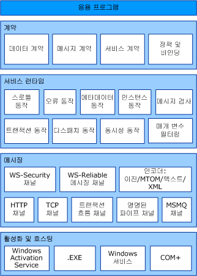

# Windows Communication Foundation 아키텍처
다음 그래픽은 [!INCLUDE[indigo1](../../../includes/indigo1-md.md)] 아키텍처의 주요 계층을 나타낸 것입니다.  
  
## WCF 아키텍처  
   
  
### 계약 및 설명  
 계약은 메시지 시스템의 다양한 양상을 정의합니다. 데이터 계약에서는 서비스에서 만들거나 사용할 수 있는 모든 메시지를 구성하는 모든 매개 변수를 설명합니다. 메시지 매개 변수는 XML을 이해할 수 있는 모든 시스템에서 문서를 처리할 수 있도록 XSD(XML Schema Definition language) 문서로 정의됩니다. 메시지 계약에서는 SOAP 프로토콜을 사용하여 특정 메시지 부분을 정의하며, 상호 운용성을 위해 필요한 경우 세밀하게 메시지 부분을 제어할 수 있습니다. 서비스의 실제 메서드 서명을 지정하는 서비스 계약은 Visual Basic 또는 Visual C# 등의 지원되는 프로그래밍 언어 중 하나를 통해 인터페이스로 배포됩니다.  
  
 정책과 바인딩은 서비스와의 통신을 위해 필요한 조건을 규정합니다.  예를 들어, 바인딩에서는 최소한 HTTP 또는 TCP 등의 사용되는 전송 방식과 인코딩을 지정해야 합니다. 정책에는 보안 요구 사항과 서비스와의 통신을 위해 충족시켜야 하는 다른 조건이 포함됩니다.  
  
### 서비스 런타임  
 서비스 런타임 계층에는 실제 서비스를 수행하는 동안에만 발생하는 동작, 즉 런타임 동작이 있습니다. 스로틀은 처리되는 메시지의 수를 제어하며, 이는 서비스 요청이 미리 설정한 제한까지 증가한 경우 달라질 수 있습니다. 오류 동작에서는 클라이언트에 전달되는 정보를 제어하는 등의 방법으로 서비스에 내부 오류가 발생하는 경우 일어나는 일을 지정합니다. 너무 많은 정보를 지정하면 악의적인 사용자가 공격에 이용할 수 있습니다. 메타데이터 동작에서는 메타데이터를 만들어 외부 세계에서 사용할 수 있게 제공하는 방법을 결정합니다. 인스턴스 동작에서는 서비스에서 실행할 수 있는 인스턴스의 수를 지정합니다. 예를 들어 singleton을 지정하면 한 인스턴스에서만 모든 메시지를 처리할 수 있습니다. 트랜잭션 동작을 사용하면 실패가 발생하는 경우 트랜잭션된 작업을 복원할 수 있습니다. 디스패치 동작에서는 [!INCLUDE[indigo2](../../../includes/indigo2-md.md)] 인프라로 메시지를 처리하는 방법을 제어합니다.  
  
 확장성을 사용하면 런타임 프로세스를 사용자 지정할 수 있습니다. 예를 들어 메시지 검사에서는 메시지 부분을 검사하고, 매개 변수 필터링에서는 메시지 헤더에서 작동하는 필터에 따라 미리 설정된 작업을 발생시킵니다.  
  
### 메시징  
 메시징 계층으로 구성 됩니다 *채널*합니다. 채널은 메시지를 인증하는 등의 방법으로 메시지를 처리하는 구성 요소입니다. 채널의 집합이 라고도 *채널 스택을*합니다. 채널은 메시지와 메시지 헤더에서 작동합니다. 주로 메시지 본문 내용 처리를 담당하는 서비스 런타임 계층과는 다릅니다.  
  
 채널에는 전송 채널과 프로토콜 채널의 두 가지 유형이 있습니다.  
  
 전송 채널에서는 네트워크나 기타 외부 세계의 통신 지점으로부터 메시지를 읽고 씁니다. 일부 전송에서는 인코더를 사용하여 XML Infoset으로 표현되는 메시지에서 네트워크에 사용되는 바이트 스트림 표현으로 변환 및 변환 해제합니다. 전송의 예에는 HTTP, 명명된 파이프, TCP 및 MSMQ가 있습니다. 인코딩의 예에는 XML과 최적화된 이진이 있습니다.  
  
 프로토콜 채널은 흔히 메시지의 추가 헤더를 읽거나 써서 메시지 처리 프로토콜을 구현합니다. 그러한 프로토콜의 예로는 WS-Security와 WS-Reliability가 있습니다.  
  
 메시징 계층에서는 데이터의 가능한 형식과 교환 패턴을 나타냅니다. WS-Security는 메시지 계층에서 보안을 활성화하는 WS-Security 사양을 구현한 것입니다. WS-Reliable Messaging 채널을 사용하면 메시지 배달을 보장할 수 있습니다. 인코더에서는 메시지의 필요에 맞게 사용할 수 있는 다양한 인코딩을 제공합니다. HTTP 채널에서는 메시지 배달에 HTTP(HyperText Transport Protocol)를 사용하도록 지정합니다. TCP 채널에서는 마찬가지로 TCP 프로토콜을 지정합니다. 트랜잭션 흐름 채널은 트랜잭션되는 메시지 패턴을 결정합니다. 명명된 파이프 채널을 사용하면 프로세스 간 통신이 가능합니다. MSMQ 채널을 사용하면 MSMQ 응용 프로그램과 상호 작용할 수 있습니다.  
  
### 호스팅 및 활성화  
 서비스의 최종 형태는 프로그램입니다. 다른 프로그램과 마찬가지로, 서비스 역시 실행 파일로 실행해야 합니다. 로 알려져는 *자체 호스트* 서비스입니다.  
  
 서비스 일 수도 있습니다 *호스팅된*, 되거나 IIS 또는 WAS Windows Activation Service ()와 같이 외부 에이전트에서 관리 하는 실행 파일에서 실행 합니다. WAS를 사용하면 WAS를 실행하는 컴퓨터에 배포된 [!INCLUDE[indigo2](../../../includes/indigo2-md.md)] 응용 프로그램을 자동으로 활성화할 수 있습니다. 실행 파일(.exe 파일)을 통해 서비스를 수동으로 실행할 수도 있습니다. 서비스를 Windows 서비스로 자동 실행할 수도 있습니다. COM+ 구성 요소를 [!INCLUDE[indigo2](../../../includes/indigo2-md.md)] 서비스로 호스팅할 수도 있습니다.  
  
## 참고 항목  
 [Windows Communication Foundation 정의](../../../docs/framework/wcf/whats-wcf.md)  
 [기본적인 Windows Communication Foundation 개념](../../../docs/framework/wcf/fundamental-concepts.md)
