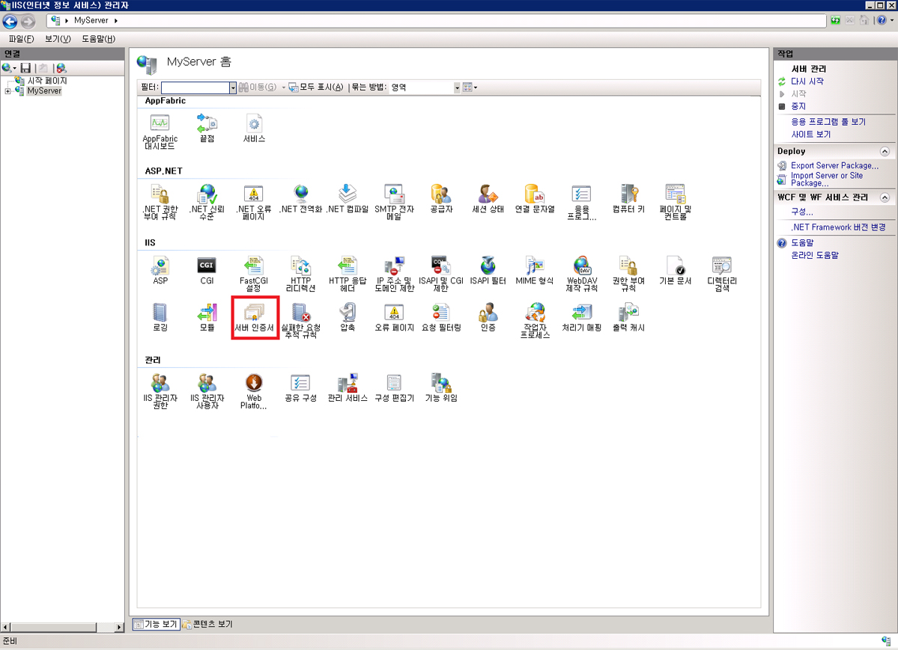
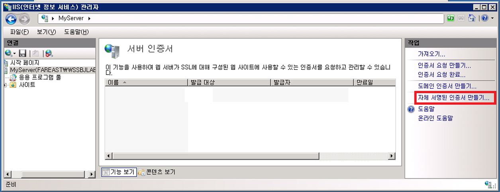
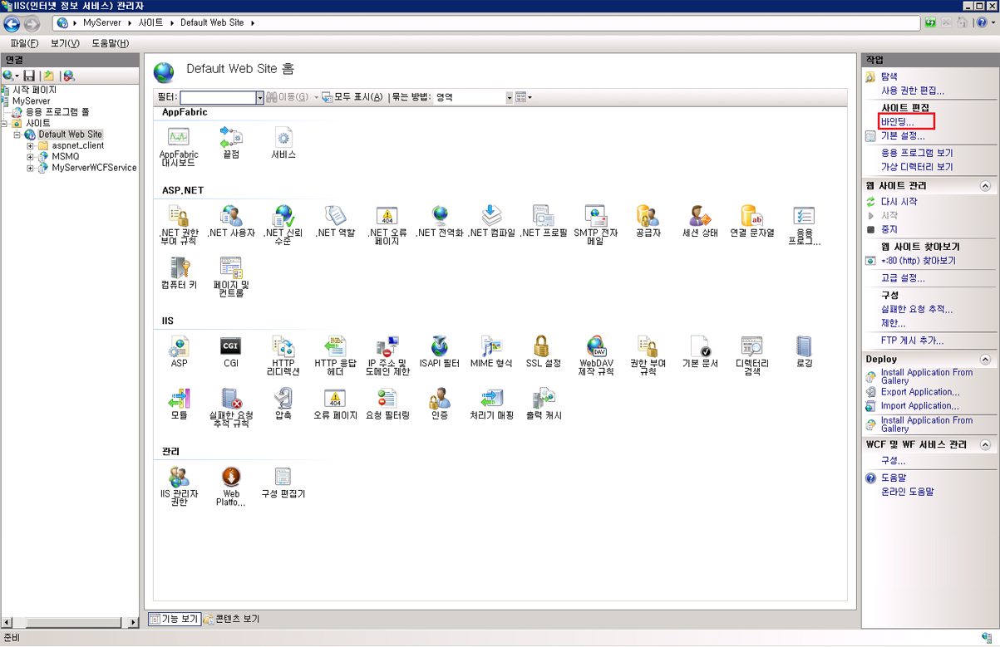
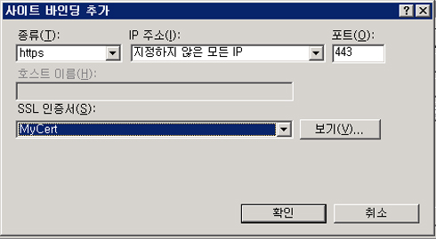
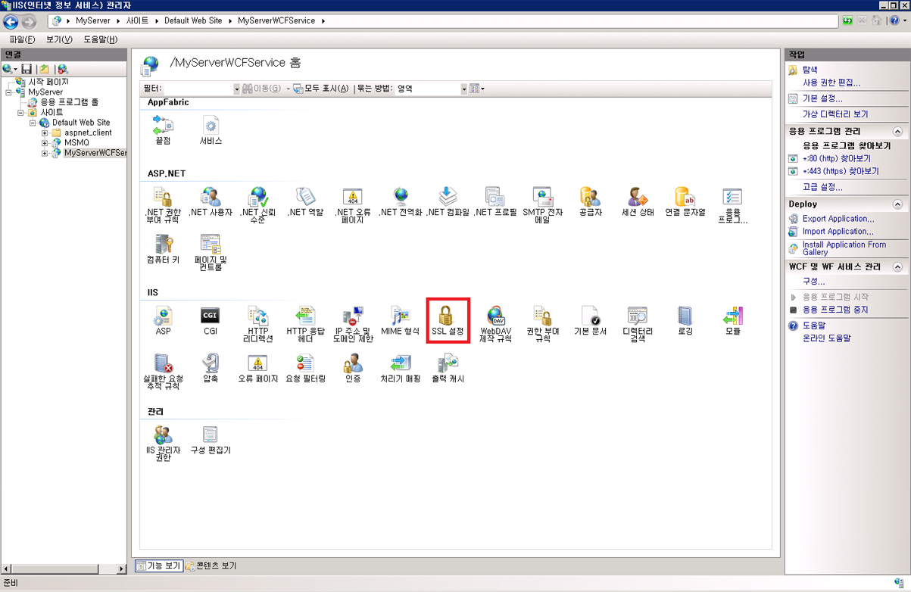
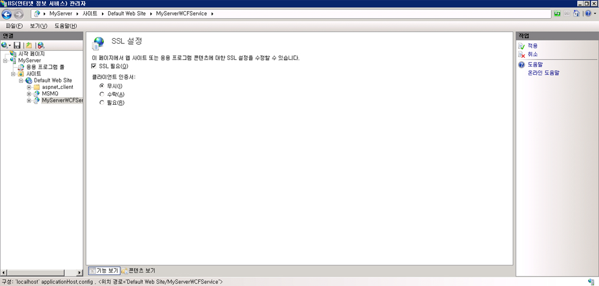

# 방법: SSL을 사용하여 IIS에서 호스트되는 WCF 서비스 구성
이 항목에서는 HTTP 전송 보안을 사용하도록 IIS에서 호스트되는 WCF 서비스를 설정하는 방법에 대해 설명합니다.  HTTP 전송 보안에는 IIS에 등록할 SSL 인증서가 필요합니다.  SSL 인증서가 없는 경우에는 IIS를 사용하여 테스트 인증서를 생성할 수 있습니다.  그런 다음 SSL 바인딩을 웹 사이트에 추가하고 웹 사이트의 인증 속성을 구성해야 합니다.  마지막으로, HTTPS를 사용하도록 WCF 서비스를 구성해야 합니다.  
  
### 자체 서명된 인증서 만들기  
  
1.  인터넷 정보 서비스 관리자\(inetmgr.exe\)를 열고 왼쪽 트리 뷰에서 컴퓨터 이름을 선택합니다.  화면 오른쪽에서 서버 인증서를 선택합니다.  
  
       
  
2.  서버 인증서 창에서 **자체 서명된 인증서 만들기...** 링크를 클릭합니다.  
  
       
  
3.  자체 서명된 인증서의 이름을 입력하고 **확인**을 클릭합니다.  
  
       
  
     이제 새로 만든 자체 서명된 인증서 정보가 **서버 인증서** 창에 표시됩니다.  
  
       
  
     생성된 인증서는 신뢰할 수 있는 루트 인증 기관 저장소에 설치됩니다.  
  
### SSL 바인딩 추가  
  
1.  인터넷 정보 서비스 관리자에서 **사이트** 폴더를 확장한 다음 화면 왼쪽의 트리 뷰에서 **기본 웹 사이트** 폴더를 확장합니다.  
  
2.  창 오른쪽 상단의 **동작** 섹션에서 **바인딩...** 링크를 클릭합니다.  
  
       
  
3.  사이트 바인딩 창에서 **추가** 단추를 클릭합니다.  
  
       
  
4.  **사이트 바인딩 추가** 대화 상자에서 방금 만든 자체 서명된 인증서의 이름 및 형식에 대한 https를 선택합니다.  
  
       
  
### SSL용 가상 디렉터리 구성  
  
1.  인터넷 정보 서비스 관리자에서 WCF 보안 서비스를 포함하는 가상 디렉터리를 선택합니다.  
  
2.  창의 가운데 창에 있는 IIS 섹션에서 **SSL 설정**을 선택합니다.  
  
       
  
3.  SSL 설정 창에서 **SSL 필요** 확인란을 선택하고 화면 오른쪽의 **동작** 섹션에서 **적용** 링크를 클릭합니다.  
  
       
  
### HTTP 전송 보안을 위한 WCF 서비스 구성  
  
1.  WCF 서비스의 web.config에서 다음 XML에 표시된 것처럼 전송 보안을 사용하도록 HTTP 바인딩을 구성합니다.  
  
    ```  
    <bindings>  
          <basicHttpBinding>  
            <binding name="secureHttpBinding">  
              <security mode="Transport">  
                <transport clientCredentialType="None"/>  
              </security>  
            </binding>  
          </basicHttpBinding>  
        </bindings>  
  
    ```  
  
2.  다음 XML에 표시된 것처럼 서비스 및 서비스 끝점을 지정합니다.  
  
    ```  
    <services>  
          <service name="MySecureWCFService.Service1">  
            <endpoint address=""  
                      binding="basicHttpBinding"  
                      bindingConfiguration="secureHttpBinding"  
                      contract="MySecureWCFService.IService1"/>  
  
            <endpoint address="mex"  
                      binding="mexHttpsBinding"  
                      contract="IMetadataExchange" />  
          </service>  
        </services>  
  
    ```  
  
## 예제  
 다음은 HTTP 전송 보안을 사용하는 WCF 서비스에 대한 web.config 파일의 전체 예제입니다.  
  
```  
<?xml version="1.0"?>  
<configuration>  
  
  <system.web>  
    <compilation debug="true" targetFramework="4.0" />  
  </system.web>  
  <system.serviceModel>  
    <services>  
      <service name="MySecureWCFService.Service1">  
        <endpoint address=""  
                  binding="basicHttpBinding"  
                  bindingConfiguration="secureHttpBinding"  
                  contract="MySecureWCFService.IService1"/>  
  
        <endpoint address="mex"  
                  binding="mexHttpsBinding"  
                  contract="IMetadataExchange" />  
      </service>  
    </services>  
    <bindings>  
      <basicHttpBinding>  
        <binding name="secureHttpBinding">  
          <security mode="Transport">  
            <transport clientCredentialType="None"/>  
          </security>  
        </binding>  
      </basicHttpBinding>  
    </bindings>  
    <behaviors>  
      <serviceBehaviors>  
        <behavior>  
          <!-- To avoid disclosing metadata information, set the value below to false and remove the metadata endpoint above before deployment -->  
          <serviceMetadata httpsGetEnabled="true"/>  
          <!-- To receive exception details in faults for debugging purposes, set the value below to true.  Set to false before deployment to avoid disclosing exception information -->  
          <serviceDebug includeExceptionDetailInFaults="false"/>  
        </behavior>  
      </serviceBehaviors>  
    </behaviors>  
    <serviceHostingEnvironment multipleSiteBindingsEnabled="true" />  
  </system.serviceModel>  
 <system.webServer>  
    <modules runAllManagedModulesForAllRequests="true"/>  
  </system.webServer>  
  
</configuration>  
  
```  
  
<!-- TODO: review snippet reference  [!CODE [Microsoft.Win32.RegistryKey#4](Microsoft.Win32.RegistryKey#4)]  -->  
  
## 참고 항목  
 [인터넷 정보 서비스에서의 호스팅](../../../../docs/framework/wcf/feature-details/hosting-in-internet-information-services.md)   
 [인터넷 정보 서비스 호스팅 지침](../../../../docs/framework/wcf/samples/internet-information-service-hosting-instructions.md)   
 [인터넷 정보 서비스 호스팅을 위한 최선의 방법](../../../../docs/framework/wcf/feature-details/internet-information-services-hosting-best-practices.md)   
 [인라인 코드를 사용한 IIS 호스팅](../../../../docs/framework/wcf/samples/iis-hosting-using-inline-code.md)