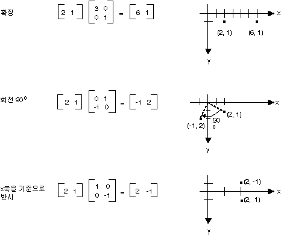
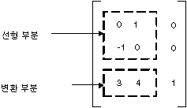

# 매트릭스에 의한 변환 표시
m n 매트릭스는 m개의 행과 n개의 열로 배열된 숫자 집합입니다.  다음 그림은 몇 가지 매트릭스를 나타냅니다.  
  
   
  
 매트릭스의 개별 요소를 더하여 크기가 동일한 두 매트릭스를 더할 수 있습니다.  다음 그림은 매트릭스 더하기의 두 예제를 보여 줍니다.  
  
   
  
 m n 매트릭스는 n p 매트릭스와 곱할 수 있으며 그 결과로 m p 매트릭스가 만들어집니다.  첫 번째 매트릭스의 열 수는 두 번째 매트릭스의 행 수와 같아야 합니다.  예를 들어 4×2 매트릭스를 2×3 매트릭스와 곱하면 4×3 매트릭스가 만들어집니다.  
  
 평면 상의 점과 매트릭스의 행\/열은 벡터로 생각할 수 있습니다.  예를 들어, \(2, 5\)는 두 요소로 구성된 벡터이고 \(3, 7, 1\)은 세 요소로 구성된 벡터입니다.  두 벡터의 도트 곱은 다음과 같이 정의됩니다.  
  
 \(a, b\) • \(c, d\) \= ac \+ bd  
  
 \(a, b, c\) • \(d, e, f\) \= ad \+ be \+ cf  
  
 예를 들어 \(2, 3\)과 \(5, 4\)의 도트 곱은 \(2\)\(5\) \+ \(3\)\(4\) \= 22이며,  \(2, 5, 1\)과 \(4, 3, 1\)의 도트 곱은 \(2\)\(4\) \+ \(5\)\(3\) \+ \(1\)\(1\) \= 24입니다.  두 벡터의 도트 곱은 또 다른 벡터가 아니라 수라는 점에 주의합니다.  또한 두 벡터의 요소 수가 동일한 경우에만 도트 곱을 계산할 수 있다는 점에 주의합니다.  
  
 A\(i, j\)는 매트릭스 A에서 i번째 행과 j번째 열에 있는 엔트리입니다.  예를 들어 A\(3, 2\)는 매트릭스 A에서 3번째 행과 2번째 열에 있는 엔트리입니다.  A, B, C가 매트릭스이고 AB \= C라고 가정할 때  C의 엔트리는 다음과 같이 계산됩니다.  
  
 C\(i, j\) \= \(A의 i행\) • \(B의 j열\)  
  
 다음 그림은 매트릭스 곱하기의 몇 가지 예제를 보여 줍니다.  
  
   
  
 평면 위의 점을 1×2 매트릭스로 생각하면 이 매트릭스와 2×2 매트릭스를 곱하여 점을 변환할 수 있습니다.  다음 그림은 점 \(2, 1\)에 적용된 몇 가지 변환을 보여 줍니다.  
  
   
  
 위의 그림에 나타난 모든 변환은 선형 변환입니다.  이동과 같은 기타 특정 변환은 선형이 아니므로 2×2 매트릭스 곱으로 표현할 수 없습니다.  가령, 점\(2, 1\)에서 시작하여 이 점을 90도 회전시키고 x방향으로 3단위, y방향으로 4단위를 이동하려는 경우를 가정해 보겠습니다.  이 동작은 매트릭스 곱과 매트릭스 합을 차례로 사용하여 수행할 수 있습니다.  
  
   
  
 선형 변환\(2×2 매트릭스 곱하기\) 후에 이동\(1×2 매트릭스 더하기\) 변환을 수행하는 것을 상관 변환\(affine transformation\)이라고 합니다.  상관 변환을 한 쌍의 매트릭스\(선형 변환용 매트릭스와 이동 변환용 매트릭스\)에 저장하는 대신 전체 변환을 단일 3×3 매트릭스에 저장할 수도 있습니다.  이렇게 하려면 세 번째 좌표가 더미인 1×3 매트릭스에 평면 위의 점을 저장해야 합니다.  일반적으로는 세 번째 좌표를 모두 1로 만듭니다.  예를 들어 점 \(2, 1\)은 \[2 1 1\] 매트릭스로 표현됩니다.  다음 그림은 단일 3×3 매트릭스 곱으로 표현된 상관 변환을 나타냅니다. 이 상관 변환은 좌표를 90도 회전시키고 x축 방향으로 3단위, y축 방향으로 4단위를 이동합니다.  
  
   
  
 위의 예에서 점 \(2, 1\)은 점 \(2, 6\)으로 매핑됩니다.  3×3 매트릭스의 세 번째 열에 포함되어 있는 숫자 0, 0, 1에 주목하십시오.  유사 변환의 3×3 매트릭스에는 항상 이 숫자가 사용됩니다.  여기서 중요한 숫자는 1열과 2열의 숫자 6개입니다.  매트릭스의 왼쪽 위에 있는 2×2 부분은 선형 변환 부분을 나타내고 세 번째 행의 처음 두 항목은 이동 변환을 나타냅니다.  
  
   
  
 [!INCLUDE[ndptecgdiplus](../../../../includes/ndptecgdiplus-md.md)]에서는 유사 변환을 <xref:System.Drawing.Drawing2D.Matrix> 개체에 저장할 수 있습니다.  상관 변환을 나타내는 매트릭스의 세 번째 열은 항상 \(0, 0, 1\)이므로 <xref:System.Drawing.Drawing2D.Matrix> 개체를 구성하는 경우 처음 두 열에 있는 6개의 숫자만 지정합니다.  `Matrix myMatrix = new Matrix(0, 1, -1, 0, 3, 4)` 문은 위의 그림에 표시된 매트릭스를 구성합니다.  
  
## 복합 변환  
 복합 변환은 일련의 변환을 차례대로 수행하는 변환입니다.  다음 목록과 같은 매트릭스 및 변환을 예로 들어 보겠습니다.  
  
|||  
|-|-|  
|매트릭스 A|90도 회전|  
|매트릭스 B|x축 방향으로 2의 비율로 크기 조정|  
|매트릭스 C|y축 방향으로 3단위만큼 이동|  
  
 매트릭스 \[2 1 1\]로 표현되는 점 \(2, 1\)에 매트릭스 A, B, C를 차례로 곱하면 점 \(2, 1\)에 대해 이 순서대로 세 개의 변환이 실행됩니다.  
  
 \[2 1 1\]ABC \= \[\-2 5 1\]  
  
 복합 변환의 세 부분을 세 개의 매트릭스에 개별적으로 저장하는 대신 A, B, C를 동시에 곱하면 전체 복합 변환이 저장되는 단일 3×3 매트릭스를 만들 수 있습니다.  ABC \= D라고 가정하고  이 점에 D를 곱하면 A, B, C를 차례로 곱한 것과 동일한 결과를 얻을 수 있습니다.  
  
 \[2 1 1\]D \= \[\-2 5 1\]  
  
 다음 그림은 매트릭스 A, B, C, D를 나타냅니다.  
  
   
  
 개별 변환 매트릭스를 곱하여 전체 변환 매트릭스를 구성할 수 있으면 모든 상관 변환 순서를 단일 <xref:System.Drawing.Drawing2D.Matrix> 개체에 저장할 수 있습니다.  
  
> [!CAUTION]
>  복합 변환의 경우 순서가 중요합니다.  일반적으로 회전, 크기 조정, 이동을 차례로 수행하는 것은 크기 조정, 회전, 이동을 차례로 수행하는 것과 다릅니다.  마찬가지로 매트릭스 곱셈 연산에서도 순서가 중요합니다.  일반적으로 ABC와 BAC는 다릅니다.  
  
 <xref:System.Drawing.Drawing2D.Matrix> 클래스에서는 <xref:System.Drawing.Drawing2D.Matrix.Multiply%2A>, <xref:System.Drawing.Drawing2D.Matrix.Rotate%2A>, <xref:System.Drawing.Drawing2D.Matrix.RotateAt%2A>, <xref:System.Drawing.Drawing2D.Matrix.Scale%2A>, <xref:System.Drawing.Drawing2D.Matrix.Shear%2A>, <xref:System.Drawing.Drawing2D.Matrix.Translate%2A>와 같이 복합 변환을 구성하는 데 필요한 몇 가지 메서드를 제공합니다.  다음 예제에서 만들어진 복합 변환 매트릭스는 30도를 회전시키고, y축 방향으로 2의 비율로 크기를 조정한 다음, x축 방향으로 5단위를 이동합니다.  
  
 [!code-csharp[System.Drawing.CoordinateSystems#11](../../../../samples/snippets/csharp/VS_Snippets_Winforms/System.Drawing.CoordinateSystems/CS/Class1.cs#11)]
 [!code-vb[System.Drawing.CoordinateSystems#11](../../../../samples/snippets/visualbasic/VS_Snippets_Winforms/System.Drawing.CoordinateSystems/VB/Class1.vb#11)]  
  
 다음 그림은 이 매트릭스를 나타냅니다.  
  
   
  
## 참고 항목  
 [좌표계 및 변환](../../../../docs/framework/winforms/advanced/coordinate-systems-and-transformations.md)   
 [관리 GDI\+에서 변환 사용](../../../../docs/framework/winforms/advanced/using-transformations-in-managed-gdi.md)