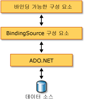

# BindingSource 구성 요소 개요
<xref:System.Windows.Forms.BindingSource> 구성 요소는 내부 데이터 소스에 컨트롤을 바인딩하는 프로세스를 간소화하도록 설계되었습니다. <xref:System.Windows.Forms.BindingSource> 구성 요소는 바인딩하는 다른 컨트롤에 대한 통로 및 데이터 소스 역할을 합니다. 내부 데이터 목록에 명령을 전달하는 동안 폼의 데이터 연결에 대한 추상화를 제공합니다. 또한 구성 요소 자체가 데이터 소스 역할을 하도록 데이터를 직접 추가할 수 있습니다.  
  
## 중개자로 작동하는 BindingSource 구성 요소  
 <xref:System.Windows.Forms.BindingSource> 구성 요소는 폼의 일부 또는 모든 컨트롤에 대한 데이터 소스 역할을 합니다. Visual Studio에서의 <xref:System.Windows.Forms.BindingSource> 방법으로 컨트롤에 바인딩할 수는 `DataBindings` 에서 액세스할 수 있는 속성의 **속성** 창. [방법: 디자이너를 사용하여 Windows Forms 컨트롤에 BindingSource 구성 요소 바인딩](../../../../docs/framework/winforms/controls/bind-wf-controls-with-the-bindingsource.md)을 참조하세요.  
  
 개체의 단순 속성이나 기본 컬렉션(예: <xref:System.Collections.ArrayList>)과 같은 간단한 데이터 소스 및 데이터베이스 테이블과 같은 복잡한 데이터 소스 둘 다에 <xref:System.Windows.Forms.BindingSource> 구성 요소를 바인딩할 수 있습니다. <xref:System.Windows.Forms.BindingSource> 구성 요소는 바인딩 및 통화 관리 서비스를 제공하는 중간자 역할을 합니다. 디자인 타임 또는 런타임에 해당 <xref:System.Windows.Forms.BindingSource.DataSource%2A> 및 <xref:System.Windows.Forms.BindingSource.DataMember%2A> 속성을 각각 데이터베이스와 테이블로 설정하여 <xref:System.Windows.Forms.BindingSource> 구성 요소를 복잡한 데이터 소스에 바인딩할 수 있습니다. 다음 그림에서는 <xref:System.Windows.Forms.BindingSource> 구성 요소가 기존 데이터 바인딩 아키텍처에 들어가는 위치를 보여 줍니다.  
  
   
  
> [!NOTE]
>  디자인 타임에 데이터 창에서 빈 폼으로 데이터베이스 테이블 끌기와 같은 일부 작업은 <xref:System.Windows.Forms.BindingSource> 구성 요소를 만들고, 내부 데이터 소스에 바인딩한 다음 하나의 작업에서 모든 데이터 인식 컨트롤을 추가합니다. [Visual Studio에서 데이터에 Windows Forms 컨트롤 바인딩](/visualstudio/data-tools/bind-windows-forms-controls-to-data-in-visual-studio)을 참조하세요.  
  
## 데이터 소스로 작동하는 BindingSource 구성 요소  
 먼저 바인딩할 목록을 지정하지 않고 <xref:System.Windows.Forms.BindingSource> 구성 요소에 항목 추가를 시작하는 경우 구성 요소는 목록 스타일 데이터 소스처럼 작동하며 이러한 추가된 항목을 수락합니다.  
  
 또한 항목이 목록에 추가되기 전에 <xref:System.Windows.Forms.BindingSource.AddingNew> 메서드를 호출할 때 발생하는 <xref:System.Windows.Forms.BindingSource.AddNew%2A> 이벤트를 통해 사용자 지정 "AddNew" 기능을 제공하는 코드를 작성할 수 있습니다. 자세한 내용은 [BindingSource 구성 요소 아키텍처](../../../../docs/framework/winforms/controls/bindingsource-component-architecture.md)를 참조하세요.  
  
## 탐색  
 폼에서 데이터를 탐색해야 하는 사용자의 경우 <xref:System.Windows.Forms.BindingNavigator> 구성 요소를 사용하면 <xref:System.Windows.Forms.BindingSource> 구성 요소에 따라 데이터를 탐색 및 조작할 수 있습니다. 자세한 내용은 [BindingNavigator 컨트롤](../../../../docs/framework/winforms/controls/bindingnavigator-control-windows-forms.md)을 참조하세요.  
  
## 데이터 조작  
 <xref:System.Windows.Forms.BindingSource>는 모든 바인딩에 대한 <xref:System.Windows.Forms.CurrencyManager> 역할을 하므로 데이터 소스와 관련해서 통화 및 위치 정보에 대한 액세스를 제공합니다. 다음 표에서는 <xref:System.Windows.Forms.BindingSource> 구성 요소가 내부 데이터 액세스 및 조작을 위해 제공하는 멤버를 보여 줍니다.  
  
|멤버|설명|  
|------------|-----------------|  
|<xref:System.Windows.Forms.BindingSource.Current%2A> 속성|데이터 소스의 현재 항목을 가져옵니다.|  
|<xref:System.Windows.Forms.BindingSource.Position%2A> 속성|내부 목록에서 현재 위치를 가져오거나 설정합니다.|  
|<xref:System.Windows.Forms.BindingSource.List%2A> 속성|<xref:System.Windows.Forms.BindingSource.DataSource%2A> 및 <xref:System.Windows.Forms.BindingSource.DataMember%2A>의 평가인 목록을 가져옵니다. <xref:System.Windows.Forms.BindingSource.DataMember%2A>가 설정되지 않은 경우 <xref:System.Windows.Forms.BindingSource.DataSource%2A>에 지정된 목록을 반환합니다.|  
|<xref:System.Windows.Forms.BindingSource.Insert%2A> 메서드|목록의 지정된 인덱스에 항목을 삽입합니다.|  
|<xref:System.Windows.Forms.BindingSource.RemoveCurrent%2A> 메서드|목록에서 현재 항목을 제거합니다.|  
|<xref:System.Windows.Forms.BindingSource.EndEdit%2A> 메서드|내부 데이터 소스에 보류 중인 변경 내용을 적용합니다.|  
|<xref:System.Windows.Forms.BindingSource.CancelEdit%2A> 메서드|현재 편집 작업을 취소합니다.|  
|<xref:System.Windows.Forms.BindingSource.AddNew%2A> 메서드|내부 목록에 새 항목을 추가합니다. 데이터 소스가 <xref:System.ComponentModel.IBindingList>를 구현하고 <xref:System.Windows.Forms.BindingSource.AddingNew> 이벤트에서 항목을 반환하는 경우 이 항목을 추가합니다. 그러지 않으면 요청이 목록의 <xref:System.ComponentModel.IBindingList.AddNew%2A> 메서드에 전달됩니다. 내부 목록이 <xref:System.ComponentModel.IBindingList>가 아닌 경우 public 기본 생성자를 통해 항목이 자동으로 만들어집니다.|  
  
## 정렬 및 필터링  
 일반적으로 데이터 소스의 정렬 또는 필터링된 뷰를 사용해야 합니다. 다음 표에서는 <xref:System.Windows.Forms.BindingSource> 구성 요소 데이터 소스가 제공하는 멤버를 보여 줍니다.  
  
|멤버|설명|  
|------------|-----------------|  
|<xref:System.Windows.Forms.BindingSource.Sort%2A> 속성|데이터 소스가 <xref:System.ComponentModel.IBindingList>인 경우 정렬에 사용되는 열 이름과 정렬 순서 정보를 가져오거나 설정합니다. 데이터 소스가 <xref:System.ComponentModel.IBindingListView>이고 고급 정렬을 지원하는 경우 정렬에 사용되는 여러 개의 열 이름과 정렬 순서 정보를 가져옵니다.|  
|<xref:System.Windows.Forms.BindingSource.Filter%2A> 속성|데이터 소스가 <xref:System.ComponentModel.IBindingListView>인 경우 표시할 행을 필터링하는 데 사용하는 식을 가져오거나 설정합니다.|  
  
## 참고 항목  
 <xref:System.Windows.Forms.BindingSource>  
 <xref:System.Windows.Forms.BindingNavigator>  
 [BindingSource 구성 요소 아키텍처](../../../../docs/framework/winforms/controls/bindingsource-component-architecture.md)  
 [BindingSource 구성 요소](../../../../docs/framework/winforms/controls/bindingsource-component.md)  
 [BindingNavigator 컨트롤](../../../../docs/framework/winforms/controls/bindingnavigator-control-windows-forms.md)  
 [Windows Forms 데이터 바인딩](../../../../docs/framework/winforms/windows-forms-data-binding.md)  
 [Windows Forms에 사용할 수 있는 컨트롤](../../../../docs/framework/winforms/controls/controls-to-use-on-windows-forms.md)
