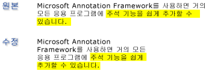

# 주석 개요
종이 문서에 메모나 설명을 적는 것은 당연하게 받아들이는 매우 일반적인 행동입니다. 이러한 메모나 설명은 나중에 참조하기 위해 관심 있는 항목을 강조 표시하거나 정보를 첨부하기 위해 문서에 추가하는 "주석"입니다. 인쇄된 문서에 메모를 적는 것은 간단하고 일반적이지만 전자 문서에 개인적인 주석을 추가하는 기능은 대개 가능하더라도 매우 제한적입니다.  
  
 이 항목에서는 스티커 메모 및 강조 표시와 같은 몇 가지 일반적인 주석 유형 및 Microsoft annotation Framework가 Windows Presentation Foundation를 통해 응용 프로그램에서 이러한 유형의 주석을 어떻게 활용 하는 방법을 보여 줍니다. (WPF ) 문서 보기 컨트롤.  [!INCLUDE[TLA2#tla_wpf](../../../../includes/tla2sharptla-wpf-md.md)]주석을 지 원하는 문서 보기 컨트롤에 <xref:System.Windows.Controls.FlowDocumentReader> 는 <xref:System.Windows.Controls.FlowDocumentScrollViewer>및와 같은 <xref:System.Windows.Controls.DocumentViewer> 에서 <xref:System.Windows.Controls.Primitives.DocumentViewerBase> <xref:System.Windows.Controls.FlowDocumentPageViewer>파생 된 컨트롤 뿐만 아니라 및가 포함 됩니다.  

   
## 스티커 메모  
 일반적인 스티커 메모는 작은 색지에 정보를 작성하여 문서에 "붙입니다". 디지털 스티커 메모는 전자 문서에 비슷한 기능을 제공하지만 입력된 텍스트, 필기 메모(예: [!INCLUDE[TLA#tla_tpc](../../../../includes/tlasharptla-tpc-md.md)] "잉크" 스트로크) 또는 웹 링크와 같이 다양한 유형의 콘텐츠를 유연하게 추가할 수 있습니다.  
  
 다음 그림에서는 강조 표시, 텍스트 스티커 메모 및 잉크 스티커 메모 주석의 몇 가지 예를 보여 줍니다.  
  
   
  
 다음 예제에서는 애플리케이션에서 주석 지원을 설정하는 데 사용할 수 있는 메서드를 보여 줍니다.  
  
 [!code-csharp[DocViewerAnnotationsXml#DocViewXmlStartAnnotations](~/samples/snippets/csharp/VS_Snippets_Wpf/DocViewerAnnotationsXml/CSharp/Window1.xaml.cs#docviewxmlstartannotations)]
 [!code-vb[DocViewerAnnotationsXml#DocViewXmlStartAnnotations](~/samples/snippets/visualbasic/VS_Snippets_Wpf/DocViewerAnnotationsXml/visualbasic/window1.xaml.vb#docviewxmlstartannotations)]  
  
   
## 강조 표시  
 사람들은 종이 문서에 표시할 때 밑줄 긋기, 강조 표시, 문장에 포함된 단어에 동그라미 표시, 여백에 표식이나 주석 그리기 등의 창조적인 방법으로 관심 있는 항목에 주의를 끌도록 합니다.  Microsoft 주석 프레임 워크의 주석 강조 표시는 문서 보기 컨트롤에 [!INCLUDE[TLA2#tla_wpf](../../../../includes/tla2sharptla-wpf-md.md)] 표시 되는 정보를 표시 하는 유사한 기능을 제공 합니다.  
  
 다음 그림에서는 강조 표시 주석의 예를 보여 줍니다.  
  
   
  
 일반적으로 사용자는 먼저 일부 텍스트 또는 관심 있는 항목을 선택한 다음 마우스 오른쪽 단추를 클릭 하 여 주석 옵션 <xref:System.Windows.Controls.ContextMenu> 의를 표시 하는 방식으로 주석을 만듭니다.  다음 예제에서는 사용자가 [!INCLUDE[TLA#tla_xaml](../../../../includes/tlasharptla-xaml-md.md)] 주석을 만들고 관리 하기 위해 액세스할 <xref:System.Windows.Controls.ContextMenu> 수 있는 라우트된 명령으로를 선언 하는 데 사용할 수 있는을 보여 줍니다.  
  
 [!code-xaml[DocViewerAnnotationsXps#CreateDeleteAnnotations](~/samples/snippets/csharp/VS_Snippets_Wpf/DocViewerAnnotationsXps/CSharp/Window1.xaml#createdeleteannotations)]  
  
   
## 데이터 고정  
 주석 프레임 워크는 표시 뷰의 위치가 아니라 사용자가 선택 하는 데이터에 주석을 바인딩합니다. 따라서 사용자가 표시 창을 스크롤하거나 크기를 조정할 때와 같이 문서 보기가 변경되면 주석은 바인딩된 데이터 선택 항목과 함께 그대로 유지됩니다. 예를 들어 다음 그래픽에서는 사용자가 텍스트를 선택하여 만든 주석을 보여 줍니다. 문서 보기가 변경되면(스크롤, 크기 조정, 배율 또는 이동 등) 강조 표시 주석은 원래의 데이터 선택 항목과 함께 이동합니다.  
  
   
  
   
## 주석이 지정된 개체에 주석 연결  
 주석을 해당 주석이 지정된 개체와 연결할 수 있습니다. 예를 들어 주석 창이 있는 간단한 문서 판독기 애플리케이션을 생각해 보겠습니다. 주석 창은 문서에 고정된 주석 목록의 텍스트를 표시하는 목록 상자일 수 있습니다. 사용자가 목록 상자에서 항목을 선택하면 애플리케이션에서 해당 주석 개체에 고정된 문서의 단락을 표시합니다.  
  
 다음 예제에서는 주석 창으로 사용되는 목록 상자의 이벤트 처리기를 구현하는 방법을 보여 줍니다.  
  
 [!code-csharp[FlowDocumentAnnotatedViewer#Handler](~/samples/snippets/csharp/VS_Snippets_Wpf/FlowDocumentAnnotatedViewer/CSharp/Window1.xaml.cs#handler)]
 [!code-vb[FlowDocumentAnnotatedViewer#Handler](~/samples/snippets/visualbasic/VS_Snippets_Wpf/FlowDocumentAnnotatedViewer/visualbasic/window1.xaml.vb#handler)]  
  
 또 다른 예제 시나리오에는 전자 메일을 통해 문서 판독기 간에 주석과 스티커 메모를 교환할 수 있는 응용 프로그램이 포함 됩니다. 이러한 애플리케이션은 이 기능을 통해 판독기에서 교환하는 주석이 포함된 페이지로 이동할 수 있습니다.  
  
## 참고자료

- <xref:System.Windows.Controls.Primitives.DocumentViewerBase>
- <xref:System.Windows.Controls.DocumentViewer>
- <xref:System.Windows.Controls.FlowDocumentPageViewer>
- <xref:System.Windows.Controls.FlowDocumentScrollViewer>
- <xref:System.Windows.Controls.FlowDocumentReader>
- <xref:System.Windows.Annotations.IAnchorInfo>
- [주석 스키마](annotations-schema.md)
- [ContextMenu 개요](../controls/contextmenu-overview.md)
- [명령 개요](commanding-overview.md)
- [유동 문서 개요](flow-document-overview.md)
- [방법: MenuItem에 명령 추가](https://docs.microsoft.com/previous-versions/dotnet/netframework-3.5/ms741839(v=vs.90))
