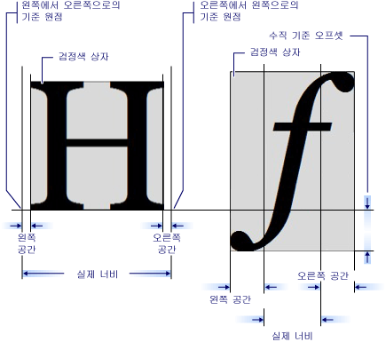

# GlyphRun 개체 및 Glyphs 요소 소개
이 항목에 설명 된 <xref:System.Windows.Media.GlyphRun> 개체 및 <xref:System.Windows.Documents.Glyphs> 요소입니다.  
  
   
  
   
## GlyphRun 소개  
 [!INCLUDE[TLA#tla_winclient](../../../../includes/tlasharptla-winclient-md.md)]직접 액세스 하 여 문자 모양 수준의 태그를 포함 하 여 고급 텍스트 지원을 제공 <xref:System.Windows.Documents.Glyphs> 가로채 고 포맷 한 후 텍스트를 유지 하려는 고객에 대 한 합니다. 이러한 기능은 중요 한 지원을 제공 다양 한 텍스트에 대 한 각각 다음과 같은 시나리오의 요구 사항을 렌더링 합니다.  
  
1.  고정 된 형식의 문서의 화면 표시 합니다.  
  
2.  시나리오를 인쇄 합니다.  
  
    -   [!INCLUDE[TLA#tla_xaml](../../../../includes/tlasharptla-xaml-md.md)]장치 프린터 언어로 합니다.  
  
    -   [!INCLUDE[TLA#tla_mxdw](../../../../includes/tlasharptla-mxdw-md.md)].  
  
    -   이전 프린터 드라이버에서 출력 [!INCLUDE[TLA#tla_win32](../../../../includes/tlasharptla-win32-md.md)] 고정된 형식으로 응용 프로그램입니다.  
  
    -   인쇄 스풀 형식입니다.  
  
3.  이전 버전의에 대 한 클라이언트를 포함 하는 고정 된 형식의 문서 표현 [!INCLUDE[TLA#tla_mswin](../../../../includes/tlasharptla-mswin-md.md)] 및 기타 컴퓨팅 장치입니다.  
  
> [!NOTE]
>  <xref:System.Windows.Documents.Glyphs> 및 <xref:System.Windows.Media.GlyphRun> 고정 형식 문서 표시 및 인쇄 시나리오에 대 한 설계 되었습니다.                      [!INCLUDE[TLA#tla_winclient](../../../../includes/tlasharptla-winclient-md.md)]일반 레이아웃에 대 한 몇 가지 요소를 제공 하 고 [!INCLUDE[TLA#tla_ui](../../../../includes/tlasharptla-ui-md.md)] 시나리오와 같은 <xref:System.Windows.Controls.Label> 및 <xref:System.Windows.Controls.TextBlock>합니다. 레이아웃에 대 한 자세한 내용은 및 [!INCLUDE[TLA2#tla_ui](../../../../includes/tla2sharptla-ui-md.md)] 시나리오 참조는 [WPF의 입력 체계](../../../../docs/framework/wpf/advanced/typography-in-wpf.md)합니다.  
  
   
## GlyphRun 개체  
 <xref:System.Windows.Media.GlyphRun> 개체의 단일 크기에서 단일 렌더링 스타일을 사용 하 여 단일 글꼴이에서 일련의 문자를 나타냅니다.  
  
 <xref:System.Windows.Media.GlyphRun> 문자 모양이 모두 글꼴 세부 정보 포함 <xref:System.Windows.Documents.Glyphs.Indices%2A> 및 개별 문자 모양 위치 합니다. 또한 원래 포함 [!INCLUDE[TLA#tla_unicode](../../../../includes/tlasharptla-unicode-md.md)] 코드 포인트를 문자-문자 모양 버퍼 오프셋된 매핑 정보 및 문자별 및 문자별 플래그에서 생성 된 합니다.  
  
 <xref:System.Windows.Media.GlyphRun> 는 해당 상위 수준 <xref:System.Windows.FrameworkElement>, <xref:System.Windows.Documents.Glyphs>합니다.                  <xref:System.Windows.Documents.Glyphs> 요소 트리 및 사용할 수 있습니다 [!INCLUDE[TLA2#tla_xaml](../../../../includes/tla2sharptla-xaml-md.md)] 나타내는 태그를 <xref:System.Windows.Media.GlyphRun> 출력 합니다.  
  
   
## Glyphs 요소  
 <xref:System.Windows.Documents.Glyphs> 요소의 출력을 보여는 <xref:System.Windows.Media.GlyphRun> 에서 [!INCLUDE[TLA2#tla_xaml](../../../../includes/tla2sharptla-xaml-md.md)]합니다. 다음 태그 구문 기술에 사용 되는 <xref:System.Windows.Documents.Glyphs> 요소입니다.  
  
 [!code-xml[GlyphsOvwSample1#1](../../../../samples/snippets/csharp/VS_Snippets_Wpf/GlyphsOvwSample1/CS/default.xaml#1)]  
  
 다음 속성 정의 샘플 태그에 있는 처음 네 개의 특성에 해당합니다.  
  
|속성|설명|  
|--------------|-----------------|  
|<xref:System.Windows.Documents.Glyphs.FontUri%2A>|리소스 식별자를 지정 합니다: 파일 이름, 웹 [!INCLUDE[TLA#tla_uri](../../../../includes/tlasharptla-uri-md.md)], 또는 응용 프로그램.exe 또는 컨테이너의 리소스 참조 합니다.|  
|<xref:System.Windows.Documents.Glyphs.FontRenderingEmSize%2A>|그리기 화면 단위로 (기본값은.&96; 인치)에서 글꼴 크기를 지정 합니다.|  
|<xref:System.Windows.Documents.Glyphs.StyleSimulations%2A>|굵게 및 기울임꼴 스타일에 대 한 플래그를 지정합니다.|  
|<xref:System.Windows.Documents.Glyphs.BidiLevel%2A>|양방향 레이아웃 수준을 지정합니다. 짝수 및&0; 값 권한도 왼쪽에서 오른쪽 레이아웃 홀수 번호 값 오른쪽에서 왼쪽 레이아웃을 의미 합니다.|  
  
   
### 인덱스 속성  
 <xref:System.Windows.Documents.Glyphs.Indices%2A> 속성은 문자 모양 사양의 문자열입니다. 단일 클러스터를 형성 하는 일련의 문자를 클러스터의 첫 번째 문자 모양 지정은 문자 모양의 개수 사양 및 코드 포인트는 결합 되어 클러스터 옵니다. <xref:System.Windows.Documents.Glyphs.Indices%2A> 속성은 다음과 같은 속성이 하나의 문자열에서 수집 합니다.  
  
-   문자 모양 인덱스  
  
-   문자 모양 실제 너비  
  
-   문자 모양 첨부 벡터를 결합합니다.  
  
-   문자 모양으로 코드 포인트의 클러스터 매핑  
  
-   문자 모양 플래그  
  
 각 문자 모양 사양의 형식은 다음과 같습니다.  
  
 `[GlyphIndex][,[Advance][,[uOffset][,[vOffset][,[Flags]]]]]`  
  
   
## 문자 모양 메트릭  
 각 문자 모양에는 다른 맞추는 방법을 지정 하는 메트릭을 정의 <xref:System.Windows.Documents.Glyphs>합니다. 다음 그림에는 두 개의 서로 다른 문자 모양 문자의 다양 한 입력 품질 정의합니다.  
  
   
  
   
## 태그 문자 모양  
 다음 코드 예제에서는 다양 한 속성을 사용 하는 방법을 보여 줍니다.는 <xref:System.Windows.Documents.Glyphs> 요소에 [!INCLUDE[TLA2#tla_xaml](../../../../includes/tla2sharptla-xaml-md.md)]합니다.  
  
 [!code-xml[GlyphsOvwSamp2#1](../../../../samples/snippets/csharp/VS_Snippets_Wpf/GlyphsOvwSamp2/CS/default.xaml#1)]  
  
## 참고 항목  
 [WPF의 입력 체계](../../../../docs/framework/wpf/advanced/typography-in-wpf.md)   
 [WPF의 문서](../../../../docs/framework/wpf/advanced/documents-in-wpf.md)   
 [텍스트](../../../../docs/framework/wpf/advanced/optimizing-performance-text.md)