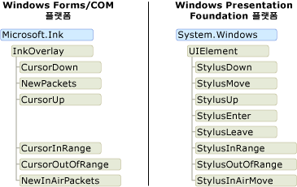

# 잉크 개체 모델: Windows Forms 및 COM과 WPF
디지털 잉크를 지원하는 세 가지 기본 플랫폼은 Tablet PC Windows Forms 플랫폼, Tablet PC COM 플랫폼 및 [!INCLUDE[TLA#tla_wpf](../../../../includes/tlasharptla-wpf-md.md)] 플랫폼입니다.  Windows Forms과 COM 플랫폼은 비슷한 개체 모델을 공유하지만 [!INCLUDE[TLA2#tla_wpf](../../../../includes/tla2sharptla-wpf-md.md)] 플랫폼의 개체 모델은 크게 다릅니다.  이 항목에서는 한 개체 모델로 오래 동안 작업해 온 개발자가 다른 개체 모델을 쉽게 이해할 수 있도록 이러한 차이점에 대해 개괄적으로 설명합니다.  
  
## 응용 프로그램에서 잉크 사용  
 세 플랫폼 모두 응용 프로그램에서 태블릿 펜의 입력을 받을 수 있게 해주는 개체와 컨트롤을 제공합니다.  Windows Forms 및 COM 플랫폼은 <xref:Microsoft.Ink.InkPicture>, <xref:Microsoft.Ink.InkEdit>, <xref:Microsoft.Ink.InkOverlay> 및 <xref:Microsoft.Ink.InkCollector> 클래스를 제공합니다.  <xref:Microsoft.Ink.InkPicture> 및 <xref:Microsoft.Ink.InkEdit>는 잉크를 수집하기 위해 응용 프로그램에 추가할 수 있는 컨트롤입니다.  <xref:Microsoft.Ink.InkOverlay> 및 <xref:Microsoft.Ink.InkCollector>는 창과 사용자 지정 컨트롤에서 잉크를 지원하도록 기존 창에 연결할 수 있습니다.  
  
 WPF 플랫폼에는 <xref:System.Windows.Controls.InkCanvas> 컨트롤이 포함되어 있습니다.  응용 프로그램에 <xref:System.Windows.Controls.InkCanvas>를 추가한 후 즉시 잉크 수집을 시작할 수 있습니다.  <xref:System.Windows.Controls.InkCanvas>를 사용하면 사용자가 잉크를 복사하고, 선택하고, 크기를 조정할 수 있습니다.  <xref:System.Windows.Controls.InkCanvas>에 다른 컨트롤을 추가할 수 있으며, 사용자가 이러한 컨트롤에 필기 입력을 할 수도 있습니다.  컨트롤에 <xref:System.Windows.Controls.InkPresenter>를 추가하고 해당 스타일러스 포인트를 수집하여 잉크 지원 사용자 지정 컨트롤을 만들 수 있습니다.  
  
 다음 표에는 응용 프로그램에서 잉크를 사용하기 위한 자세한 정보를 제공하는 링크가 나와 있습니다.  
  
|수행할 작업|WPF 플랫폼|Windows Forms\/COM 플랫폼|  
|------------|-------------|----------------------------|  
|응용 프로그램에 잉크 지원 컨트롤 추가|[잉크 시작](../../../../docs/framework/wpf/advanced/getting-started-with-ink.md)를 참조하십시오.|[Auto Claims Form Sample](http://msdn.microsoft.com/ko-kr/bec4333a-62ca-4254-a39b-04bc2c556992)을 참조하십시오.|  
|사용자 지정 컨트롤에서 잉크 사용|[잉크 입력 컨트롤 만들기](../../../../docs/framework/wpf/advanced/creating-an-ink-input-control.md)를 참조하십시오.|[Ink Clipboard Sample](http://msdn.microsoft.com/ko-kr/a0c42f1c-543d-44f8-83d9-fe810de410ff)를 참조하십시오.|  
  
## 잉크 데이터  
 Windows Forms 및 COM 플랫폼에서는 <xref:Microsoft.Ink.InkCollector>, <xref:Microsoft.Ink.InkOverlay>, <xref:Microsoft.Ink.InkEdit> 및 <xref:Microsoft.Ink.InkPicture>가 <xref:Microsoft.Ink.Ink?displayProperty=fullName> 개체를 각각 노출합니다.  <xref:Microsoft.Ink.Ink> 개체는 하나 이상의 <xref:Microsoft.Ink.Stroke?displayProperty=fullName> 개체에 대한 데이터를 포함하고 있으며 이러한 스트로크를 관리하고 조작하기 위한 공통 메서드와 속성을 노출합니다.  <xref:Microsoft.Ink.Ink> 개체는 개체에 포함된 스트로크의 수명을 관리합니다. 즉, <xref:Microsoft.Ink.Ink> 개체는 자신이 소유하는 스트로크를 만들고 삭제합니다.  각 <xref:Microsoft.Ink.Stroke>에는 해당 부모 <xref:Microsoft.Ink.Ink> 개체 내에서 고유한 식별자가 있습니다.  
  
 WPF 플랫폼에서는 <xref:System.Windows.Ink.Stroke?displayProperty=fullName> 클래스가 고유의 수명을 가지며 이를 관리합니다.  잉크 적중 테스트, 삭제, 변환, serialize 등의 일반적인 잉크 데이터 관리 작업을 수행할 수 있는 메서드를 제공하는 <xref:System.Windows.Ink.StrokeCollection>에 <xref:System.Windows.Ink.Stroke> 개체의 그룹을 수집할 수 있습니다.  <xref:System.Windows.Ink.Stroke>는 특정 시점에서 0개, 한 개 또는 두 개 이상의 <xref:System.Windows.Ink.StrokeCollection> 개체에 속할 수 있습니다.  <xref:System.Windows.Controls.InkCanvas> 및 <xref:System.Windows.Controls.InkPresenter>에는 <xref:Microsoft.Ink.Ink?displayProperty=fullName> 개체 대신 <xref:System.Windows.Ink.StrokeCollection?displayProperty=fullName>이 들어 있습니다.  
  
 다음 두 그림에서는 두 잉크 데이터 개체 모델을 비교합니다.  Windows Forms 및 COM 플랫폼에서는 <xref:Microsoft.Ink.Ink?displayProperty=fullName> 개체가 <xref:Microsoft.Ink.Stroke?displayProperty=fullName> 개체의 수명을 제한하며 스타일러스 패킷이 개별 스트로크에 속합니다.  다음 그림과 같이 둘 이상의 스트로크가 동일한 <xref:Microsoft.Ink.DrawingAttributes?displayProperty=fullName> 개체를 참조할 수 있습니다.  
  
   
  
 [!INCLUDE[TLA2#tla_winclient](../../../../includes/tla2sharptla-winclient-md.md)]에서 각 <xref:System.Windows.Ink.Stroke?displayProperty=fullName>는 이를 참조하는 항목이 있는 한 계속 유지되는 공용 언어 런타임 개체입니다.  각 <xref:System.Windows.Ink.Stroke>는 <xref:System.Windows.Input.StylusPointCollection> 및 <xref:System.Windows.Ink.DrawingAttributes?displayProperty=fullName> 개체를 참조하며 이러한 개체도 공용 언어 런타임 개체입니다.  
  
   
  
 다음 표에서는 [!INCLUDE[TLA2#tla_wpf](../../../../includes/tla2sharptla-wpf-md.md)] 플랫폼과 Windows Forms 및 COM 플랫폼에서 몇 가지 일반적인 작업을 수행하는 방법을 비교해서 보여 줍니다.  
  
|Task|Windows Presentation Foundation|Windows Forms 및 COM|  
|----------|-------------------------------------|-------------------------|  
|잉크 저장|<xref:System.Windows.Ink.StrokeCollection.Save%2A>|<xref:Microsoft.Ink.Ink.Save%2A>|  
|잉크 로드|<xref:System.Windows.Ink.StrokeCollection.%23ctor%28System.IO.Stream%29?displayProperty=fullName> 생성자를 사용하여 <xref:System.Windows.Ink.StrokeCollection>을 만듭니다.|[M:Microsoft.Ink.Ink.Load\(System.Byte\<xref:Microsoft.Ink.Ink.Load%2A>|  
|적중 테스트|<xref:System.Windows.Ink.StrokeCollection.HitTest%2A>|<xref:Microsoft.Ink.Ink.HitTest%2A>|  
|잉크 복사|<xref:System.Windows.Controls.InkCanvas.CopySelection%2A>|<xref:Microsoft.Ink.Ink.ClipboardCopy%2A>|  
|잉크 붙여넣기|<xref:System.Windows.Controls.InkCanvas.Paste%2A>|<xref:Microsoft.Ink.Ink.ClipboardPaste%2A>|  
|스트로크 컬렉션의 사용자 지정 속성에 액세스|<xref:System.Windows.Ink.StrokeCollection.AddPropertyData%2A>\(속성이 내부에 저장되며 <xref:System.Windows.Ink.StrokeCollection.AddPropertyData%2A>, <xref:System.Windows.Ink.StrokeCollection.RemovePropertyData%2A> 및 <xref:System.Windows.Ink.StrokeCollection.ContainsPropertyData%2A>를 통해 액세스됨\)|<xref:Microsoft.Ink.Ink.ExtendedProperties%2A> 사용|  
  
### 플랫폼 간 잉크 공유  
 플랫폼마다 잉크 데이터의 개체 모델이 다르지만 플랫폼 간에 데이터를 쉽게 공유할 수 있습니다.  다음 예제에서는 Windows Forms 응용 프로그램의 잉크를 저장하여 Windows Presentation Foundation 응용 프로그램에 로드합니다.  
  
 [!code-csharp[WinFormWPFInk#UsingWinforms](../../../../samples/snippets/csharp/VS_Snippets_Wpf/WinformWPFInk/CSharp/Program.cs#usingwinforms)]
 [!code-vb[WinFormWPFInk#UsingWinforms](../../../../samples/snippets/visualbasic/VS_Snippets_Wpf/WinformWPFInk/VisualBasic/Module1.vb#usingwinforms)]  
[!code-csharp[WinFormWPFInk#SaveWinforms](../../../../samples/snippets/csharp/VS_Snippets_Wpf/WinformWPFInk/CSharp/Program.cs#savewinforms)]
[!code-vb[WinFormWPFInk#SaveWinforms](../../../../samples/snippets/visualbasic/VS_Snippets_Wpf/WinformWPFInk/VisualBasic/Module1.vb#savewinforms)]  
  
 [!code-csharp[WinFormWPFInk#UsingWPF](../../../../samples/snippets/csharp/VS_Snippets_Wpf/WinformWPFInk/CSharp/Program.cs#usingwpf)]
 [!code-vb[WinFormWPFInk#UsingWPF](../../../../samples/snippets/visualbasic/VS_Snippets_Wpf/WinformWPFInk/VisualBasic/Module1.vb#usingwpf)]  
[!code-csharp[WinFormWPFInk#LoadWPF](../../../../samples/snippets/csharp/VS_Snippets_Wpf/WinformWPFInk/CSharp/Program.cs#loadwpf)]
[!code-vb[WinFormWPFInk#LoadWPF](../../../../samples/snippets/visualbasic/VS_Snippets_Wpf/WinformWPFInk/VisualBasic/Module1.vb#loadwpf)]  
  
 다음 예제에서는 Windows Presentation Foundation 응용 프로그램의 잉크를 저장하여 Windows Forms 응용 프로그램에 로드합니다.  
  
 [!code-csharp[WinFormWPFInk#UsingWPF](../../../../samples/snippets/csharp/VS_Snippets_Wpf/WinformWPFInk/CSharp/Program.cs#usingwpf)]
 [!code-vb[WinFormWPFInk#UsingWPF](../../../../samples/snippets/visualbasic/VS_Snippets_Wpf/WinformWPFInk/VisualBasic/Module1.vb#usingwpf)]  
[!code-csharp[WinFormWPFInk#SaveWPF](../../../../samples/snippets/csharp/VS_Snippets_Wpf/WinformWPFInk/CSharp/Program.cs#savewpf)]
[!code-vb[WinFormWPFInk#SaveWPF](../../../../samples/snippets/visualbasic/VS_Snippets_Wpf/WinformWPFInk/VisualBasic/Module1.vb#savewpf)]  
  
 [!code-csharp[WinFormWPFInk#UsingWinforms](../../../../samples/snippets/csharp/VS_Snippets_Wpf/WinformWPFInk/CSharp/Program.cs#usingwinforms)]
 [!code-vb[WinFormWPFInk#UsingWinforms](../../../../samples/snippets/visualbasic/VS_Snippets_Wpf/WinformWPFInk/VisualBasic/Module1.vb#usingwinforms)]  
[!code-csharp[WinFormWPFInk#LoadWinforms](../../../../samples/snippets/csharp/VS_Snippets_Wpf/WinformWPFInk/CSharp/Program.cs#loadwinforms)]
[!code-vb[WinFormWPFInk#LoadWinforms](../../../../samples/snippets/visualbasic/VS_Snippets_Wpf/WinformWPFInk/VisualBasic/Module1.vb#loadwinforms)]  
  
## 태블릿 펜의 이벤트  
 Windows Forms 및 COM 플랫폼의 <xref:Microsoft.Ink.InkOverlay>, <xref:Microsoft.Ink.InkCollector> 및 <xref:Microsoft.Ink.InkPicture>는 사용자가 펜 데이터를 입력할 때 이벤트를 수신합니다.  <xref:Microsoft.Ink.InkOverlay>나 <xref:Microsoft.Ink.InkCollector>는 창이나 컨트롤에 연결할 수 있으며 태블릿 입력 데이터가 발생시킨 이벤트를 구독할 수 있습니다.  이러한 이벤트가 발생하는 스레드는 펜, 마우스 또는 프로그래밍 방식 중 어떤 것을 통해 이벤트가 발생되었는지에 따라 다릅니다.  이러한 이벤트와 관련된 스레딩에 대한 자세한 내용은 [General Threading Considerations](http://msdn.microsoft.com/ko-kr/cf35724f-5f80-4b3e-992a-a9d5ea99aae9) 및 [Threads on Which an Event Can Fire](http://msdn.microsoft.com/ko-kr/d1a5ab9b-d474-4ed7-9aa8-b5bdb771934f)를 참조하십시오.  
  
 Windows Presentation Foundation 플랫폼에서 <xref:System.Windows.UIElement> 클래스에는 펜 입력과 관련된 이벤트가 있습니다.  즉, 모든 컨트롤이 전체 스타일러스 이벤트 집합을 노출합니다.  스타일러스 이벤트는 터널링\/버블링 이벤트 쌍을 갖고 있으며 항상 응용 프로그램 스레드에서 발생합니다.  자세한 내용은 [라우트된 이벤트 개요](../../../../docs/framework/wpf/advanced/routed-events-overview.md)를 참조하십시오.  
  
 다음 다이어그램에서는 스타일러스 이벤트를 발생시키는 클래스의 개체 모델을 비교해서 보여 줍니다.  Windows Presentation Foundation 개체 모델은 버블링 이벤트만 보여 주고 해당 터널링 이벤트는 보여 주지 않습니다.  
  
   
  
## 펜 데이터  
 세 플랫폼 모두 태블릿 펜에서 나오는 데이터를 가로채서 조작할 수 있는 방법을 제공합니다.  Windows Forms 및 COM 플랫폼에서는 <xref:Microsoft.StylusInput.RealTimeStylus>를 만들어 여기에 창이나 컨트롤을 연결하고 <xref:Microsoft.StylusInput.IStylusSyncPlugin> 또는 <xref:Microsoft.StylusInput.IStylusAsyncPlugin> 인터페이스를 구현하는 클래스를 만들면 됩니다.  그러면 사용자 지정 플러그 인이 <xref:Microsoft.StylusInput.RealTimeStylus>의 플러그 인 컬렉션에 추가됩니다.  이 개체 모델에 대한 자세한 내용은 [Architecture of the StylusInput APIs](http://msdn.microsoft.com/ko-kr/88bab0ab-df9f-4813-9a9f-9a137813f0b4)를 참조하십시오.  
  
 [!INCLUDE[TLA2#tla_wpf](../../../../includes/tla2sharptla-wpf-md.md)] 플랫폼에서는 <xref:System.Windows.UIElement> 클래스가 플러그 인 컬렉션을 노출하며 이 컬렉션은 디자인이 <xref:Microsoft.StylusInput.RealTimeStylus>와 비슷합니다.  펜 데이터를 가로채려면 <xref:System.Windows.Input.StylusPlugIns.StylusPlugIn>에서 상속되는 클래스를 만든 다음 <xref:System.Windows.UIElement>의 <xref:System.Windows.UIElement.StylusPlugIns%2A> 컬렉션에 해당 개체를 추가합니다.  이 작업에 대한 자세한 내용은 [스타일러스에서 입력 가로채기](../../../../docs/framework/wpf/advanced/intercepting-input-from-the-stylus.md)를 참조하십시오.  
  
 어떤 플랫폼에서든 스레드 풀이 스타일러스 이벤트를 통해 잉크 데이터를 수신한 다음 이를 응용 프로그램 스레드에 전송합니다.  COM 및 Windows 플랫폼의 스레딩에 대한 자세한 내용은 [Threading Considerations for the StylusInput APIs](http://msdn.microsoft.com/ko-kr/5d98768a-c60b-4bb0-8640-9bf38254d41f)를 참조하십시오.  Windows Presentation 소프트웨어의 스레딩에 대한 자세한 내용은 [잉크 스레딩 모델](../../../../docs/framework/wpf/advanced/the-ink-threading-model.md)을 참조하십시오.  
  
 다음 그림에서는 펜 스레드 풀에서 펜 데이터를 수신하는 클래스의 개체 모델을 비교해서 보여 줍니다.  
  
 