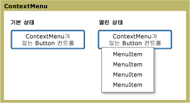

# ContextMenu
<xref:System.Windows.Controls.ContextMenu>를 사용하면 컨트롤의 컨텍스트와 관련된 <xref:System.Windows.Controls.Menu>를 표시할 수 있습니다.  일반적으로 <xref:System.Windows.Controls.ContextMenu>는 마우스 오른쪽 단추나 키보드 메뉴 단추를 통해 [!INCLUDE[TLA#tla_ui](../../../../includes/tlasharptla-ui-md.md)]로 노출됩니다.  
  
 다음 그림에서는 <xref:System.Windows.Controls.ContextMenu>의 두 가지 상태인 기본 상태와 열린 상태를 보여 줍니다.  기본 상태에서는 컨트롤이 축소됩니다.  메뉴의 상위 항목에서 마우스 오른쪽 단추를 누르면 컨트롤이 확장되고 메뉴 항목이 표시됩니다.  
  
   
여러 가지 상태의 ContextMenu  
  
## 단원 내용  
 [ContextMenu 개요](../../../../docs/framework/wpf/controls/contextmenu-overview.md)  
  
## 참조  
 <xref:System.Windows.Controls.ContextMenu>  
  
## 관련 단원