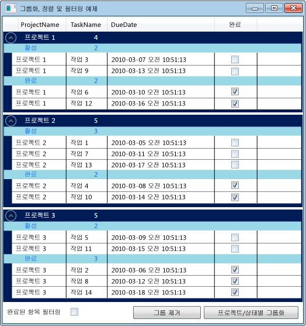

# 방법: DataGrid 컨트롤에서 데이터 그룹화, 정렬 및 필터링

데이터를 그룹화, 정렬 및 필터링 하 여 다양 한 방법으로 <xref:System.Windows.Controls.DataGrid>의 데이터를 보는 것이 유용한 경우가 많습니다. <xref:System.Windows.Controls.DataGrid>에서 데이터를 그룹화, 정렬 및 필터링 하려면 이러한 함수를 지 원하는 <xref:System.Windows.Data.CollectionView>에 바인딩합니다. 그런 다음 기본 원본 데이터에 영향을 주지 않고 <xref:System.Windows.Data.CollectionView>의 데이터로 작업할 수 있습니다. 컬렉션 뷰의 변경 내용은 UI (<xref:System.Windows.Controls.DataGrid> 사용자 인터페이스)에 반영 됩니다.

<xref:System.Windows.Data.CollectionView> 클래스는 <xref:System.Collections.IEnumerable> 인터페이스를 구현 하는 데이터 소스에 대 한 그룹화 및 정렬 기능을 제공 합니다. <xref:System.Windows.Data.CollectionViewSource> 클래스를 사용 하 여 XAML에서 <xref:System.Windows.Data.CollectionView> 속성을 설정할 수 있습니다.

이 예제에서는 `Task` 개체의 컬렉션이 <xref:System.Windows.Data.CollectionViewSource>에 바인딩되어 있습니다. <xref:System.Windows.Data.CollectionViewSource>는 <xref:System.Windows.Controls.DataGrid>에 대 한 <xref:System.Windows.Controls.ItemsControl.ItemsSource%2A>으로 사용 됩니다. 그룹화, 정렬 및 필터링은 <xref:System.Windows.Data.CollectionViewSource>에서 수행 되며 <xref:System.Windows.Controls.DataGrid> UI에 표시 됩니다.

 DataGrid의 그룹화 된 데이터

## System.windows.controls.itemscontrol.itemssource로 CollectionViewSource 사용

<xref:System.Windows.Controls.DataGrid> 컨트롤에서 데이터를 그룹화, 정렬 및 필터링 하려면 이러한 함수를 지 원하는 <xref:System.Windows.Data.CollectionView>에 <xref:System.Windows.Controls.DataGrid>를 바인딩합니다. 이 예제에서 <xref:System.Windows.Controls.DataGrid>는 `Task` 개체의 <xref:System.Collections.Generic.List%601>에 대해 이러한 함수를 제공 하는 <xref:System.Windows.Data.CollectionViewSource>에 바인딩되어 있습니다.

### CollectionViewSource에 DataGrid를 바인딩하려면

1. <xref:System.Collections.IEnumerable> 인터페이스를 구현 하는 데이터 컬렉션을 만듭니다.

    <xref:System.Collections.Generic.List%601>를 사용 하 여 컬렉션을 만드는 경우 <xref:System.Collections.Generic.List%601>인스턴스를 인스턴스화하는 대신 <xref:System.Collections.Generic.List%601>에서 상속 되는 새 클래스를 만들어야 합니다. 이렇게 하면 XAML에서 컬렉션에 데이터 바인딩할 수 있습니다.

    > [!NOTE]
    > <xref:System.Windows.Controls.DataGrid> 속성 변경 및 편집에 올바르게 응답 하려면 컬렉션의 개체 <xref:System.ComponentModel.INotifyPropertyChanged> 변경 된 인터페이스 및 <xref:System.ComponentModel.IEditableObject> 인터페이스를 구현 해야 합니다. 자세한 내용은 [속성 변경 알림 구현](../data/how-to-implement-property-change-notification.md)을 참조하세요.

    [!code-csharp[DataGrid_GroupSortFilter#101](~/samples/snippets/csharp/VS_Snippets_Wpf/DataGrid_GroupSortFilter/CS/MainWindow.xaml.cs#101)]
    [!code-vb[DataGrid_GroupSortFilter#101](~/samples/snippets/visualbasic/VS_Snippets_Wpf/DataGrid_GroupSortFilter/VB/MainWindow.xaml.vb#101)]

2. XAML에서 컬렉션 클래스의 인스턴스를 만들고 [X:Key 지시어](../../xaml-services/x-key-directive.md)를 설정 합니다.

3. XAML에서 <xref:System.Windows.Data.CollectionViewSource> 클래스의 인스턴스를 만들고, [X:Key 지시어](../../xaml-services/x-key-directive.md)를 설정 하 고, 컬렉션 클래스의 인스턴스를 <xref:System.Windows.Data.CollectionViewSource.Source%2A>로 설정 합니다.

    [!code-xaml[DataGrid_GroupSortFilter#201](~/samples/snippets/csharp/VS_Snippets_Wpf/DataGrid_GroupSortFilter/CS/WindowSnips1.xaml#201)]

4. <xref:System.Windows.Controls.DataGrid> 클래스의 인스턴스를 만들고 <xref:System.Windows.Controls.ItemsControl.ItemsSource%2A> 속성을 <xref:System.Windows.Data.CollectionViewSource>로 설정 합니다.

    [!code-xaml[DataGrid_GroupSortFilter#002](~/samples/snippets/csharp/VS_Snippets_Wpf/DataGrid_GroupSortFilter/CS/MainWindow.xaml#002)]

5. 코드에서 <xref:System.Windows.Data.CollectionViewSource>에 액세스 하려면 <xref:System.Windows.Data.CollectionViewSource.GetDefaultView%2A> 메서드를 사용 하 여 <xref:System.Windows.Data.CollectionViewSource>에 대 한 참조를 가져옵니다.

    [!code-csharp[DataGrid_GroupSortFilter#102](~/samples/snippets/csharp/VS_Snippets_Wpf/DataGrid_GroupSortFilter/CS/MainWindow.xaml.cs#102)]
    [!code-vb[DataGrid_GroupSortFilter#102](~/samples/snippets/visualbasic/VS_Snippets_Wpf/DataGrid_GroupSortFilter/VB/MainWindow.xaml.vb#102)]

## DataGrid에서 항목 그룹화

<xref:System.Windows.Controls.DataGrid>에서 항목을 그룹화 하는 방법을 지정 하려면 <xref:System.Windows.Data.PropertyGroupDescription> 유형을 사용 하 여 원본 뷰의 항목을 그룹화 합니다.

### XAML을 사용 하 여 DataGrid에서 항목을 그룹화 하려면

1. 그룹화 할 속성을 지정 하는 <xref:System.Windows.Data.PropertyGroupDescription>을 만듭니다. XAML 또는 코드에서 속성을 지정할 수 있습니다.

   1. XAML에서 <xref:System.Windows.Data.PropertyGroupDescription.PropertyName%2A>를 group by 속성의 이름으로 설정 합니다.

   2. 코드에서 그룹화 할 속성의 이름을 생성자에 전달 합니다.

2. <xref:System.Windows.Data.CollectionViewSource.GroupDescriptions%2A?displayProperty=nameWithType> 컬렉션에 <xref:System.Windows.Data.PropertyGroupDescription>를 추가 합니다.

3. <xref:System.Windows.Data.CollectionViewSource.GroupDescriptions%2A> 컬렉션에 <xref:System.Windows.Data.PropertyGroupDescription>의 추가 인스턴스를 추가 하 여 그룹화 수준을 더 추가 합니다.

    [!code-xaml[DataGrid_GroupSortFilter#012](~/samples/snippets/csharp/VS_Snippets_Wpf/DataGrid_GroupSortFilter/CS/MainWindow.xaml#012)]
    [!code-csharp[DataGrid_GroupSortFilter#112](~/samples/snippets/csharp/VS_Snippets_Wpf/DataGrid_GroupSortFilter/CS/MainWindow.xaml.cs#112)]
    [!code-vb[DataGrid_GroupSortFilter#112](~/samples/snippets/visualbasic/VS_Snippets_Wpf/DataGrid_GroupSortFilter/VB/MainWindow.xaml.vb#112)]

4. 그룹을 제거 하려면 <xref:System.Windows.Data.CollectionViewSource.GroupDescriptions%2A> 컬렉션에서 <xref:System.Windows.Data.PropertyGroupDescription>을 제거 합니다.

5. 모든 그룹을 제거 하려면 <xref:System.Windows.Data.CollectionViewSource.GroupDescriptions%2A> 컬렉션의 <xref:System.Collections.ObjectModel.Collection%601.Clear%2A> 메서드를 호출 합니다.

    [!code-csharp[DataGrid_GroupSortFilter#114](~/samples/snippets/csharp/VS_Snippets_Wpf/DataGrid_GroupSortFilter/CS/MainWindow.xaml.cs#114)]
    [!code-vb[DataGrid_GroupSortFilter#114](~/samples/snippets/visualbasic/VS_Snippets_Wpf/DataGrid_GroupSortFilter/VB/MainWindow.xaml.vb#114)]

항목이 <xref:System.Windows.Controls.DataGrid>그룹화 되 면 각 그룹의 모양을 지정 하는 <xref:System.Windows.Controls.GroupStyle>를 정의할 수 있습니다. <xref:System.Windows.Controls.GroupStyle> DataGrid의 <xref:System.Windows.Controls.ItemsControl.GroupStyle%2A> 컬렉션에 추가 하 여이를 적용 합니다. 그룹화 수준이 여러 개인 경우 각 그룹 수준에 다른 스타일을 적용할 수 있습니다. 스타일은 정의 된 순서 대로 적용 됩니다. 예를 들어 두 스타일을 정의 하는 경우 첫 번째이 최상위 행 그룹에 적용 됩니다. 두 번째 스타일은 두 번째 수준 이하의 모든 행 그룹에 적용 됩니다. <xref:System.Windows.Controls.GroupStyle> <xref:System.Windows.FrameworkElement.DataContext%2A>는 그룹이 나타내는 <xref:System.Windows.Data.CollectionViewGroup>입니다.

### 행 그룹 머리글의 모양을 변경 하려면

1. 행 그룹의 모양을 정의 하는 <xref:System.Windows.Controls.GroupStyle>을 만듭니다.

2. <xref:System.Windows.Controls.GroupStyle>를 `<DataGrid.GroupStyle>` 태그 안에 배치 합니다.

    [!code-xaml[DataGrid_GroupSortFilter#003](~/samples/snippets/csharp/VS_Snippets_Wpf/DataGrid_GroupSortFilter/CS/MainWindow.xaml#003)]

## DataGrid에서 항목 정렬

<xref:System.Windows.Controls.DataGrid>에서 항목을 정렬 하는 방법을 지정 하려면 <xref:System.ComponentModel.SortDescription> 유형을 사용 하 여 소스 뷰의 항목을 정렬 합니다.

### DataGrid에서 항목을 정렬 하려면

1. 정렬할 속성을 지정 하는 <xref:System.ComponentModel.SortDescription>을 만듭니다. XAML 또는 코드에서 속성을 지정할 수 있습니다.

    1. XAML에서 <xref:System.ComponentModel.SortDescription.PropertyName%2A>를 정렬할 속성의 이름으로 설정 합니다.

    2. 코드에서 정렬할 속성의 이름과 생성자에 <xref:System.ComponentModel.ListSortDirection>를 전달 합니다.

2. <xref:System.Windows.Data.CollectionViewSource.SortDescriptions%2A?displayProperty=nameWithType> 컬렉션에 <xref:System.ComponentModel.SortDescription>를 추가 합니다.

3. 추가 속성을 기준으로 정렬 하려면 <xref:System.ComponentModel.SortDescription>의 인스턴스를 <xref:System.Windows.Data.CollectionViewSource.SortDescriptions%2A> 컬렉션에 추가 합니다.

    [!code-xaml[DataGrid_GroupSortFilter#011](~/samples/snippets/csharp/VS_Snippets_Wpf/DataGrid_GroupSortFilter/CS/MainWindow.xaml#011)]
    [!code-csharp[DataGrid_GroupSortFilter#211](~/samples/snippets/csharp/VS_Snippets_Wpf/DataGrid_GroupSortFilter/CS/WindowSnips1.xaml.cs#211)]
    [!code-vb[DataGrid_GroupSortFilter#211](~/samples/snippets/visualbasic/VS_Snippets_Wpf/DataGrid_GroupSortFilter/VB/MainWindow.xaml.vb#211)]

## DataGrid에서 항목 필터링

<xref:System.Windows.Data.CollectionViewSource>를 사용 하 여 <xref:System.Windows.Controls.DataGrid>에서 항목을 필터링 하려면 <xref:System.Windows.Data.CollectionViewSource.Filter?displayProperty=nameWithType> 이벤트에 대 한 처리기에 필터링 논리를 제공 합니다.

### DataGrid에서 항목을 필터링 하려면

1. <xref:System.Windows.Data.CollectionViewSource.Filter?displayProperty=nameWithType> 이벤트에 대 한 처리기를 추가 합니다.

2. <xref:System.Windows.Data.CollectionViewSource.Filter> 이벤트 처리기에서 필터링 논리를 정의 합니다.

    뷰를 새로 고칠 때마다 필터가 적용 됩니다.

    [!code-xaml[DataGrid_GroupSortFilter#013](~/samples/snippets/csharp/VS_Snippets_Wpf/DataGrid_GroupSortFilter/CS/MainWindow.xaml#013)]
    [!code-csharp[DataGrid_GroupSortFilter#113](~/samples/snippets/csharp/VS_Snippets_Wpf/DataGrid_GroupSortFilter/CS/MainWindow.xaml.cs#113)]
    [!code-vb[DataGrid_GroupSortFilter#113](~/samples/snippets/visualbasic/VS_Snippets_Wpf/DataGrid_GroupSortFilter/VB/MainWindow.xaml.vb#113)]

또는 필터링 논리를 제공 하는 메서드를 만들고 <xref:System.Windows.Data.CollectionView.Filter%2A?displayProperty=nameWithType> 속성을 설정 하 여 필터를 적용 하 여 <xref:System.Windows.Controls.DataGrid>에서 항목을 필터링 할 수 있습니다. 이 메서드의 예를 보려면 [뷰에서 데이터 필터링](../data/how-to-filter-data-in-a-view.md)을 참조 하세요.

## 예제

다음 예에서는 <xref:System.Windows.Data.CollectionViewSource>에서 `Task` 데이터를 그룹화, 정렬 및 필터링 하 고 <xref:System.Windows.Controls.DataGrid>에서 그룹화, 정렬 및 필터링 된 `Task` 데이터를 표시 하는 방법을 보여 줍니다. <xref:System.Windows.Data.CollectionViewSource>는 <xref:System.Windows.Controls.DataGrid>에 대 한 <xref:System.Windows.Controls.ItemsControl.ItemsSource%2A>으로 사용 됩니다. 그룹화, 정렬 및 필터링은 <xref:System.Windows.Data.CollectionViewSource>에서 수행 되며 <xref:System.Windows.Controls.DataGrid> UI에 표시 됩니다.

이 예를 테스트 하려면 프로젝트 이름과 일치 하도록 DGGroupSortFilterExample 이름을 조정 해야 합니다. Visual Basic를 사용 하는 경우 <xref:System.Windows.Window>의 클래스 이름을 다음과 같이 변경 해야 합니다.

`<Window x:Class="MainWindow"`

[!code-xaml[DataGrid_GroupSortFilter#000](~/samples/snippets/csharp/VS_Snippets_Wpf/DataGrid_GroupSortFilter/CS/MainWindow.xaml#000)]
[!code-csharp[DataGrid_GroupSortFilter#100](~/samples/snippets/csharp/VS_Snippets_Wpf/DataGrid_GroupSortFilter/CS/MainWindow.xaml.cs#100)]
[!code-vb[DataGrid_GroupSortFilter#100](~/samples/snippets/visualbasic/VS_Snippets_Wpf/DataGrid_GroupSortFilter/VB/MainWindow.xaml.vb#100)]

## 참조

- [데이터 바인딩 개요](../../../desktop-wpf/data/data-binding-overview.md)
- [ObservableCollection 만들기 및 바인딩](../data/how-to-create-and-bind-to-an-observablecollection.md)
- [뷰에서 데이터 필터링](../data/how-to-filter-data-in-a-view.md)
- [뷰의 데이터 정렬](../data/how-to-sort-data-in-a-view.md)
- [XAML 데이터 정렬 및 그룹화](../data/how-to-sort-and-group-data-using-a-view-in-xaml.md)
