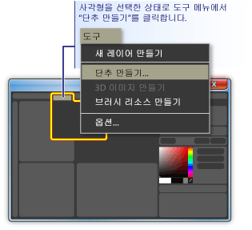
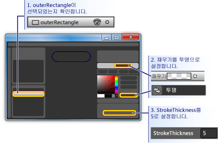
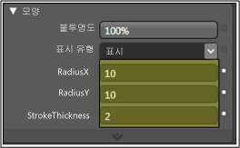

# 연습: Microsoft Expression Blend를 사용하여 단추 만들기
이 연습 단계를 만드는 과정을 안내는 [!INCLUDE[TLA2#tla_wpf](../../../../includes/tla2sharptla-wpf-md.md)] Microsoft Expression Blend를 사용 하 여 사용자 지정 된 단추입니다.  
  
> [!IMPORTANT]
>  Microsoft Expression Blend를 생성 하 여 작동 [!INCLUDE[TLA#tla_xaml](../../../../includes/tlasharptla-xaml-md.md)] 실행 프로그램을 확인 한 다음 컴파일됩니다입니다. 하면 사용 하려는 경우 [!INCLUDE[TLA#tla_xaml](../../../../includes/tlasharptla-xaml-md.md)] 를 직접는이 수행 하 여와 같은 응용 프로그램을 만드는 다른 연습을 [!INCLUDE[TLA#tla_xaml](../../../../includes/tlasharptla-xaml-md.md)] 와 [!INCLUDE[vs_current_short](../../../../includes/vs-current-short-md.md)] Blend 대신 합니다. 참조 [xaml을 사용 하 여 단추 만들기](../../../../docs/framework/wpf/controls/walkthrough-create-a-button-by-using-xaml.md) 자세한 정보에 대 한 합니다.  
  
 다음 그림 만들기는 사용자 지정된 단추를 보여 줍니다.  
  
   
  
## 도형을 단추로 변환  
 이 연습의 첫 번째 부분에서 사용자 지정 모양을 사용자 지정 단추를 만듭니다. 이 수행 하려면 먼저를 단추에는 사각형을 변환 합니다. 다음 추가 셰이프를 추가 단추를 템플릿에 더 복잡 한 모양의 단추를 만듭니다. 일반 단추로 시작 하 고 사용자 지정할 수 없습니까? 단추에 필요 하지 않은; 기본 제공 기능이 있기 때문에 사용자 지정 단추에 대 한 사각형을 시작 하려면 쉽습니다.  
  
#### Expression Blend에서 새 프로젝트를 만들려면  
  
1.  Expression Blend를 시작 합니다. (클릭 **시작**, 가리킨 **모든 프로그램**, 가리킨 **Microsoft 식**, 클릭 하 고 **Microsoft Expression Blend**.)  
  
2.  필요한 경우 응용 프로그램을 최대화 합니다.  
  
3.  **파일** 메뉴에서 **새 프로젝트**를 클릭합니다.  
  
4.  선택 **표준 응용 프로그램 (.exe)**합니다.  
  
5.  프로젝트 이름을 `CustomButton` 누릅니다 **확인**합니다.  
  
 이 시점에서 비어 있는 [!INCLUDE[TLA2#tla_wpf](../../../../includes/tla2sharptla-wpf-md.md)] 프로젝트. F5 키를 눌러 응용 프로그램을 실행할 수 있습니다. 예상 대로 응용 프로그램 빈 창이 이루어져 있습니다. 다음으로, 모서리가 둥근된 사각형을 만들고 단추로 변환 합니다.  
  
#### 단추에 사각형을 변환 하려면  
  
1.  **창 배경 속성 검정색으로 설정:** 창을 선택를 클릭는 **속성 탭**를 설정 하 고는 <xref:System.Windows.Controls.Control.Background%2A> 속성을 `Black`합니다.  
  
       
  
2.  **창에 있는 단추의 크기 약 사각형 그리기:** 왼쪽 도구 패널에 사각형 도구를 선택 하 고 창으로 사각형으로 끕니다.  
  
       
  
3.  **사각형의 모퉁이:** 사각형의 제어점 끌어 하거나 직접 설정는 <xref:System.Windows.Shapes.Rectangle.RadiusX%2A> 및 <xref:System.Windows.Shapes.Rectangle.RadiusY%2A> 속성입니다. 값을 설정할 <xref:System.Windows.Shapes.Rectangle.RadiusX%2A> 및 <xref:System.Windows.Shapes.Rectangle.RadiusY%2A> 20입니다.  
  
       
  
4.  **사각형을 단추로 변경한:** 사각형을 선택 합니다. 에 **도구** 메뉴를 클릭 하 여 **단추 만들기**합니다.  
  
       
  
5.  **스타일/template의 범위 지정:** 다음과 같은 결과 같은 대화 상자.  
  
       
  
     에 대 한 **리소스 이름 (키)**선택, **모두 적용**합니다.  이렇게 하면 결과 스타일 및 단추 템플릿은 단추가 있는 모든 개체에 적용 합니다. 에 대 한 **에서 정의**선택, **응용 프로그램**합니다. 이렇게 하면 결과 스타일 및 범위는 전체 응용 프로그램에 대 한 단추 템플릿이 있습니다. 전체 응용 프로그램 내에서 모든 단추에 적용 하는 단추 스타일 및 서식 파일 및 응용 프로그램에서 만드는 모든 단추는 기본적으로 이러한 두 상자에 값을 설정할 때이 템플릿을 사용 합니다.  
  
## 편집 단추 템플릿  
 단추에 변경 된 사각형을 생깁니다. 이 섹션에서는 단추 서식 파일을 수정 하 고 어떻게 나타나는지를 추가로 사용자 지정할 합니다.  
  
#### 단추 모양을 변경 하려면 단추 템플릿을 편집 하려면  
  
1.  **템플릿 편집 뷰로 이동:** 단추의 모양을 추가로 사용자 지정 하려면 단추 서식 파일을 편집 해야 합니다. 단추에는 사각형으로 변환할 때이 템플릿을 만들었습니다. 단추 서식 파일을 편집 하려면 단추를 마우스 오른쪽 단추로 클릭 하 고 선택 **컨트롤 구성 요소 (템플릿)** 차례로 **템플릿 편집**합니다.  
  
       
  
     템플릿 편집기에서 단추가 이제으로 분리 되어 있는지를 확인 한 <xref:System.Windows.Shapes.Rectangle> 및 <xref:System.Windows.Controls.ContentPresenter>합니다. <xref:System.Windows.Controls.ContentPresenter> 단추 (예를 들어 문자열 "단추") 내에서 콘텐츠를 제공 하는 데 사용 됩니다. 두 사각형 및 <xref:System.Windows.Controls.ContentPresenter> 내에 배치 되는 <xref:System.Windows.Controls.Grid>합니다.  
  
       
  
2.  **템플릿 구성의 이름을 변경:** 템플릿 인벤토리, 변경 된 사각형을 마우스 오른쪽 단추로 클릭는 <xref:System.Windows.Shapes.Rectangle> "차원적"를 "[사각형]"에서 이름을 지정 하 고 "[ContentPresenter]" "요소의"로 변경 합니다.  
  
       
  
3.  **사각형을 변경 하는 (예: 도넛형) 안에 비어:** 선택 **차원적** 설정 <xref:System.Windows.Shapes.Shape.Fill%2A> "transparent" 및 <xref:System.Windows.Shapes.Shape.StrokeThickness%2A> 5입니다.  
  
       
  
     다음 설정의 <xref:System.Windows.Shapes.Shape.Stroke%2A> 템플릿을 수 무엇이 든의 색입니다. 이 작업을 수행 하려면 작은 흰색 상자 옆에 **획**을 선택 **CustomExpression**, 대화 상자에 "{TemplateBinding 배경}"를 입력 합니다.  
  
       
  
4.  **내부 사각형 만들기:** 이제 다른 사각형을 만듭니다 ("그" 이름을) 대칭적의 안쪽에 배치 **차원적** 합니다. 이러한 종류의 작업에 대 한 편집 영역에서 더 큰 단추 만들기를 확대/축소 하려고 할 수 있습니다.  
  
    > [!NOTE]
    >  사각형에 그림에 있는 것 보다 다르게 보일 수 있습니다 (예를 들어 것 수 둥글게).  
  
       
  
5.  **ContentPresenter 맨 위로 이동:** 이 시점에서 것 같습니다 "단추" 라는 텍스트 수 없음을 표시 더 이상. 그런 경우 때문에 이것이 **그** 기반는 **사각형과**합니다. 이 문제를 해결 하려면 드래그 **사각형과** 아래 **그**합니다. 사각형의 위치를 변경 하 고 **사각형과** 아래 처럼 보이도록 합니다.  
  
    > [!NOTE]
    >  또는 배치할 수도 있습니다 **사각형과** 위에 표시 하기를 마우스 오른쪽 단추로 클릭 하 고 키를 눌러 **앞으로 보낼**합니다.  
  
       
  
6.  **그의 모양을 변경:** 설정는 <xref:System.Windows.Shapes.Rectangle.RadiusX%2A>, <xref:System.Windows.Shapes.Rectangle.RadiusY%2A>, 및 <xref:System.Windows.Shapes.Shape.StrokeThickness%2A> 값을 20입니다. 또한 설정는 <xref:System.Windows.Shapes.Shape.Fill%2A> "{TemplateBinding 배경}" 사용자 지정 식을 사용 하 여 서식 파일의 배경에) 설정 하 고 <xref:System.Windows.Shapes.Shape.Stroke%2A> "투명"입니다. 에 대 한 설정을 <xref:System.Windows.Shapes.Shape.Fill%2A> 및 <xref:System.Windows.Shapes.Shape.Stroke%2A> 의 **그** 대의 반대 **차원적**합니다.  
  
       
  
7.  **유리 레이어 맨 위에 추가:** 단추의 모양을 사용자 지정의 마지막 부분 위에 유리 레이어를 추가 하는 것입니다. 이 항목이 며 계층은 세 번째 사각형으로 이루어져 있습니다. 투명 효과 사각형에 대 한 차원을 비슷합니다 유리 됩니다 전체 단추를 포함 하기 때문에 **차원적**합니다. 따라서 단순히 복사 하 여 사각형을 만듭니다는 **차원적**합니다. 강조 표시 **차원적** CTRL + C 및 CTRL + V를 사용 하 여 복사본을 만들 수 있습니다. 이 새 사각형 "glassCube" 이름을 지정 합니다.  
  
8.  **필요한 경우 glassCube 위치 변경:** 경우 **glassCube** 은 위치로 끕니다 아직을 전체 단추 덮도 록의 위치를 지정 합니다.  
  
9. **GlassCube 차원적 모양이 약간 다른 제공:** 의 속성 변경 **glassCube**합니다. 변경 하 여 시작 된 <xref:System.Windows.Shapes.Rectangle.RadiusX%2A> 및 <xref:System.Windows.Shapes.Rectangle.RadiusY%2A> 속성을 10 및 <xref:System.Windows.Shapes.Shape.StrokeThickness%2A> 2로 합니다.  
  
       
  
10. **유리 처럼 표시 glassCube 확인:** 설정의 <xref:System.Windows.Shapes.Shape.Fill%2A> 를 사용 하 여 숨겨 조회 하도록 75% 불투명 하 고 사이 번갈아 전환 White와 투명 6 약 균등 하 게 하는 선형 그라데이션 간격을 따라 합니다. 값은 그라데이션 중지점으로 설정 합니다.  
  
    -   그라데이션 중지점 1: White 75%의 알파 값으로  
  
    -   그라데이션 중지점 2: 투명 한  
  
    -   그라데이션 중지점 3: White 75%의 알파 값으로  
  
    -   그라데이션 중지점 4: 투명 한  
  
    -   그라데이션 중지점 5: White 75%의 알파 값으로  
  
    -   그라데이션 중지점 6: 투명 한  
  
     이렇게 하면 "물결 무늬" 유리 모양을 만들어집니다.  
  
       
  
11. **유리 레이어 숨기기:** 레이어를 숨겨 모양을, 참조 했으므로 다루지는 **모양 창** 의 **속성 패널** 불투명도 0%로 설정 합니다. 다음 단원에서 속성 트리거 및 이벤트 보기 및 조작 유리 레이어를 사용 합니다.  
  
       
  
## 단추 동작을 사용자 지정  
 이 시점에서 해당 템플릿을 편집 하 여 단추 표시를 사용자 지정한 하지만 일반적인 단추 처럼 (예를 들어 마우스를 위에 놓았을 때 모양이 변경, 포커스를 받을 고 클릭 합니다.) 단추 사용자 작업에 응답 하지 않습니다. 다음 두 절차에는 사용자 지정 단추에 이러한 동작을 작성 하는 방법을 보여 줍니다. 간단한 속성 트리거 시작 알아보고 트리거 이벤트 및 애니메이션을 추가 하겠습니다.  
  
#### 트리거 속성을 설정 하려면  
  
1.  **새 속성 트리거 만들기:** 와 **glassCube** 선택한 클릭 **+ 속성** 에 **트리거** 패널 (다음 단계에 나오는 그림 참조). 이렇게 하면 기본 속성 트리거 속성 트리거를 만들어집니다.  
  
2.  **IsMouseOver 트리거에 의해 사용 되는 속성 확인:** 속성을 변경 <xref:System.Windows.UIElement.IsMouseOver%2A>합니다. 이렇게 하면 되었을 때 활성화 속성 트리거는 <xref:System.Windows.UIElement.IsMouseOver%2A> 속성은 `true` (때 사용자 포인트는 마우스 단추).  
  
       
  
3.  **IsMouseOver glassCube에 대 한 100%의 불투명도 트리거합니다:** 는 **트리거 기록** (위 그림 참조). 즉,의 속성 값에 적용 한 변경 내용 **glassCube** 동안 되는 경우 발생 하 <xref:System.Windows.UIElement.IsMouseOver%2A> 은 `true`합니다. 기록 하는 동안 변경 된 <xref:System.Windows.UIElement.Opacity%2A> 의 **glassCube** 100%입니다.  
  
       
  
     이제 사용자의 첫 번째 속성 트리거를 만들어졌습니다. 다음에 유의 **트리거 패널** 편집기의 기록에 <xref:System.Windows.UIElement.Opacity%2A> 100%로 변경 합니다.  
  
       
  
     F5 키를 눌러 응용 프로그램을 실행 하 고 켜거나 단추 위로 마우스 포인터를 이동 합니다. 했을 때 나타나는 유리 계층 표시 되어야 단추 위에 마우스를 벗어날 때 사라집니다.  
  
4.  **IsMouseOver 트리거 값을 변경 하 스트로크:** 다른 작업을 연결 해 보겠습니다는 <xref:System.Windows.UIElement.IsMouseOver%2A> 트리거. 기록을 계속 하는 동안 사용자에서 선택한 항목을 전환 **glassCube** 를 **차원적**합니다. 다음 설정의 <xref:System.Windows.Shapes.Shape.Stroke%2A> 의 **차원적** "{DynamicResource {X:static SystemColors.HighlightBrushKey}}"에서는 사용자 지정 식입니다. 이 옵션은 설정 된 <xref:System.Windows.Shapes.Shape.Stroke%2A> 일반적인 하려면 색 단추에서 사용 하는 강조 표시 합니다. F5 키를 눌러 단추 위로 마우스를 가져가면 영향을 확인할 수 있습니다.  
  
       
  
5.  **IsMouseOver 트리거 텍스트가 번:** 보겠습니다 작업을 하나 더 연결는 <xref:System.Windows.UIElement.IsMouseOver%2A> 속성 트리거. 유리 위에 표시 되 면 약간 흐리게 표시 하는 단추의 콘텐츠를 확인 합니다. 이 작업을 수행 하는 흐림 효과 적용할 수 있습니다 <xref:System.Windows.Media.Effects.BitmapEffect> 에 <xref:System.Windows.Controls.ContentPresenter> (**사각형과**).  
  
       
  
    > [!NOTE]
    >  반환 하는 **속성 패널** 를 다시 검색 하기 전에 <xref:System.Windows.Media.Effects.BitmapEffect>에서 텍스트를 지우십시오는 **검색 상자**합니다.  
  
     이 시점에서 사용 했습니다 속성 트리거 몇 가지 작업이 연결된 된 동작을 만들 강조 표시에 대 한 마우스 포인터를 입력 하 고 단추 영역에서 벗어날 때. 또 다른 일반적인 동작은 단추에 포커스가 있을 때 강조 표시 하는 것 (으로 클릭 한 후). 이러한 동작에 대 한 다른 속성 트리거를 추가 하 여 추가할 수 있습니다는 <xref:System.Windows.UIElement.IsFocused%2A> 속성입니다.  
  
6.  **속성 트리거 IsFocused에 대 한 만들기:** 와 동일한 절차를 사용 하 여 <xref:System.Windows.UIElement.IsMouseOver%2A> (이 섹션의 첫 번째 단계 참조)에 대 한 다른 속성 트리거 만들기는 <xref:System.Windows.UIElement.IsFocused%2A> 속성입니다. 동안 **트리거 기록**, 다음 작업 트리거를 추가 합니다.  
  
    -   **glassCube** 가져옵니다는 <xref:System.Windows.UIElement.Opacity%2A> 100%입니다.  
  
    -   **차원적** 가져옵니다는 <xref:System.Windows.Shapes.Shape.Stroke%2A> "{DynamicResource {X:static SystemColors.HighlightBrushKey}}"의 사용자 지정 식 값입니다.  
  
 이 연습에서 마지막 단계로 단추에 애니메이션 추가 합니다. 이러한 애니메이션은 이벤트에 의해 트리거되지-특히는 <xref:System.Windows.UIElement.MouseEnter> 및 <xref:System.Windows.Controls.Primitives.ButtonBase.Click> 이벤트입니다.  
  
#### 대화형 작업을 추가 하려면 이벤트 트리거 및 애니메이션을 사용 하려면  
  
1.  **MouseEnter 이벤트 트리거 만들기:** 새 이벤트 트리거를 추가 하 고 선택 <xref:System.Windows.UIElement.MouseEnter> 트리거에 사용 하도록 이벤트로 합니다.  
  
       
  
2.  **애니메이션 타임 라인 만들기:** 애니메이션 타임 라인에 다음으로, 연결 된 <xref:System.Windows.UIElement.MouseEnter> 이벤트입니다.  
  
       
  
     키를 누르면 **확인** 새 일정을 만듭니다는 **타임 라인 패널** 표시 "기록 시간 표시 막대" 디자인 패널에 표시 되 고 있습니다. 즉, (애니메이션 적용 속성 변화 없음) 타임 라인에 속성 변경을 기록를 시작할 수 있습니다.  
  
    > [!NOTE]
    >  창 및/또는 패널을 표시 되는 크기를 조정 해야 합니다.  
  
       
  
3.  **키 프레임을 만듭니다:** 애니메이션을 만들려는 애니메이션, 타임 라인에서 및 이러한 키 프레임에 대 한 두 개 이상의 키 프레임을 만들, 간을 보간하여 애니메이션 속성 값을 설정 하려는 개체를 선택 합니다. 다음 그림에서는 키 프레임의 생성을 안내합니다.  
  
       
  
4.  **이 키 프레임에서 glassCube 축소:** 으로 선택한 두 번째 키 프레임의 크기를 축소는 **glassCube** 사용 하 여 해당 전체 크기의 90%는 **크기 변형**합니다.  
  
       
  
     F5 키를 눌러 응용 프로그램을 실행합니다. 마우스 포인터를 단추 위로 이동 합니다. 투명 효과 레이어 단추 위에 축소 확인 합니다.  
  
5.  **다른 이벤트 트리거를 만들고 다른 애니메이션 연결:** 애니메이션을 하나 더 추가 합니다. 이전 이벤트 트리거 애니메이션을 만드는 데 사용 하는 유사한 프로시저를 사용 합니다.  
  
    1.  사용 하 여 새 이벤트 트리거 만들기는 <xref:System.Windows.Controls.Primitives.ButtonBase.Click> 이벤트입니다.  
  
    2.  연결 된 새 타임은 <xref:System.Windows.Controls.Primitives.ButtonBase.Click> 이벤트입니다.  
  
       
  
    1.  이 타임 라인에 대 한 두 개의 키프레임, 각각 0.0 초 및 0.3 초에 두 번째 식을 만듭니다.  
  
    2.  강조 표시 된 0.3 초에 키 프레임을 사용 하 여 설정할는 **회전 변형 각도** 부터 360도 까지입니다.  
  
       
  
    1.  F5 키를 눌러 응용 프로그램을 실행합니다. 단추를 클릭합니다. 투명 효과 레이어가 회전 확인 합니다.  
  
## 결론  
 사용자 지정된 단추를 완료 했습니다. 응용 프로그램의 모든 단추에 적용 되는 단추 템플릿을 사용 하 여이 연습 했습니다. 템플릿 편집 모드를 두면 (다음 그림 참조) 및 더 많은 단추 만들기, 모양 및 기본 단추 처럼 아닌 사용자 지정 단추 처럼 동작 하 표시 됩니다.  
  
   
  
   
  
 F5 키를 눌러 응용 프로그램을 실행합니다. 단추를 클릭 하 고 어떻게 모두 동일 하 게 동작 합니다.  
  
 서식 파일을 사용자 지정 하는 동안 설정 하는 기억는 <xref:System.Windows.Shapes.Shape.Fill%2A> 속성 **그** 및 <xref:System.Windows.Shapes.Shape.Stroke%2A> 속성 **차원적** ({템플릿 배경 TemplateBinding 배경})입니다. 이 인해 개별 단추의 배경색을 설정 하는 경우 설정한 백그라운드 사용될지 이러한 각 속성에 합니다. 배경을 지금 변경해 보십시오. 다음 그림에서는 다양 한 그라데이션이 사용 합니다. 따라서 템플릿이 있으면 단추와 같은 컨트롤의 전체 사용자 지정 하는 데 유용 하지만 서식 파일을 사용 하 여 컨트롤 계속 하도록 수정할 수 있습니다를 서로 다르게 표시 합니다.  
  
   
  
 결론적으로 단추 템플릿을 사용자 지정 하는 과정 Microsoft Expression Blend에서 다음을 수행 하는 방법을 설명 했습니다.  
  
-   컨트롤의 모양을 사용자 지정 합니다.  
  
-   속성 트리거를 설정 합니다. 속성 트리거 컨트롤 뿐만 아니라 대부분의 개체에 사용할 수 있기 때문에 매우 유용 합니다.  
  
-   이벤트 트리거를 설정 합니다. 이벤트 트리거 컨트롤 뿐만 아니라 대부분의 개체에 사용할 수 있기 때문에 매우 유용 합니다.  
  
-   애니메이션 만들기  
  
-   Bitmapeffect 추가 그라데이션, 만들기, 변환, 사용 하 고 개체의 기본 속성을 설정 합니다.  
  
## 참고 항목  
 [XAML을 사용하여 단추 만들기](../../../../docs/framework/wpf/controls/walkthrough-create-a-button-by-using-xaml.md)  
 [스타일 지정 및 템플릿](../../../../docs/framework/wpf/controls/styling-and-templating.md)  
 [애니메이션 개요](../../../../docs/framework/wpf/graphics-multimedia/animation-overview.md)  
 [단색 및 그라데이션을 사용한 그리기 개요](../../../../docs/framework/wpf/graphics-multimedia/painting-with-solid-colors-and-gradients-overview.md)  
 [비트맵 효과 개요](../../../../docs/framework/wpf/graphics-multimedia/bitmap-effects-overview.md)
