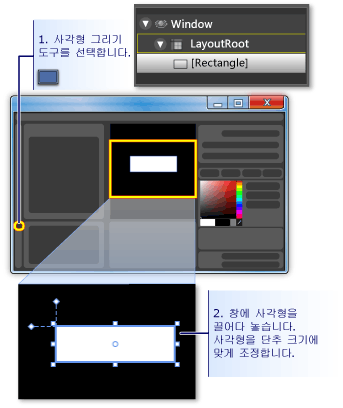
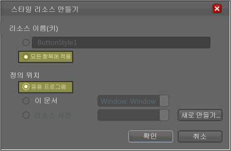
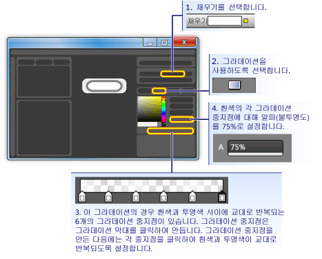
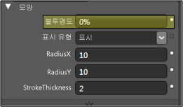
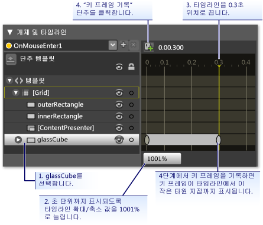
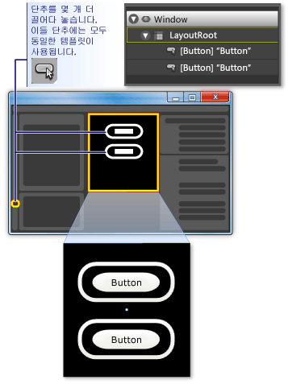

# 연습: Microsoft Expression Blend를 사용하여 단추 만들기Walkthrough: Create a Button by Using Microsoft Expression Blend

이 연습에서는 Microsoft Expression Blend를 사용 하 여 [!INCLUDE[TLA2#tla_wpf](../../../../includes/tla2sharptla-wpf-md.md)] 사용자 지정 된 단추를 만드는 과정을 단계별로 안내 합니다.This walkthrough steps you through the process of creating a [!INCLUDE[TLA2#tla_wpf](../../../../includes/tla2sharptla-wpf-md.md)] customized button using Microsoft Expression Blend.

> [!IMPORTANT]
> Microsoft Expression Blend는 실행 프로그램 [!INCLUDE[TLA#tla_xaml](../../../../includes/tlasharptla-xaml-md.md)] 을 만들기 위해 컴파일되는을 생성 하는 방식으로 작동 합니다.Microsoft Expression Blend works by generating [!INCLUDE[TLA#tla_xaml](../../../../includes/tlasharptla-xaml-md.md)] that is then compiled to make the executable program. 를 직접 사용 하는 경우 Blend가 아닌 Visual Studio [!INCLUDE[TLA#tla_xaml](../../../../includes/tlasharptla-xaml-md.md)] 와 동일한 응용 프로그램을 만드는 다른 연습이 있습니다. [!INCLUDE[TLA#tla_xaml](../../../../includes/tlasharptla-xaml-md.md)]If you would rather work with [!INCLUDE[TLA#tla_xaml](../../../../includes/tlasharptla-xaml-md.md)] directly, there is another walkthrough that creates the same application as this one using [!INCLUDE[TLA#tla_xaml](../../../../includes/tlasharptla-xaml-md.md)] with Visual Studio rather than Blend. 자세한 내용은 [XAML을 사용 하 여 단추 만들기](walkthrough-create-a-button-by-using-xaml.md) 를 참조 하세요.See [Create a Button by Using XAML](walkthrough-create-a-button-by-using-xaml.md) for more information.

다음 그림에서는 사용자가 만드는 사용자 지정 된 단추를 보여 줍니다.The following illustration shows the customized button that you will create.

## 셰이프를 단추로 변환Convert a Shape to a Button

이 연습의 첫 번째 부분에서는 사용자 지정 단추의 사용자 지정 모양을 만듭니다.In the first part of this walkthrough you create the custom look of the custom button. 이렇게 하려면 먼저 사각형을 단추로 변환 합니다.To do this, you first convert a rectangle to a button. 그런 다음 단추 템플릿에 셰이프를 추가 하 여 더 복잡 한 모양의 단추를 만듭니다.You then add additional shapes to the template of the button, creating a more complex looking button. 일반 단추로 시작 하지 않고 사용자 지정 하는 이유는 무엇 인가요?Why not start with a regular button and customize it? 단추에는 기본 제공 기능이 필요 하지 않습니다. 사용자 지정 단추의 경우 사각형으로 시작 하는 것이 더 쉽습니다.Because a button has built-in functionality that you do not need; for custom buttons, it is easier to start with a rectangle.

### Expression Blend에서 새 프로젝트를 만들려면To create a new project in Expression Blend

1. 식 Blend를 시작 합니다.Start Expression Blend. **시작**을 클릭 하 고 **모든 프로그램**, **microsoft Expression**을 차례로 가리킨 다음 **microsoft expression Blend**를 클릭 합니다.(Click **Start**, point to **All Programs**, point to **Microsoft Expression**, and then click **Microsoft Expression Blend**.)

2. 필요한 경우 응용 프로그램을 최대화 합니다.Maximize the application if needed.

3. **파일** 메뉴에서 **새 프로젝트**를 클릭합니다.On the **File** menu, click **New Project**.

4. **표준 응용 프로그램 (.exe)** 을 선택 합니다.Select **Standard Application (.exe)**.

5. 프로젝트 `CustomButton` 이름을로 확인 하 고 **확인을**누릅니다.Name the project `CustomButton` and press **OK**.

이때 빈 [!INCLUDE[TLA2#tla_wpf](../../../../includes/tla2sharptla-wpf-md.md)] 프로젝트가 표시 됩니다.At this point you have a blank [!INCLUDE[TLA2#tla_wpf](../../../../includes/tla2sharptla-wpf-md.md)] project. F5 키를 눌러 응용 프로그램을 실행할 수 있습니다.You can press F5 to run the application. 짐작할 수 있듯이 응용 프로그램은 빈 창 으로만 구성 됩니다.As you might expect, the application consists of only a blank window. 다음으로 모퉁이가 둥근 사각형을 만들어 단추로 변환 합니다.Next, you create a rounded rectangle and convert it into a button.

### 사각형을 단추로 변환 하려면To convert a Rectangle to a Button

1. **창 배경 속성을 검은색으로 설정 합니다.** 창을 선택 하 고 **속성 탭**을 클릭 한 다음 <xref:System.Windows.Controls.Control.Background%2A> 속성을로 `Black`설정 합니다.**Set the Window Background property to black:** Select the Window, click the **Properties Tab**, and set the <xref:System.Windows.Controls.Control.Background%2A> property to `Black`.

    

2. **창의 단추 크기에 따라 사각형을 그립니다.** 왼쪽 도구 패널에서 사각형 도구를 선택 하 고 사각형을 창으로 끌어 놓습니다.**Draw a rectangle approximately the size of a button on the Window:** Select the rectangle tool on the left-hand tool panel and drag the rectangle onto the Window.

    

3. **사각형의 모퉁이를 둥글게 합니다.** 사각형의 제어점을 끌거나 <xref:System.Windows.Shapes.Rectangle.RadiusX%2A> 및 <xref:System.Windows.Shapes.Rectangle.RadiusY%2A> 속성을 직접 설정 합니다.**Round out the corners of the rectangle:** Either drag the control points of the rectangle or directly set the <xref:System.Windows.Shapes.Rectangle.RadiusX%2A> and <xref:System.Windows.Shapes.Rectangle.RadiusY%2A> properties. <xref:System.Windows.Shapes.Rectangle.RadiusX%2A> 및<xref:System.Windows.Shapes.Rectangle.RadiusY%2A> 의 값을 20으로 설정 합니다.Set the values of <xref:System.Windows.Shapes.Rectangle.RadiusX%2A> and <xref:System.Windows.Shapes.Rectangle.RadiusY%2A> to 20.

    

4. **사각형을 단추로 변경 합니다.** 사각형을 선택 합니다.**Change the rectangle into a button:** Select the rectangle. **도구** 메뉴에서 **만들기 단추**를 클릭 합니다.On the **Tools** menu, click **Make Button**.

    

5. **스타일/템플릿의 범위를 지정 합니다.** 다음과 같은 대화 상자가 나타납니다.**Specify the scope of the style/template:** A dialog box like the following appears.

    

    **리소스 이름 (키)** 의 경우 **모두에 적용**을 선택 합니다.For **Resource name (Key)**, select **Apply to all**.  이렇게 하면 결과 스타일 및 단추 템플릿이 단추인 모든 개체에 적용 됩니다.This will make the resulting style and button template apply to all objects that are buttons. **정의에서** **응용 프로그램**을 선택 합니다.For **Define in**, select **Application**. 이렇게 하면 결과 스타일 및 단추 템플릿의 범위가 전체 응용 프로그램에 대해 결정 됩니다.This will make the resulting style and button template have scope over the entire application. 이러한 두 상자에 값을 설정 하면 단추 스타일 및 템플릿이 전체 응용 프로그램 내의 모든 단추에 적용 되 고 응용 프로그램에서 만드는 모든 단추가 기본적으로이 템플릿을 사용 합니다.When you set the values in these two boxes, the button style and template apply to all buttons within the entire application and any button you create in the application will, by default, use this template.

## 단추 템플릿 편집Edit the Button Template

이제 단추로 변경 된 사각형이 있습니다.You now have a rectangle that has been changed to a button. 이 섹션에서는 단추의 템플릿을 수정 하 고 모양을 추가로 사용자 지정 합니다.In this section, you'll modify the template of the button and further customize how it looks.

### 단추 모양을 변경 하는 단추 템플릿을 편집 하려면To edit the button template to change the button appearance

1. **편집 템플릿 보기로 이동:** 단추 모양을 추가로 사용자 지정 하려면 단추 템플릿을 편집 해야 합니다.**Go into edit template view:** To further customize the look of our button, we need to edit the button template. 이 템플릿은 사각형을 단추로 변환할 때 만들어졌습니다.This template was created when we converted the rectangle into a button. 단추 템플릿을 편집 하려면 단추를 마우스 오른쪽 단추로 클릭 하 고 **컨트롤 파트 편집 (템플릿)** 을 선택한 다음 **템플릿 편집**을 선택 합니다.To edit the button template, right-click the button and select **Edit Control Parts (Template)** and then **Edit Template**.

    

    템플릿 편집기에서 단추가 <xref:System.Windows.Shapes.Rectangle> <xref:System.Windows.Controls.ContentPresenter>와로 분리 되었는지 확인 합니다.In the template editor, notice that the button is now separated into a <xref:System.Windows.Shapes.Rectangle> and the <xref:System.Windows.Controls.ContentPresenter>. 는 <xref:System.Windows.Controls.ContentPresenter> 단추 내에 콘텐츠를 표시 하는 데 사용 됩니다 (예: 문자열 "button").The <xref:System.Windows.Controls.ContentPresenter> is used to present content within the button (for example, the string "Button"). 사각형 및 <xref:System.Windows.Controls.ContentPresenter> 는 모두 내 <xref:System.Windows.Controls.Grid>에 배치 됩니다.Both the rectangle and <xref:System.Windows.Controls.ContentPresenter> are laid out inside of a <xref:System.Windows.Controls.Grid>.

    

2. **템플릿 구성 요소의 이름을 변경 합니다.** 템플릿 인벤토리에서 사각형을 마우스 오른쪽 단추로 클릭 하 고 "[ <xref:System.Windows.Shapes.Rectangle> rectangle]"에서 "outerRectangle"로 이름을 변경 하 고 "[ContentPresenter]"를 "myContentPresenter"로 변경 합니다.**Change the names of the template components:** Right-click the rectangle in the template inventory, change the <xref:System.Windows.Shapes.Rectangle> name from "[Rectangle]" to "outerRectangle", and change "[ContentPresenter]" to "myContentPresenter".

    

3. **사각형을 도넛 (예: 도넛) 안에 비어 있도록 변경 합니다.** **OuterRectangle** 를 선택 하 <xref:System.Windows.Shapes.Shape.Fill%2A> 고를 "투명" <xref:System.Windows.Shapes.Shape.StrokeThickness%2A> 으로 설정 하 고를 5로 설정 합니다.**Alter the rectangle so that it is empty inside (like a donut):** Select **outerRectangle** and set <xref:System.Windows.Shapes.Shape.Fill%2A> to "Transparent" and <xref:System.Windows.Shapes.Shape.StrokeThickness%2A> to 5.

    

    그런 다음를 <xref:System.Windows.Shapes.Shape.Stroke%2A> 템플릿의 색으로 설정 합니다.Then set the <xref:System.Windows.Shapes.Shape.Stroke%2A> to the color of whatever the template will be. 이렇게 하려면 **스트로크**옆의 작은 흰색 상자를 클릭 하 고 **customexpression**을 선택한 다음 대화 상자에 "{TemplateBinding Background}"를 입력 합니다.To do this, click the small white box next to **Stroke**, select **CustomExpression**, and type "{TemplateBinding Background}" in the dialog box.

    

4. **내부 사각형을 만듭니다.** 이제 다른 사각형 (이름을 "innerRectangle"로 ")을 만들고 **outerRectangle** 내부에서 대칭적으로 배치 합니다.**Create an inner rectangle:** Now, create another rectangle (name it "innerRectangle") and position it symmetrically on the inside of **outerRectangle** . 이러한 종류의 작업을 수행 하려면 확대/축소 하 여 편집 영역에서 단추를 확대 하는 것이 좋습니다.For this kind of work, you will probably want to zoom to make the button larger in the editing area.

    > [!NOTE]
    > 사각형이 그림에 있는 것과 다를 수 있습니다 (예를 들어 모퉁이가 둥근 경우).Your rectangle might look different than the one in the figure (for example, it might have rounded corners).

    

5. **ContentPresenter를 맨 위로 이동 합니다.** 이 시점에서 텍스트 "Button"이 더 이상 표시 되지 않을 수 있습니다.**Move ContentPresenter to the top:** At this point, it is possible that the text "Button" will not be visible any longer. 이 경우 **innerRectangle** 가 **myContentPresenter**의 맨 위에 있기 때문입니다.If this is so, this is because **innerRectangle** is on top of the **myContentPresenter**. 이 문제를 해결 하려면 **myContentPresenter** 를 **innerRectangle**아래로 끕니다.To fix this, drag **myContentPresenter** below **innerRectangle**. 다음과 같이 사각형 및 **myContentPresenter** 의 위치를 변경 합니다.Reposition rectangles and **myContentPresenter** to look similar to below.

    > [!NOTE]
    > 또는 마우스 오른쪽 단추로 클릭 하 고 **앞으로 보내기**를 눌러 **myContentPresenter** 를 위쪽에 배치할 수도 있습니다.Alternatively, you can also position **myContentPresenter** on top by right-clicking it and pressing **Send Forward**.

    

6. **InnerRectangle의 모양을 변경 합니다.** <xref:System.Windows.Shapes.Rectangle.RadiusX%2A>, 및값<xref:System.Windows.Shapes.Shape.StrokeThickness%2A> 을 20으로 설정 합니다. <xref:System.Windows.Shapes.Rectangle.RadiusY%2A>**Change the look of innerRectangle:** Set the <xref:System.Windows.Shapes.Rectangle.RadiusX%2A>, <xref:System.Windows.Shapes.Rectangle.RadiusY%2A>, and <xref:System.Windows.Shapes.Shape.StrokeThickness%2A> values to 20. 또한 사용자 지정 식 " <xref:System.Windows.Shapes.Shape.Fill%2A> {TemplateBinding background}"을 사용 하 여를 템플릿의 배경으로 설정 하 고을 "투명 <xref:System.Windows.Shapes.Shape.Stroke%2A> "으로 설정 합니다.In addition, set the <xref:System.Windows.Shapes.Shape.Fill%2A> to the background of the template using the custom expression "{TemplateBinding Background}" ) and set <xref:System.Windows.Shapes.Shape.Stroke%2A> to "transparent". <xref:System.Windows.Shapes.Shape.Fill%2A> **InnerRectangle** 의 및에 대 한 설정은 <xref:System.Windows.Shapes.Shape.Stroke%2A> **outerRectangle**의 경우와 반대입니다.Notice that the settings for the <xref:System.Windows.Shapes.Shape.Fill%2A> and <xref:System.Windows.Shapes.Shape.Stroke%2A> of **innerRectangle** are the opposite of those for **outerRectangle**.

    

7. **위쪽에 투명 효과 계층 추가:** 단추의 모양을 사용자 지정 하는 마지막 부분은 투명 효과 계층을 위쪽에 추가 하는 것입니다.**Add a glass layer on top:** The final piece of customizing the look of the button is to add a glass layer on top. 이 투명 계층은 세 번째 사각형으로 구성 됩니다.This glass layer consists of a third rectangle. 유리는 전체 단추를 포함 하기 때문에 투명 효과 사각형은 **outerRectangle**크기와 비슷합니다.Because the glass will cover the entire button, the glass rectangle is similar in dimensions to the **outerRectangle**. 따라서 단순히 **outerRectangle**복사본을 만들어 사각형을 만듭니다.Therefore, create the rectangle by simply making a copy of the **outerRectangle**. **OuterRectangle** 를 강조 표시 하 고 Ctrl + C 및 Ctrl + V를 사용 하 여 복사본을 만듭니다.Highlight **outerRectangle** and use CTRL+C and CTRL+V to make a copy. 새 사각형의 이름을 "glassCube"로 합니다.Name this new rectangle "glassCube".

8. **필요한 경우 glassCube의 위치를 변경 합니다.** **GlassCube** 가 아직 배치 되지 않아 전체 단추를 포함 하는 경우에는 위치로 끕니다.**Reposition glassCube if necessary:** If **glassCube** is not already positioned so that it covers the entire button, drag it into position.

9. **GlassCube을 outerRectangle과 약간 다른 모양으로 지정 합니다.** **GlassCube**의 속성을 변경 합니다.**Give glassCube a slightly different shape than outerRectangle:** Change the properties of **glassCube**. <xref:System.Windows.Shapes.Rectangle.RadiusX%2A> 및<xref:System.Windows.Shapes.Rectangle.RadiusY%2A>속성을 10으로 변경 하 고 을2로변경하여를시작합니다.<xref:System.Windows.Shapes.Shape.StrokeThickness%2A>Start off by changing the <xref:System.Windows.Shapes.Rectangle.RadiusX%2A> and <xref:System.Windows.Shapes.Rectangle.RadiusY%2A> properties to 10 and the <xref:System.Windows.Shapes.Shape.StrokeThickness%2A> to 2.

    

10. **투명 하 게 보이게 glassCube.** 75% 불투명 선형 그라데이션을 사용 하 여을 glassy 모양으로 설정 하 고 색 흰색 사이에서 교대로 간격이 균일 한 간격이 있는 6 보다 투명 하 게설정합니다.<xref:System.Windows.Shapes.Shape.Fill%2A>**Make glassCube look like glass:** Set the <xref:System.Windows.Shapes.Shape.Fill%2A> to a glassy look by  using a linear gradient that is 75% opaque and alternates between the color White and Transparent over 6 approximately evenly spaced intervals. 다음은 그라데이션 중지점을 설정 하는 것입니다.This is what to set the gradient stops to:

    - 그라데이션 중지점 1: 알파 값이 75% 인 흰색Gradient Stop 1: White with Alpha value of 75%

    - 그라데이션 중지점 2: 투명Gradient Stop 2: Transparent

    - 그라데이션 중지점 3: 알파 값이 75% 인 흰색Gradient Stop 3: White with Alpha value of 75%

    - 그라데이션 중지점 4: 투명Gradient Stop 4: Transparent

    - 그라데이션 중지점 5: 알파 값이 75% 인 흰색Gradient Stop 5: White with Alpha value of 75%

    - 그라데이션 중지점 6: 투명Gradient Stop 6: Transparent

    그러면 "물결선" 유리 모양이 생성 됩니다.This creates a "wavy" glass look.

    

11. **투명 효과 계층을 숨깁니다.** 이제 glassy 계층이 어떻게 표시 되는지 확인 하 고, **속성 패널** 의 **모양 창** 으로 이동 하 고, 불투명도를 0%로 설정 하 여 숨깁니다.**Hide the glass layer:** Now that you see what the glassy layer looks like, go into the **Appearance pane** of the **Properties panel** and set the Opacity to 0% to hide it. 앞의 섹션에서는 속성 트리거와 이벤트를 사용 하 여 투명 효과 계층을 표시 하 고 조작 합니다.In the sections ahead, we'll use property triggers and events to show and manipulate the glass layer.

    

## 단추 동작 사용자 지정Customize the Button Behavior

이 시점에서 해당 템플릿을 편집 하 여 단추의 표시를 사용자 지정 했지만 단추는 마우스를 가져갈 때 모양 변경, 포커스 받기, 클릭 등의 작업을 수행 하는 등의 방법으로 사용자 작업에 응답 하지 않습니다. 다음 두 절차에서는 사용자 지정 단추에 이와 같은 동작을 빌드하는 방법을 보여 줍니다.At this point, you have customized the presentation of the button by editing its template, but the button does not react to user actions as typical buttons do (for example, changing appearance upon mouse-over, receiving focus, and clicking.) The next two procedures show how to build behaviors like these into the custom button. 간단한 속성 트리거로 시작한 다음 이벤트 트리거와 애니메이션을 추가 합니다.We'll start with simple property triggers, and then add event triggers and animations.

### 속성 트리거를 설정 하려면To set property triggers

1. **새 속성 트리거를 만듭니다.** **GlassCube** 가 선택 된 상태에서 **트리거** 패널에서 **+ 속성** 을 클릭 합니다 (다음 단계를 따르는 그림 참조).**Create a new property trigger:** With **glassCube** selected, click **+ Property** in the **Triggers** panel (see the figure that follows the next step). 이렇게 하면 기본 속성 트리거를 사용 하 여 속성 트리거가 만들어집니다.This creates a property trigger with a default property trigger.

2. **트리거에서 사용 하는 속성을 System.windows.uielement.ismouseover 확인 합니다.** 속성을로 <xref:System.Windows.UIElement.IsMouseOver%2A>변경 합니다.**Make IsMouseOver the property used by the trigger:** Change the property to <xref:System.Windows.UIElement.IsMouseOver%2A>. 이렇게 하면 <xref:System.Windows.UIElement.IsMouseOver%2A> 속성이 인 `true` 경우 (사용자가 마우스로 단추를 가리킬 때) 속성 트리거가 활성화 됩니다.This makes the property trigger activate when the <xref:System.Windows.UIElement.IsMouseOver%2A> property is `true` (when the user points to the button with the mouse).

    

3. **System.windows.uielement.ismouseover는 glassCube에 대해 100%의 불투명도를 트리거합니다.** **트리거 기록이 설정 된 것** 을 확인 합니다 (이전 그림 참조).**IsMouseOver triggers opacity of 100% for glassCube:** Notice that the **Trigger recording is on** (see the preceding figure). 즉, 기록 하는 동안 **glassCube** 의 속성 값에 대 한 모든 변경 내용은가 인 <xref:System.Windows.UIElement.IsMouseOver%2A> `true`경우 발생 하는 작업이 됩니다.This means that any changes you make to the property values of **glassCube** while recording is on will become an action that takes place when <xref:System.Windows.UIElement.IsMouseOver%2A> is `true`. 기록 하는 동안 <xref:System.Windows.UIElement.Opacity%2A> **glassCube** 의를 100%로 변경 합니다.While recording, change the <xref:System.Windows.UIElement.Opacity%2A> of **glassCube** to 100%.

    

    이제 첫 번째 속성 트리거를 만들었습니다.You have now created your first property trigger. 편집기의 **트리거 패널** 은 변경 된를 <xref:System.Windows.UIElement.Opacity%2A> 100%로 기록 합니다.Notice that the **Triggers panel** of the editor has recorded the <xref:System.Windows.UIElement.Opacity%2A> being changed to 100%.

    

    F5 키를 눌러 응용 프로그램을 실행 하 고 단추 위로 마우스 포인터를 이동 합니다.Press F5 to run the application, and move the mouse pointer over and off the button. 단추 위에 마우스를 놓았을 때 투명 효과 계층이 표시 되 고 포인터가 벗어나면 사라집니다.You should see the glass layer appear when you mouse-over the button and disappear when the pointer leaves.

4. **System.windows.uielement.ismouseover 트리거 스트로크 값 변경:** <xref:System.Windows.UIElement.IsMouseOver%2A> 트리거와 다른 작업을 연결 해 보겠습니다.**IsMouseOver triggers stroke value change:** Let's associate some other actions with the <xref:System.Windows.UIElement.IsMouseOver%2A> trigger. 기록이 지속 되는 동안 선택 항목을 **glassCube** 에서 **outerRectangle**로 전환 합니다.While recording continues, switch your selection from **glassCube** to **outerRectangle**. 그런 다음 <xref:System.Windows.Shapes.Shape.Stroke%2A> **outerRectangle** 의를 "{DynamicResource {x:Static systemcolors}}"의 사용자 지정 식으로 설정 합니다.Then set the <xref:System.Windows.Shapes.Shape.Stroke%2A> of **outerRectangle** to the custom expression of "{DynamicResource {x:Static SystemColors.HighlightBrushKey}}". 그러면이 단추 <xref:System.Windows.Shapes.Shape.Stroke%2A> 에 사용 되는 일반적인 강조 색으로 설정 됩니다.This sets the <xref:System.Windows.Shapes.Shape.Stroke%2A> to the typical highlight color used by buttons. 단추 위에 마우스를 놓았을 때 효과를 확인 하려면 F5 키를 누릅니다.Press F5 to see the effect when you mouse over the button.

    

5. **System.windows.uielement.ismouseover는 흐린 텍스트를 트리거합니다.** <xref:System.Windows.UIElement.IsMouseOver%2A> 속성 트리거에 하나 이상의 작업을 연결 해 보겠습니다.**IsMouseOver triggers blurry text:** Let's associate one more action to the <xref:System.Windows.UIElement.IsMouseOver%2A> property trigger. 투명 효과가 표시 되 면 단추의 콘텐츠가 약간 흐리게 표시 되도록 합니다.Make the content of the button appear a little blurry when the glass appears over it. 이렇게 하려면 <xref:System.Windows.Media.Effects.BitmapEffect> <xref:System.Windows.Controls.ContentPresenter> (**myContentPresenter**)에 흐림 효과를 적용할 수 있습니다.To do this, we can apply a blur <xref:System.Windows.Media.Effects.BitmapEffect> to the <xref:System.Windows.Controls.ContentPresenter> (**myContentPresenter**).

    

    > [!NOTE]
    > **속성 패널** 을 검색 <xref:System.Windows.Media.Effects.BitmapEffect>하기 전의 상태로 되돌리려면 **검색 상자**에서 텍스트를 지웁니다.To return the **Properties panel** back to what it was before you did the search for <xref:System.Windows.Media.Effects.BitmapEffect>, clear the text from the **Search box**.

    이 시점에서 마우스 포인터를 단추 영역으로 가져갈 때의 강조 동작을 만들기 위해 몇 가지 관련 작업을 포함 하는 속성 트리거를 사용 했습니다.At this point, we have used a property trigger with several associated actions to create highlighting behavior for when the mouse pointer enters and leaves the button area. 단추에 대 한 일반적인 다른 동작은 클릭 한 대로 포커스가 있을 때 강조 표시 하는 것입니다.Another typical behavior for a button is to highlight when it has focus (as after it is clicked). <xref:System.Windows.UIElement.IsFocused%2A> 속성에 다른 속성 트리거를 추가 하 여 이러한 동작을 추가할 수 있습니다.We can add such behavior by adding another property trigger for the <xref:System.Windows.UIElement.IsFocused%2A> property.

6. **IsFocused 있는 속성 트리거를 만듭니다.** 에 대해 <xref:System.Windows.UIElement.IsMouseOver%2A> 와 동일한 절차를 사용 하 여 (이 섹션의 첫 번째 단계 참조) <xref:System.Windows.UIElement.IsFocused%2A> 속성에 대 한 다른 속성 트리거를 만듭니다.**Create property trigger for IsFocused:** Using the same procedure as for <xref:System.Windows.UIElement.IsMouseOver%2A> (see the first step of this section), create another property trigger for the <xref:System.Windows.UIElement.IsFocused%2A> property. **트리거 기록이 설정 되어 있는**동안 트리거에 다음 작업을 추가 합니다.While **Trigger recording is on**, add the following actions to the trigger:

    - **glassCube** 는 100 <xref:System.Windows.UIElement.Opacity%2A> %의를 가져옵니다.**glassCube** gets an <xref:System.Windows.UIElement.Opacity%2A> of 100%.

    - **outerRectangle** 사용자 지정 <xref:System.Windows.Shapes.Shape.Stroke%2A> 식 값 "{DynamicResource {x:Static systemcolors. HighlightBrushKey}}"를 가져옵니다.**outerRectangle** gets a <xref:System.Windows.Shapes.Shape.Stroke%2A> custom expression value of "{DynamicResource {x:Static SystemColors.HighlightBrushKey}}".

이 연습의 마지막 단계에서는 단추에 애니메이션을 추가 합니다.As the final step in this walkthrough, we will add animations to the button. 이러한 애니메이션은 이벤트, <xref:System.Windows.UIElement.MouseEnter> 특히 및 <xref:System.Windows.Controls.Primitives.ButtonBase.Click> 이벤트에 의해 트리거됩니다.These animations will be triggered by events—specifically, the <xref:System.Windows.UIElement.MouseEnter> and <xref:System.Windows.Controls.Primitives.ButtonBase.Click> events.

### 이벤트 트리거와 애니메이션을 사용 하 여 대화형 작업을 추가 하려면To use event triggers and animations to add interactivity

1. **MouseEnter 이벤트 트리거를 만듭니다.** 새 이벤트 트리거를 추가 하 고 <xref:System.Windows.UIElement.MouseEnter> 트리거에서 사용할 이벤트로를 선택 합니다.**Create a MouseEnter Event Trigger:** Add a new event trigger and select <xref:System.Windows.UIElement.MouseEnter> as the event to use in the trigger.

     

2. **애니메이션 타임 라인을 만듭니다.** 그런 다음 애니메이션 타임 라인을 <xref:System.Windows.UIElement.MouseEnter> 이벤트에 연결 합니다.**Create an animation timeline:** Next, associate an animation timeline to the <xref:System.Windows.UIElement.MouseEnter> event.

    

    **확인** 을 눌러 새 타임 라인을 만든 후에는 **타임 라인 패널이** 나타나고 "타임 라인 기록이 켜져 있습니다."가 디자인 패널에 표시 됩니다.After you press **OK** to create a new timeline, a **Timeline Panel** appears and "Timeline recording is on" is visible in the design panel. 즉, 속성 변경 내용에 애니메이션을 적용 하 여 타임 라인의 속성 변경 내용을 기록 하기 시작할 수 있습니다.This means we can start recording property changes in the timeline (animate property changes).

    > [!NOTE]
    > 디스플레이를 표시 하려면 창 및/또는 패널 크기를 조정 해야 할 수 있습니다.You may need to resize your window and/or panels to see the display.

    

3. **키 프레임을 만듭니다.** 애니메이션을 만들려면 애니메이션 효과를 적용할 개체를 선택 하 고, 타임 라인에서 두 개 이상의 키 프레임을 만들고, 해당 키프레임에 대해 애니메이션이 보간 하려는 속성 값을 설정 합니다.**Create a keyframe:** To create an animation, select the object you want to animate, create two or more keyframes on the timeline, and for those keyframes, set the property values you want the animation to interpolate between. 다음 그림에서는 키 프레임을 만드는 과정을 안내 합니다.The following figure guides you through the creation of a keyframe.

    

4. **이 키프레임에서 glassCube 축소:** 두 번째 키프레임이 선택 된 상태에서 **크기 변환을**사용 하 여 **glassCube** 크기를 전체 크기의 90%로 축소 합니다.**Shrink glassCube at this keyframe:** With the second keyframe selected, shrink the size of the **glassCube** to 90% of its full size using the **Size Transform**.

    

    F5 키를 눌러 애플리케이션을 실행합니다.Press F5 to run the application. 마우스 포인터를 단추 위로 이동 합니다.Move the mouse pointer over the button. 투명 효과 레이어가 단추 위쪽으로 축소 됩니다.Notice that the glass layer shrinks on top of the button.

5. **다른 이벤트 트리거를 만들고 다른 애니메이션을 연결 합니다.** 하나 이상의 애니메이션을 추가 해 보겠습니다.**Create another Event Trigger and associate a different animation with it:** Let's add one more animation. 이전 이벤트 트리거 애니메이션을 만드는 데 사용한 것과 비슷한 절차를 사용 합니다.Use a similar procedure to what you used to create the previous event trigger animation:

    1. 이벤트를 <xref:System.Windows.Controls.Primitives.ButtonBase.Click> 사용 하 여 새 이벤트 트리거를 만듭니다.Create a new event trigger using the <xref:System.Windows.Controls.Primitives.ButtonBase.Click> event.

    2. 새 타임 라인을 <xref:System.Windows.Controls.Primitives.ButtonBase.Click> 이벤트와 연결 합니다.Associate a new timeline with the <xref:System.Windows.Controls.Primitives.ButtonBase.Click> event.

        

    3. 이 타임 라인의 경우 두 개의 키를 만듭니다. 하나는 0.0 초에, 두 번째는 0.3 초에 하나씩 만듭니다.For this timeline, create two keyframes, one at 0.0 seconds and the second one at 0.3 seconds.

    4. 0\.3 초의 키프레임이 강조 표시 된 상태로 **회전 변환 각도** 를 360도로 설정 합니다.With the keyframe at 0.3 seconds highlighted, set the **Rotate Transform Angle** to 360 degrees.

        

    5. F5 키를 눌러 애플리케이션을 실행합니다.Press F5 to run the application. 단추를 클릭합니다.Click the button. 투명 효과 레이어가 회전 합니다.Notice that the glass layer spins around.

## 결론Conclusion

사용자 지정 된 단추를 완료 했습니다.You have completed a customized button. 응용 프로그램의 모든 단추에 적용 된 단추 템플릿을 사용 하 여이를 수행 했습니다.You did this using a button template that was applied to all buttons in the application. 템플릿 편집 모드 (다음 그림 참조)를 유지 하 고 더 많은 단추를 만드는 경우 기본 단추 대신 사용자 지정 단추 처럼 표시 되 고 동작 하는 것을 볼 수 있습니다.If you leave the template editing mode (see the following figure) and create more buttons, you will see that they look and behave like your custom button rather than like the default button.

F5 키를 눌러 애플리케이션을 실행합니다.Press F5 to run the application. 단추를 클릭 하 고 모두 동일한 방식으로 동작 하는 방식을 확인 합니다.Click the buttons and notice how they all behave the same.

템플릿을 사용자 지정 하는 동안 <xref:System.Windows.Shapes.Shape.Fill%2A> <xref:System.Windows.Shapes.Shape.Stroke%2A> **innerRectangle** 의 속성과 **outerRectangle** 속성을 템플릿 배경 ({TemplateBinding background})으로 설정 합니다.Remember that while you were customizing the template, you set the <xref:System.Windows.Shapes.Shape.Fill%2A> property of **innerRectangle** and the <xref:System.Windows.Shapes.Shape.Stroke%2A> property **outerRectangle** to the template background ({TemplateBinding Background}). 따라서 개별 단추의 배경색을 설정 하는 경우 설정 하는 배경은 해당 속성에 사용 됩니다.Because of this, when you set the background color of the individual buttons, the background you set will be used for those respective properties. 지금 배경을 변경해 보세요.Try changing the backgrounds now. 다음 그림에서는 서로 다른 그라데이션을 사용 합니다.In the following figure, different gradients are used. 따라서 서식 파일은 단추와 같은 컨트롤의 전반적인 사용자 지정에 유용 하지만 템플릿이 있는 컨트롤은 서로 다르게 보이도록 수정할 수 있습니다.Therefore, although a template is useful for overall customization of controls like button, controls with templates can still be modified to look different from each other.

결론으로, 단추 템플릿을 사용자 지정 하는 프로세스에서는 Microsoft Expression Blend에서 다음 작업을 수행 하는 방법을 배웠습니다.In conclusion, in the process of customizing a button template you have learned how to do the following in Microsoft Expression Blend:

- 컨트롤의 모양을 사용자 지정 합니다.Customize the look of a control.

- 속성 트리거를 설정 합니다.Set property triggers. 속성 트리거는 컨트롤이 아니라 대부분의 개체에 사용할 수 있기 때문에 매우 유용 합니다.Property triggers are very useful because they can be used on most objects, not just controls.

- 이벤트 트리거를 설정 합니다.Set event triggers. 이벤트 트리거는 컨트롤이 아니라 대부분의 개체에 사용할 수 있기 때문에 매우 유용 합니다.Event triggers are very useful because they can be used on most objects, not just controls.

- 애니메이션을 만듭니다.Create animations.

- 기타: 그라데이션을 만들고, BitmapEffects을 추가 하 고, 변환을 사용 하 고, 개체의 기본 속성을 설정 합니다.Miscellaneous: create gradients, add BitmapEffects, use transforms, and set basic properties of objects.

## 참고자료See also

- [XAML을 사용하여 단추 만들기Create a Button by Using XAML](walkthrough-create-a-button-by-using-xaml.md)
- [스타일 지정 및 템플릿Styling and Templating](styling-and-templating.md)
- [애니메이션 개요Animation Overview](../graphics-multimedia/animation-overview.md)
- [단색 및 그라데이션을 사용한 그리기 개요Painting with Solid Colors and Gradients Overview](../graphics-multimedia/painting-with-solid-colors-and-gradients-overview.md)
- [비트맵 효과 개요Bitmap Effects Overview](../graphics-multimedia/bitmap-effects-overview.md)
