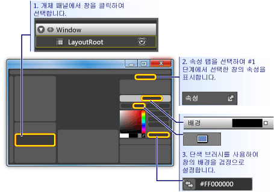
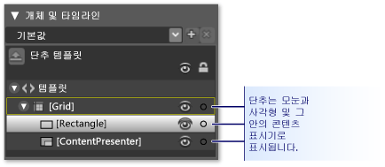
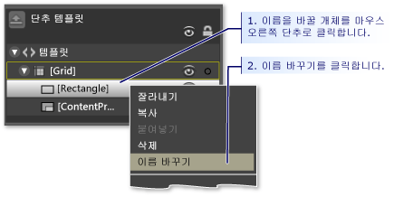
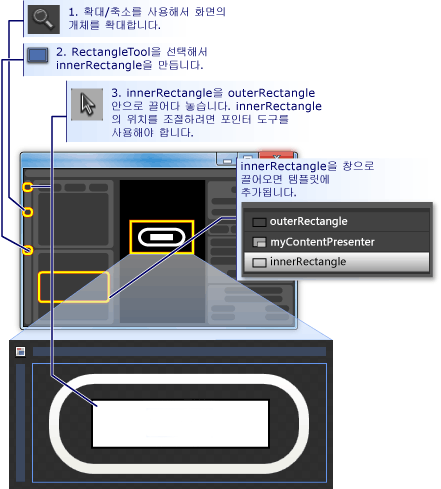
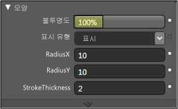
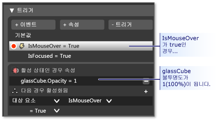
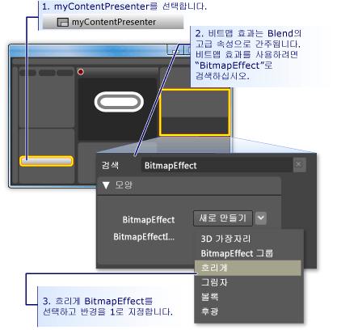
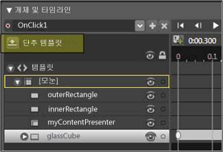

# 연습: Microsoft Expression Blend를 사용하여 단추 만들기
이 연습을 만드는 과정을 단계별로 안내를 [!INCLUDE[TLA2#tla_wpf](../../../../includes/tla2sharptla-wpf-md.md)] Microsoft Expression Blend를 사용 하 여 사용자 지정된 단추입니다.  
  
> [!IMPORTANT]
>  Microsoft Expression Blend를 생성 하 여 작동 [!INCLUDE[TLA#tla_xaml](../../../../includes/tlasharptla-xaml-md.md)] 다음 컴파일되고 실행 프로그램을 확인 합니다. 사용 하 여 원한다 면 [!INCLUDE[TLA#tla_xaml](../../../../includes/tlasharptla-xaml-md.md)] 직접적으로이 하나 사용 하 여 동일한 응용 프로그램을 만드는 다른 연습을 [!INCLUDE[TLA#tla_xaml](../../../../includes/tlasharptla-xaml-md.md)] Blend를 사용 하지 않고 Visual Studio를 사용 하 여 합니다. 참조 [XAML를 사용 하 여 단추 만들기](walkthrough-create-a-button-by-using-xaml.md) 자세한 내용은 합니다.  
  
 다음 그림에서는 만들려는 사용자 지정된 단추를 보여 줍니다.  
  
   
  
## 단추에 도형 변환  
 이 연습의 첫 번째 부분에서는 사용자 지정 모양을 사용자 지정 단추를 만듭니다. 이 작업을 수행 하려면 먼저 단추에 사각형을 변환 합니다. 그런 다음 추가 셰이프를 추가 단추 템플릿은 더 복잡 한 모양의 단추를 만듭니다. 일반 단추를 사용 하 여 시작 하 고 사용자 지정 하지 않는 이유? 단추에 필요 하지 않은; 기본 제공 기능 때문에 사용자 지정 단추에 대 한 사각형을 사용 하 여 시작 하려면 쉽습니다.  
  
#### Expression Blend에서 새 프로젝트를 만들려면  
  
1. Expression Blend를 시작 합니다. (클릭 **시작**, 가리킨 **모든 프로그램**를 가리킨 **Microsoft Expression**를 클릭 하 고 **Microsoft Expression Blend**.)  
  
2. 필요한 경우 응용 프로그램을 최대화 합니다.  
  
3. **파일** 메뉴에서 **새 프로젝트**를 클릭합니다.  
  
4. 선택 **표준 응용 프로그램 (.exe)** 합니다.  
  
5. 프로젝트 이름을 `CustomButton` 키를 누릅니다 **확인**합니다.  
  
 이 시점에서 비어 있는 [!INCLUDE[TLA2#tla_wpf](../../../../includes/tla2sharptla-wpf-md.md)] 프로젝트입니다. F5 키를 눌러 응용 프로그램을 실행할 수 있습니다. 예상할 수 있듯이 응용 프로그램은 빈 창이 구성 됩니다. 그런 다음 모퉁이가 둥근된 사각형을 만들고 단추로 변환 합니다.  
  
#### 단추에 사각형을 변환 하려면  
  
1. **창 배경 속성을 검은색으로 설정 합니다.** 창을 선택를 클릭 합니다 **속성 탭**, 설정 및는 <xref:System.Windows.Controls.Control.Background%2A> 속성을 `Black`입니다.  
  
       
  
2. **창에서 단추의 크기 약 사각형을 그립니다.** 도구 왼쪽 패널에서 사각형 도구를 선택 하 고 사각형 창으로 끌어옵니다.  
  
       
  
3. **사각형의 모퉁이 마무리 합니다.** 사각형의 제어점을 끌어 또는 직접 설정 합니다 <xref:System.Windows.Shapes.Rectangle.RadiusX%2A> 및 <xref:System.Windows.Shapes.Rectangle.RadiusY%2A> 속성입니다. 값을 설정 <xref:System.Windows.Shapes.Rectangle.RadiusX%2A> 고 <xref:System.Windows.Shapes.Rectangle.RadiusY%2A> 20입니다.  
  
       
  
4. **단추에 사각형을 변경 합니다.** 사각형을 선택 합니다. 에 **도구** 메뉴에서 클릭 **단추 만들기**합니다.  
  
       
  
5. **스타일/템플릿의 범위를 지정 합니다.** 다음과 같은 대화 상자가 나타납니다.  
  
       
  
     에 대 한 **리소스 이름 (키)** 를 선택 **모든 항목에 적용**합니다.  이렇게 하면 결과 스타일 및 단추 템플릿 단추는 모든 개체에 적용 합니다. 에 대 한 **에서 정의할**를 선택 **응용 프로그램**합니다. 이렇게 하면 결과 스타일 및 전체 응용 프로그램을 통해 범위가 단추 템플릿. 이러한 두 상자에 값을 설정 하는 경우에 단추 스타일 및 템플릿 전체 응용 프로그램 내에서 모든 단추에 적용 하 고 응용 프로그램에서 만든 모든 단추는 기본적으로이 템플릿을 사용 합니다.  
  
## 단추 템플릿 편집  
 이제 단추에 변경 된 사각형을 해야 합니다. 이 섹션에서는 단추 템플릿을 수정 하 고 추가로 모양을 사용자 지정 합니다.  
  
#### 단추 모양을 변경 하려면 단추 템플릿을 편집 하려면  
  
1. **템플릿 편집 뷰로 이동 합니다.** 단추의 모양을 추가로 사용자 지정 하려면 단추 템플릿을 편집 해야 합니다. 이 템플릿은 단추에 사각형을 변환할 때 만들어졌습니다. 단추 서식 파일을 편집 하려면 단추를 마우스 오른쪽 단추로 클릭 하 고 선택 **컨트롤 구성 요소 (템플릿)** 차례로 **템플릿 편집**합니다.  
  
       
  
     템플릿 편집기에서 단추를 이제 구분 되는 알 수 있습니다.는 <xref:System.Windows.Shapes.Rectangle> 하며 <xref:System.Windows.Controls.ContentPresenter>합니다. <xref:System.Windows.Controls.ContentPresenter> 단추 (예를 들어 문자열 "단추") 내에서 콘텐츠를 제공 하는 데 사용 됩니다. 두 사각형 및 <xref:System.Windows.Controls.ContentPresenter> 내에 배치 되는 <xref:System.Windows.Controls.Grid>합니다.  
  
       
  
2. **템플릿 구성의 이름을 변경 합니다.** 템플릿 인벤토리, 변경 된 사각형을 마우스 오른쪽 단추로 클릭는 <xref:System.Windows.Shapes.Rectangle> "차원적"에 "[사각형]"에서 이름을 지정 하 고 "[ContentPresenter]" 요소의"로 변경 합니다.  
  
       
  
3. **(예: 도넛형) 내에서 빈 되도록 사각형을 변경 합니다.** 선택 **차원적** 설정 <xref:System.Windows.Shapes.Shape.Fill%2A> "Transparent"로 하 고 <xref:System.Windows.Shapes.Shape.StrokeThickness%2A> 5입니다.  
  
       
  
     설정한는 <xref:System.Windows.Shapes.Shape.Stroke%2A> 무엇이 든 될 템플릿의의 색입니다. 이 작업을 수행 하려면 작은 흰색 상자 옆에 **스트로크**를 선택 **CustomExpression**, 대화 상자에서 "{TemplateBinding 백그라운드}"을 입력 합니다.  
  
       
  
4. **내부 영역을 만듭니다.** 이제 다른 사각형을 만듭니다 ("그" 이름을) 내부에 대칭적 놓습니다 **차원적** 합니다. 이러한 종류의 작업에 대 한 편집 영역에서 단추가 크게 확대/축소 하려고 수 있습니다.  
  
    > [!NOTE]
    >  사각형에 보다 그림과에서 다르게 보일 수 있습니다 (예를 들어,이 수 모서리가 둥글게 변합니다).  
  
       
  
5. **ContentPresenter 위쪽으로 이동 합니다.** 이 시점에서 것 "단추" 텍스트는 표시 되지 않음을 더 이상 가능 합니다. 그런 경우, 때문에 이것이 **그** 맨 위에는 **사각형과**합니다. 이 해결 하려면 끌어 **사각형과** 아래 **그**합니다. 사각형의 위치를 변경 하 고 **사각형과** 아래 처럼 보이도록 합니다.  
  
    > [!NOTE]
    >  또는 배치할 수도 있습니다 **사각형과** 위에 표시 하기를 마우스 오른쪽 단추로 클릭 하 고 키를 눌러 **앞으로 보낼**합니다.  
  
       
  
6. **그의 모양을 변경 합니다.** 설정 된 <xref:System.Windows.Shapes.Rectangle.RadiusX%2A>, <xref:System.Windows.Shapes.Rectangle.RadiusY%2A>, 및 <xref:System.Windows.Shapes.Shape.StrokeThickness%2A> 값 20 합니다. 또한 설정 합니다 <xref:System.Windows.Shapes.Shape.Fill%2A> "{TemplateBinding 백그라운드}" 사용자 지정 식을 사용 하 여 서식 파일의 배경에) 설정 및 <xref:System.Windows.Shapes.Shape.Stroke%2A> "투명"입니다. 에 대 한 설정 합니다 <xref:System.Windows.Shapes.Shape.Fill%2A> 및 <xref:System.Windows.Shapes.Shape.Stroke%2A> 의 **그** 반대에 대 한 것입니다 **차원적**합니다.  
  
       
  
7. **맨 위에 투명 레이어를 추가 합니다.** 단추 모양 사용자 지정의 마지막 부분 맨 위에 투명 레이어를 추가 하는 것입니다. 이 투명 레이어는 세 번째 사각형으로 구성 됩니다. 투명 효과 사각형을 차원을 비슷합니다 투명은 전체 단추를 처리 하기 때문에 합니다 **차원적**합니다. 따라서 단순히 복사 하 여 사각형을 만들 합니다 **차원적**합니다. 강조 표시 **차원적** CTRL + C 및 CTRL + V를 사용 하 여 복사본을 만들 수 있습니다. 이 새 사각형 "glassCube" 이름을 지정 합니다.  
  
8. **필요한 경우 glassCube 위치를 변경 합니다.** 하는 경우 **glassCube** 은 전체 단추를 아직 배치 위치로 끌어옵니다.  
  
9. **GlassCube 차원적 보다 약간 다른 셰이프를 제공 합니다.** 속성을 변경 **glassCube**합니다. 변경 하 여 시작 합니다 <xref:System.Windows.Shapes.Rectangle.RadiusX%2A> 하 고 <xref:System.Windows.Shapes.Rectangle.RadiusY%2A> 속성을 10 및 <xref:System.Windows.Shapes.Shape.StrokeThickness%2A> 2로.  
  
       
  
10. **GlassCube 투명 같이 확인 합니다.** 설정 된 <xref:System.Windows.Shapes.Shape.Fill%2A> 를 사용 하 여 숨겨 요건 선형 그라데이션을 불투명 75% 이며이 번갈아 사용 색 흰색 및 투명 6 약 균등 하 게 하는 간격을 따라 합니다. 값은 그라데이션 중지점으로 설정 합니다.  
  
    -   그라데이션 중지점 1: 알파 값이 75%를 사용 하 여 백서  
  
    -   그라데이션 중지점 2: 투명  
  
    -   그라데이션 중지점 3: 알파 값이 75%를 사용 하 여 백서  
  
    -   그라데이션 중지점 4: 투명  
  
    -   그라데이션 중지점 5: 알파 값이 75%를 사용 하 여 백서  
  
    -   그라데이션 중지점 6: 투명  
  
     이 "물결선" 투명 모양을 만듭니다.  
  
       
  
11. **투명 레이어 숨기기:** 레이어를 숨겨 모양은 하세요 했으므로로 이동 합니다 **모양 창** 의 합니다 **속성 패널** 불투명도 0%로 설정 하 고 합니다. 다음 단원에서 속성 트리거 및 이벤트를 표시 하 고 투명 레이어를 조작 하 사용 하겠습니다.  
  
       
  
## 단추 동작을 사용자 지정  
 이 시점에서 해당 템플릿을 편집 하 여 단추의 표시를 사용자 지정한 하지만 일반적인 단추 처럼 (예를 들어, 마우스를 위에 놓았을 때 모양이 변경, 포커스를 받 및 클릭) 단추를 사용자의 동작에 반응 하지 않으므로 다음 두 절차에는 사용자 지정 단추에 이러한 동작을 작성 하는 방법을 보여 줍니다. 간단한 속성 트리거를 시작 하 고 트리거 이벤트 및 애니메이션을 추가 하겠습니다.  
  
#### 트리거 속성을 설정 하려면  
  
1. **새 속성 트리거를 만듭니다.** 사용 하 여 **glassCube** 선택한 클릭 **+ 속성** 에 **트리거** 패널 (다음 단계를 따르는 그림 참조). 이 기본 속성 트리거를 사용 하 여 속성 트리거를 만듭니다.  
  
2. **IsMouseOver 트리거가 사용 되는 속성을 확인 합니다.** 속성을 변경 <xref:System.Windows.UIElement.IsMouseOver%2A>합니다. 이렇게 하면 속성 트리거 되었을 때 활성화 합니다 <xref:System.Windows.UIElement.IsMouseOver%2A> 속성은 `true` (사용자 가리키는 경우 마우스를 사용 하 여 단추).  
  
       
  
3. **IsMouseOver는 glassCube에 대 한 100%의 불투명도를 트리거합니다.** 다음에 유의 합니다 **트리거 기록** (위 그림 참조). 즉, 속성 값을 변경한 **glassCube** 사용 하는 동안 기록 되는 경우 발생 하 <xref:System.Windows.UIElement.IsMouseOver%2A> 는 `true`합니다. 기록 하는 동안 변경 된 <xref:System.Windows.UIElement.Opacity%2A> 의 **glassCube** 100%입니다.  
  
       
  
     첫 번째 속성 트리거를 만들었습니다. 에 **트리거 패널** 편집기의 기록에 <xref:System.Windows.UIElement.Opacity%2A> 100%로 변경 합니다.  
  
       
  
     F5 키를 눌러 응용 프로그램을 실행 하 여 끄고 단추 위에 마우스 포인터를 이동 합니다. 했을 때 나타나는 투명 레이어 표시 단추 위로 마우스를 가져가면 하 포인터가 벗어날 때 사라집니다.  
  
4. **IsMouseOver 트리거 스트로크 값 변경:** 일부 다른 작업을 연결 합니다 <xref:System.Windows.UIElement.IsMouseOver%2A> 트리거. 기록을 계속 하는 동안 사용자에서 선택한 항목을 전환 **glassCube** 하 **차원적**합니다. 설정한 합니다 <xref:System.Windows.Shapes.Shape.Stroke%2A> 의 **차원적** "{DynamicResource {X:static SystemColors.HighlightBrushKey}}"에서는 사용자 지정 식입니다. 이 설정의 <xref:System.Windows.Shapes.Shape.Stroke%2A> 일반적인 하려면 색 단추에서 사용 하는 강조 표시 합니다. F5 키를 눌러를 단추 위로 마우스를 이동할 때 결과 볼 수 있습니다.  
  
       
  
5. **IsMouseOver는 흐리게 표시 텍스트를 트리거합니다.** 연결 작업을 하나 더는 <xref:System.Windows.UIElement.IsMouseOver%2A> 속성 트리거. 투명 위에 표시 되 면 약간 흐리게 표시 하는 단추의 콘텐츠를 확인 합니다. 이렇게 하려면 흐림 효과 적용할 수 있습니다 <xref:System.Windows.Media.Effects.BitmapEffect> 에 <xref:System.Windows.Controls.ContentPresenter> (**사각형과**).  
  
       
  
    > [!NOTE]
    >  반환할 합니다 **속성 패널** it 돌아가기 전의 검색을 수행한 <xref:System.Windows.Media.Effects.BitmapEffect>에서 텍스트를 지우십시오 합니다 **검색 상자**.  
  
     이 시점에서 마우스 포인터를 입력 하 고 단추 영역을 벗어날 때 강조 표시 동작을 만들려면 몇 가지 관련된 작업을 사용 하 여 속성 트리거를 사용가 했습니다. 단추에 대 한 또 다른 일반적인 동작에 포커스가 있을 때 강조 표시 하는 것 (마찬가지로 클릭 후). 이러한 동작에 대 한 다른 속성 트리거를 추가 하 여 추가할 수 있습니다는 <xref:System.Windows.UIElement.IsFocused%2A> 속성입니다.  
  
6. **IsFocused에 대 한 속성 트리거를 만듭니다.** 와 동일한 절차를 사용 하 여 <xref:System.Windows.UIElement.IsMouseOver%2A> (이 섹션의 첫 번째 단계 참조)에 대 한 다른 속성 트리거 만들기를 <xref:System.Windows.UIElement.IsFocused%2A> 속성입니다. 하는 동안 **트리거 기록**, 다음 작업 트리거를 추가 합니다.  
  
    -   **glassCube** 가져옵니다는 <xref:System.Windows.UIElement.Opacity%2A> 100%입니다.  
  
    -   **차원적** 가져옵니다는 <xref:System.Windows.Shapes.Shape.Stroke%2A> "{DynamicResource {X:static SystemColors.HighlightBrushKey}}"의 사용자 지정 식 값입니다.  
  
 이 연습에서 마지막 단계에서는 단추에 애니메이션 추가 하겠습니다. 이러한 애니메이션 이벤트에 의해 트리거되는지-특히 합니다 <xref:System.Windows.UIElement.MouseEnter> 및 <xref:System.Windows.Controls.Primitives.ButtonBase.Click> 이벤트입니다.  
  
#### 이벤트 트리거를 사용 하 여 대화형 작업을 추가 하는 애니메이션을  
  
1. **MouseEnter 이벤트 트리거를 만듭니다.** 새 이벤트 트리거를 추가 하 고 선택 <xref:System.Windows.UIElement.MouseEnter> 에서 트리거를 사용 하는 이벤트입니다.  
  
       
  
2. **애니메이션 타임 라인을 만듭니다.** 다음으로, 애니메이션 타임 라인에 연결 된 <xref:System.Windows.UIElement.MouseEnter> 이벤트입니다.  
  
       
  
     키를 누르면 **확인** 새 일정을 만듭니다는 **타임 라인 패널** 나타납니다 타임 라인 기록이 설정 되어 디자인 패널에 표시 됩니다. 즉, (속성에 애니메이션 효과 적용 변화 없음) 타임 라인에 속성 변경을 기록를 시작할 수 있습니다.  
  
    > [!NOTE]
    >  창 및/또는 표시 되는 창의 크기를 조정 해야 합니다.  
  
       
  
3. **키 프레임을 만듭니다.** 애니메이션을 만들려면에 애니메이션 효과 주기, 해당 키 프레임 및 타임 라인에서 두 개 이상의 키 프레임을 만듭니다, 사이 보간 애니메이션을 원하는 속성 값을 설정 하려는 개체를 선택 합니다. 다음 그림에서는 키 프레임의 생성을 안내합니다.  
  
       
  
4. **이 키 프레임에서 glassCube를 축소 합니다.** 선택한 두 번째 키 프레임의 크기를 축소 합니다 **glassCube** 을 사용 하 여 해당 전체 크기의 90%를 **크기 변형**합니다.  
  
       
  
     F5 키를 눌러 애플리케이션을 실행합니다. 마우스 포인터를 단추 위로 이동 합니다. 투명 계층 축소 단추 위에 있는지 확인 합니다.  
  
5. **다른 이벤트 트리거를 만들고 다른 애니메이션 연결 합니다.** 애니메이션을 하나 더 추가 해 보겠습니다. 이전 이벤트 트리거 애니메이션을 만드는 데 사용한 것 비슷한 절차를 사용 합니다.  
  
    1.  사용 하 여 새 이벤트 트리거는 <xref:System.Windows.Controls.Primitives.ButtonBase.Click> 이벤트입니다.  
  
    2.  새 타임 라인을 사용 하 여 연결 된 <xref:System.Windows.Controls.Primitives.ButtonBase.Click> 이벤트입니다.  
  
       
  
    1.  이 timeline에 대 한 두 개의 키프레임, 0.0 초에서 1 및 0.3 초에 두 번째를 만듭니다.  
  
    2.  강조 표시 하는 0.3 초에 키 프레임을 사용 하 여 설정 합니다 **변형 각도 회전** 360도 까지입니다.  
  
       
  
    1.  F5 키를 눌러 애플리케이션을 실행합니다. 단추를 클릭합니다. 투명 효과 레이어가 회전 하는 확인 합니다.  
  
## 결론  
 사용자 지정된 단추를 완료 했습니다. 응용 프로그램의 모든 단추에 적용 된 단추 템플릿을 사용 하 여이 연습 했습니다. 템플릿 편집 모드를 유지 하는 경우 (다음 그림 참조) 및 단추 만들기, 모양 및 아닌 기본 단추와 같은 사용자 지정 단추 처럼 동작 하 표시 됩니다.  
  
   
  
   
  
 F5 키를 눌러 애플리케이션을 실행합니다. 단추를 클릭 하 고 어떻게 모두 동일 하 게 확인할 수 있습니다.  
  
 템플릿을, 사용자 지정 하는 동안 설정 해야 합니다 <xref:System.Windows.Shapes.Shape.Fill%2A> 속성을 **그** 및 <xref:System.Windows.Shapes.Shape.Stroke%2A> 속성 **차원적** 템플릿 배경 ({ TemplateBinding 배경})입니다. 이 인해 개별 단추의 배경색을 설정 하는 경우 설정한 백그라운드는 이러한 각 속성에 대 한 합니다. 이제 배경에 변경해 보세요. 다음 그림에서는 다른 그라데이션은 사용 됩니다. 따라서 템플릿을 단추와 같은 컨트롤의 전체 사용자 지정에 대 한 유용한 경우에 컨트롤 템플릿 사용 하 여 서로 다르게 보이게 하려면 수정할 여전히 있습니다.  
  
   
  
 결론적으로 단추 템플릿 사용자 지정 프로세스 알아보았습니다 Microsoft Expression Blend에서 다음을 수행 하는 방법.  
  
-   컨트롤의 모양을 사용자 지정 합니다.  
  
-   속성 트리거를 설정 합니다. 속성 트리거 컨트롤 뿐만 아니라 대부분의 개체에 사용할 수 있기 때문에 매우 유용 합니다.  
  
-   이벤트 트리거를 설정 합니다. 이벤트 트리거 컨트롤 뿐만 아니라 대부분의 개체에 사용할 수 있기 때문에 매우 유용 합니다.  
  
-   애니메이션을 만듭니다.  
  
-   Bitmapeffect 추가 그라데이션, 만들기, 변환에 사용 및 개체의 기본 속성을 설정 합니다.  
  
## 참고자료

- [XAML을 사용하여 단추 만들기](walkthrough-create-a-button-by-using-xaml.md)
- [스타일 지정 및 템플릿](styling-and-templating.md)
- [애니메이션 개요](../graphics-multimedia/animation-overview.md)
- [단색 및 그라데이션을 사용한 그리기 개요](../graphics-multimedia/painting-with-solid-colors-and-gradients-overview.md)
- [비트맵 효과 개요](../graphics-multimedia/bitmap-effects-overview.md)
