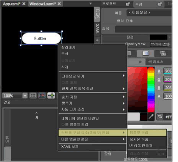
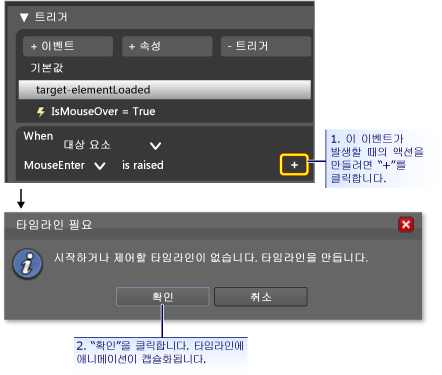
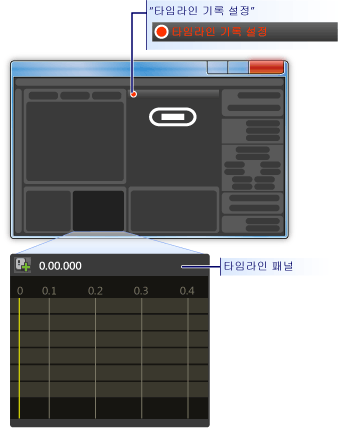
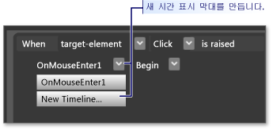
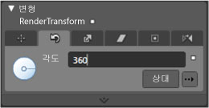

# 연습: Microsoft Expression Blend를 사용하여 단추 만들기

이 연습에서는 Microsoft Expression Blend를 사용 하 여 [!INCLUDE[TLA2#tla_wpf](../../../../includes/tla2sharptla-wpf-md.md)] 사용자 지정 단추를 만드는 과정을 단계별로 안내 합니다.

> [!IMPORTANT]
> Microsoft Expression Blend는 실행 프로그램을 만들기 위해 컴파일된 [!INCLUDE[TLA#tla_xaml](../../../../includes/tlasharptla-xaml-md.md)]를 생성 하는 방식으로 작동 합니다. XAML로 직접 작업 하는 경우 Blend가 아닌 Visual Studio에서 XAML을 사용 하 여 동일한 응용 프로그램을 만드는 다른 연습이 있습니다. 자세한 내용은 [XAML을 사용 하 여 단추 만들기](walkthrough-create-a-button-by-using-xaml.md) 를 참조 하세요.

다음 그림에서는 사용자가 만드는 사용자 지정 된 단추를 보여 줍니다.

## 셰이프를 단추로 변환

이 연습의 첫 번째 부분에서는 사용자 지정 단추의 사용자 지정 모양을 만듭니다. 이렇게 하려면 먼저 사각형을 단추로 변환 합니다. 그런 다음 단추 템플릿에 셰이프를 추가 하 여 더 복잡 한 모양의 단추를 만듭니다. 일반 단추로 시작 하지 않고 사용자 지정 하는 이유는 무엇 인가요? 단추에는 기본 제공 기능이 필요 하지 않습니다. 사용자 지정 단추의 경우 사각형으로 시작 하는 것이 더 쉽습니다.

### Expression Blend에서 새 프로젝트를 만들려면

1. 식 Blend를 시작 합니다. **시작**을 클릭 하 고 **모든 프로그램**, **microsoft Expression**을 차례로 가리킨 다음 **microsoft expression Blend**를 클릭 합니다.

2. 필요한 경우 응용 프로그램을 최대화 합니다.

3. **파일** 메뉴에서 **새 프로젝트**를 클릭합니다.

4. **표준 응용 프로그램 (.exe)** 을 선택 합니다.

5. 프로젝트 이름을 `CustomButton` 하 고 **확인**을 누릅니다.

이때 빈 [!INCLUDE[TLA2#tla_wpf](../../../../includes/tla2sharptla-wpf-md.md)] 프로젝트가 있습니다. F5 키를 눌러 응용 프로그램을 실행할 수 있습니다. 짐작할 수 있듯이 응용 프로그램은 빈 창 으로만 구성 됩니다. 다음으로 모퉁이가 둥근 사각형을 만들어 단추로 변환 합니다.

### 사각형을 단추로 변환 하려면

1. **창 배경 속성을 검은색으로 설정 합니다.** 창을 선택 하 고 **속성 탭**을 클릭 한 다음 <xref:System.Windows.Controls.Control.Background%2A> 속성을 `Black`로 설정 합니다.

    

2. **창의 단추 크기에 따라 사각형을 그립니다.** 왼쪽 도구 패널에서 사각형 도구를 선택 하 고 사각형을 창으로 끌어 놓습니다.

    

3. **사각형의 모퉁이를 둥글게 합니다.** 사각형의 제어점을 끌거나 <xref:System.Windows.Shapes.Rectangle.RadiusX%2A>을 직접 설정 하 고 <xref:System.Windows.Shapes.Rectangle.RadiusY%2A> 속성을 설정 합니다. <xref:System.Windows.Shapes.Rectangle.RadiusX%2A> 및 <xref:System.Windows.Shapes.Rectangle.RadiusY%2A> 값을 20으로 설정 합니다.

    

4. **사각형을 단추로 변경 합니다.** 사각형을 선택 합니다. **도구** 메뉴에서 **만들기 단추**를 클릭 합니다.

    

5. **스타일/템플릿의 범위를 지정 합니다.** 다음과 같은 대화 상자가 나타납니다.

    

    **리소스 이름 (키)** 의 경우 **모두에 적용**을 선택 합니다.  이렇게 하면 결과 스타일 및 단추 템플릿이 단추인 모든 개체에 적용 됩니다. **정의에서** **응용 프로그램**을 선택 합니다. 이렇게 하면 결과 스타일 및 단추 템플릿의 범위가 전체 응용 프로그램에 대해 결정 됩니다. 이러한 두 상자에 값을 설정 하면 단추 스타일 및 템플릿이 전체 응용 프로그램 내의 모든 단추에 적용 되 고 응용 프로그램에서 만드는 모든 단추가 기본적으로이 템플릿을 사용 합니다.

## 단추 템플릿 편집

이제 단추로 변경 된 사각형이 있습니다. 이 섹션에서는 단추의 템플릿을 수정 하 고 모양을 추가로 사용자 지정 합니다.

### 단추 모양을 변경 하는 단추 템플릿을 편집 하려면

1. **편집 템플릿 보기로 이동:** 단추 모양을 추가로 사용자 지정 하려면 단추 템플릿을 편집 해야 합니다. 이 템플릿은 사각형을 단추로 변환할 때 만들어졌습니다. 단추 템플릿을 편집 하려면 단추를 마우스 오른쪽 단추로 클릭 하 고 **컨트롤 파트 편집 (템플릿)** 을 선택한 다음 **템플릿 편집**을 선택 합니다.

    

    템플릿 편집기에서 단추가 <xref:System.Windows.Shapes.Rectangle> 및 <xref:System.Windows.Controls.ContentPresenter>으로 분리 되어 있는지 확인 합니다. <xref:System.Windows.Controls.ContentPresenter>은 단추 내에 콘텐츠를 표시 하는 데 사용 됩니다 (예: 문자열 "Button"). 사각형 및 <xref:System.Windows.Controls.ContentPresenter> 모두 <xref:System.Windows.Controls.Grid>내부에 배치 됩니다.

    

2. **템플릿 구성 요소의 이름을 변경 합니다.** 템플릿 인벤토리에서 사각형을 마우스 오른쪽 단추로 클릭 하 고 <xref:System.Windows.Shapes.Rectangle> 이름을 "[Rectangle]"에서 "outerRectangle"로 변경 하 고 "[ContentPresenter]"를 "myContentPresenter"로 변경 합니다.

    

3. **사각형을 도넛 (예: 도넛) 안에 비어 있도록 변경 합니다.** **OuterRectangle** 을 선택 하 고 <xref:System.Windows.Shapes.Shape.Fill%2A>를 "투명"으로 설정 하 고 <xref:System.Windows.Shapes.Shape.StrokeThickness%2A> 5로 설정 합니다.

    

    그런 다음 <xref:System.Windows.Shapes.Shape.Stroke%2A>를 템플릿의 색으로 설정 합니다. 이렇게 하려면 **스트로크**옆의 작은 흰색 상자를 클릭 하 고 **customexpression**을 선택한 다음 대화 상자에 "{TemplateBinding Background}"를 입력 합니다.

    

4. **내부 사각형을 만듭니다.** 이제 다른 사각형 (이름을 "innerRectangle"로 ")을 만들고 **outerRectangle** 내부에서 대칭적으로 배치 합니다. 이러한 종류의 작업을 수행 하려면 확대/축소 하 여 편집 영역에서 단추를 확대 하는 것이 좋습니다.

    > [!NOTE]
    > 사각형이 그림에 있는 것과 다를 수 있습니다 (예를 들어 모퉁이가 둥근 경우).

    

5. **ContentPresenter를 맨 위로 이동 합니다.** 이 시점에서 텍스트 "Button"이 더 이상 표시 되지 않을 수 있습니다. 이 경우 **innerRectangle** 가 **myContentPresenter**의 맨 위에 있기 때문입니다. 이 문제를 해결 하려면 **myContentPresenter** 를 **innerRectangle**아래로 끕니다. 다음과 같이 사각형 및 **myContentPresenter** 의 위치를 변경 합니다.

    > [!NOTE]
    > 또는 마우스 오른쪽 단추로 클릭 하 고 **앞으로 보내기**를 눌러 **myContentPresenter** 를 위쪽에 배치할 수도 있습니다.

    

6. **InnerRectangle의 모양을 변경 합니다.** <xref:System.Windows.Shapes.Rectangle.RadiusX%2A>, <xref:System.Windows.Shapes.Rectangle.RadiusY%2A>및 <xref:System.Windows.Shapes.Shape.StrokeThickness%2A> 값을 20으로 설정 합니다. 또한 사용자 지정 식 "{TemplateBinding Background}"을 사용 하 여 <xref:System.Windows.Shapes.Shape.Fill%2A>를 템플릿의 배경으로 설정 하 고 <xref:System.Windows.Shapes.Shape.Stroke%2A>를 "투명"으로 설정 합니다. **InnerRectangle** 의 <xref:System.Windows.Shapes.Shape.Fill%2A> 및 <xref:System.Windows.Shapes.Shape.Stroke%2A>에 대 한 설정은 **outerRectangle**의 경우와 반대입니다.

    

7. **위쪽에 투명 효과 계층 추가:** 단추의 모양을 사용자 지정 하는 마지막 부분은 투명 효과 계층을 위쪽에 추가 하는 것입니다. 이 투명 계층은 세 번째 사각형으로 구성 됩니다. 유리는 전체 단추를 포함 하기 때문에 투명 효과 사각형은 **outerRectangle**크기와 비슷합니다. 따라서 단순히 **outerRectangle**복사본을 만들어 사각형을 만듭니다. **OuterRectangle** 를 강조 표시 하 고 Ctrl + C 및 Ctrl + V를 사용 하 여 복사본을 만듭니다. 새 사각형의 이름을 "glassCube"로 합니다.

8. **필요한 경우 glassCube의 위치를 변경 합니다.** **GlassCube** 가 아직 배치 되지 않아 전체 단추를 포함 하는 경우에는 위치로 끕니다.

9. **GlassCube을 outerRectangle과 약간 다른 모양으로 지정 합니다.** **GlassCube**의 속성을 변경 합니다. <xref:System.Windows.Shapes.Rectangle.RadiusX%2A> 및 <xref:System.Windows.Shapes.Rectangle.RadiusY%2A> 속성을 10으로 변경 하 고 <xref:System.Windows.Shapes.Shape.StrokeThickness%2A>를 2로 변경 하 여 시작 합니다.

    

10. **투명 하 게 보이게 glassCube.** 75% 불투명 선형 그라데이션을 사용 하 여 <xref:System.Windows.Shapes.Shape.Fill%2A>를 glassy로 설정 하 고 색 흰색 사이에서 교대로 간격이 균일 하 게 6을 두고 투명 하 게 간격을 설정 합니다. 다음은 그라데이션 중지점을 설정 하는 것입니다.

    - 그라데이션 중지점 1: 알파 값이 75% 인 흰색

    - 그라데이션 중지점 2: 투명

    - 그라데이션 중지점 3: 알파 값이 75% 인 흰색

    - 그라데이션 중지점 4: 투명

    - 그라데이션 중지점 5: 알파 값이 75% 인 흰색

    - 그라데이션 중지점 6: 투명

    그러면 "물결선" 유리 모양이 생성 됩니다.

    

11. **투명 효과 계층을 숨깁니다.** 이제 glassy 계층이 어떻게 표시 되는지 확인 하 고, **속성 패널** 의 **모양 창** 으로 이동 하 고, 불투명도를 0%로 설정 하 여 숨깁니다. 앞의 섹션에서는 속성 트리거와 이벤트를 사용 하 여 투명 효과 계층을 표시 하 고 조작 합니다.

    

## 단추 동작 사용자 지정

이 시점에서 해당 템플릿을 편집 하 여 단추의 표시를 사용자 지정 했지만 단추는 마우스를 가져갈 때 모양 변경, 포커스 받기, 클릭 등의 작업을 수행 하는 등의 방법으로 사용자 작업에 응답 하지 않습니다. 다음 두 절차에서는 사용자 지정 단추에 이와 같은 동작을 빌드하는 방법을 보여 줍니다. 간단한 속성 트리거로 시작한 다음 이벤트 트리거와 애니메이션을 추가 합니다.

### 속성 트리거를 설정 하려면

1. **새 속성 트리거를 만듭니다.** **GlassCube** 가 선택 된 상태에서 **트리거** 패널에서 **+ 속성** 을 클릭 합니다 (다음 단계를 따르는 그림 참조). 이렇게 하면 기본 속성 트리거를 사용 하 여 속성 트리거가 만들어집니다.

2. **트리거에서 사용 하는 속성을 System.windows.uielement.ismouseover 확인 합니다.** 속성을 <xref:System.Windows.UIElement.IsMouseOver%2A>변경 합니다. 이렇게 하면 <xref:System.Windows.UIElement.IsMouseOver%2A> 속성이 `true` 되는 경우 (사용자가 마우스로 단추를 가리킬 때) 속성 트리거가 활성화 됩니다.

    

3. **System.windows.uielement.ismouseover는 glassCube에 대해 100%의 불투명도를 트리거합니다.** **트리거 기록이 설정 된 것** 을 확인 합니다 (이전 그림 참조). 즉, 기록 하는 동안 **glassCube** 의 속성 값에 대 한 모든 변경 내용은 <xref:System.Windows.UIElement.IsMouseOver%2A> `true`될 때 발생 하는 작업이 됩니다. 기록 하는 동안 **glassCube** 의 <xref:System.Windows.UIElement.Opacity%2A>를 100%로 변경 합니다.

    

    이제 첫 번째 속성 트리거를 만들었습니다. 편집기의 **트리거 패널** 에 100%로 변경 된 <xref:System.Windows.UIElement.Opacity%2A> 기록 되어 있습니다.

    

    F5 키를 눌러 응용 프로그램을 실행 하 고 단추 위로 마우스 포인터를 이동 합니다. 단추 위에 마우스를 놓았을 때 투명 효과 계층이 표시 되 고 포인터가 벗어나면 사라집니다.

4. **System.windows.uielement.ismouseover 트리거 스트로크 값 변경:** 다른 작업을 <xref:System.Windows.UIElement.IsMouseOver%2A> 트리거와 연결 해 보겠습니다. 기록이 지속 되는 동안 선택 항목을 **glassCube** 에서 **outerRectangle**로 전환 합니다. 그런 다음 **outerRectangle** 의 <xref:System.Windows.Shapes.Shape.Stroke%2A>을 "{DynamicResource {X:Static systemcolors}}"의 사용자 지정 식으로 설정 합니다. 이렇게 하면 <xref:System.Windows.Shapes.Shape.Stroke%2A>이 단추에 사용 되는 일반적인 강조 색으로 설정 됩니다. 단추 위에 마우스를 놓았을 때 효과를 확인 하려면 F5 키를 누릅니다.

    

5. **System.windows.uielement.ismouseover는 흐린 텍스트를 트리거합니다.** <xref:System.Windows.UIElement.IsMouseOver%2A> 속성 트리거에 하나 이상의 작업을 연결 해 보겠습니다. 투명 효과가 표시 되 면 단추의 콘텐츠가 약간 흐리게 표시 되도록 합니다. 이를 위해 <xref:System.Windows.Controls.ContentPresenter> (**myContentPresenter**)에 흐림 <xref:System.Windows.Media.Effects.BitmapEffect> 적용할 수 있습니다.

    

    > [!NOTE]
    > <xref:System.Windows.Media.Effects.BitmapEffect>검색 하기 전의 상태로 **속성 패널** 을 되돌리려면 **검색 상자**에서 텍스트를 지웁니다.

    이 시점에서 마우스 포인터를 단추 영역으로 가져갈 때의 강조 동작을 만들기 위해 몇 가지 관련 작업을 포함 하는 속성 트리거를 사용 했습니다. 단추에 대 한 일반적인 다른 동작은 클릭 한 대로 포커스가 있을 때 강조 표시 하는 것입니다. <xref:System.Windows.UIElement.IsFocused%2A> 속성에 대해 다른 속성 트리거를 추가 하 여 이러한 동작을 추가할 수 있습니다.

6. **IsFocused 있는 속성 트리거를 만듭니다.** <xref:System.Windows.UIElement.IsMouseOver%2A>와 동일한 절차를 사용 하 여 (이 섹션의 첫 번째 단계 참조) <xref:System.Windows.UIElement.IsFocused%2A> 속성에 대해 다른 속성 트리거를 만듭니다. **트리거 기록이 설정 되어 있는**동안 트리거에 다음 작업을 추가 합니다.

    - **glassCube** 는 100%의 <xref:System.Windows.UIElement.Opacity%2A>을 가져옵니다.

    - **outerRectangle** "{DynamicResource {X:Static Systemcolors HighlightBrushKey}}"의 <xref:System.Windows.Shapes.Shape.Stroke%2A> 사용자 지정 식 값을 가져옵니다.

이 연습의 마지막 단계에서는 단추에 애니메이션을 추가 합니다. 이러한 애니메이션은 이벤트 (특히 <xref:System.Windows.UIElement.MouseEnter> 및 <xref:System.Windows.Controls.Primitives.ButtonBase.Click> 이벤트에 의해 트리거됩니다.

### 이벤트 트리거와 애니메이션을 사용 하 여 대화형 작업을 추가 하려면

1. **MouseEnter 이벤트 트리거를 만듭니다.** 새 이벤트 트리거를 추가 하 고 트리거에 사용할 이벤트로 <xref:System.Windows.UIElement.MouseEnter>을 선택 합니다.

     

2. **애니메이션 타임 라인을 만듭니다.** 그런 다음 애니메이션 타임 라인을 <xref:System.Windows.UIElement.MouseEnter> 이벤트에 연결 합니다.

    

    **확인** 을 눌러 새 타임 라인을 만든 후에는 **타임 라인 패널이** 나타나고 "타임 라인 기록이 켜져 있습니다."가 디자인 패널에 표시 됩니다. 즉, 속성 변경 내용에 애니메이션을 적용 하 여 타임 라인의 속성 변경 내용을 기록 하기 시작할 수 있습니다.

    > [!NOTE]
    > 디스플레이를 표시 하려면 창 및/또는 패널 크기를 조정 해야 할 수 있습니다.

    

3. **키 프레임을 만듭니다.** 애니메이션을 만들려면 애니메이션 효과를 적용할 개체를 선택 하 고, 타임 라인에서 두 개 이상의 키 프레임을 만들고, 해당 키프레임에 대해 애니메이션이 보간 하려는 속성 값을 설정 합니다. 다음 그림에서는 키 프레임을 만드는 과정을 안내 합니다.

    

4. **이 키프레임에서 GlassCube 축소:** 두 번째 키프레임이 선택 된 상태에서 **크기 변환을**사용 하 여 **glassCube** 크기를 전체 크기의 90%로 축소 합니다.

    

    F5 키를 눌러 애플리케이션을 실행합니다. 마우스 포인터를 단추 위로 이동 합니다. 투명 효과 레이어가 단추 위쪽으로 축소 됩니다.

5. **다른 이벤트 트리거를 만들고 다른 애니메이션을 연결 합니다.** 하나 이상의 애니메이션을 추가 해 보겠습니다. 이전 이벤트 트리거 애니메이션을 만드는 데 사용한 것과 비슷한 절차를 사용 합니다.

    1. <xref:System.Windows.Controls.Primitives.ButtonBase.Click> 이벤트를 사용 하 여 새 이벤트 트리거를 만듭니다.

    2. 새 타임 라인을 <xref:System.Windows.Controls.Primitives.ButtonBase.Click> 이벤트와 연결 합니다.

        

    3. 이 타임 라인의 경우 두 개의 키를 만듭니다. 하나는 0.0 초에, 두 번째는 0.3 초에 하나씩 만듭니다.

    4. 0\.3 초의 키프레임이 강조 표시 된 상태로 **회전 변환 각도** 를 360도로 설정 합니다.

        

    5. F5 키를 눌러 애플리케이션을 실행합니다. 단추를 클릭합니다. 투명 효과 레이어가 회전 합니다.

## 결론

사용자 지정 된 단추를 완료 했습니다. 응용 프로그램의 모든 단추에 적용 된 단추 템플릿을 사용 하 여이를 수행 했습니다. 템플릿 편집 모드 (다음 그림 참조)를 유지 하 고 더 많은 단추를 만드는 경우 기본 단추 대신 사용자 지정 단추 처럼 표시 되 고 동작 하는 것을 볼 수 있습니다.

F5 키를 눌러 애플리케이션을 실행합니다. 단추를 클릭 하 고 모두 동일한 방식으로 동작 하는 방식을 확인 합니다.

템플릿을 사용자 지정 하는 동안 **innerRectangle** 의 <xref:System.Windows.Shapes.Shape.Fill%2A> 속성을 설정 하 고 <xref:System.Windows.Shapes.Shape.Stroke%2A> 속성 **outerRectangle** 를 템플릿 배경 ({TemplateBinding background})으로 설정 합니다. 따라서 개별 단추의 배경색을 설정 하는 경우 설정 하는 배경은 해당 속성에 사용 됩니다. 지금 배경을 변경해 보세요. 다음 그림에서는 서로 다른 그라데이션을 사용 합니다. 따라서 서식 파일은 단추와 같은 컨트롤의 전반적인 사용자 지정에 유용 하지만 템플릿이 있는 컨트롤은 서로 다르게 보이도록 수정할 수 있습니다.

결론으로, 단추 템플릿을 사용자 지정 하는 프로세스에서는 Microsoft Expression Blend에서 다음 작업을 수행 하는 방법을 배웠습니다.

- 컨트롤의 모양을 사용자 지정 합니다.

- 속성 트리거를 설정 합니다. 속성 트리거는 컨트롤이 아니라 대부분의 개체에 사용할 수 있기 때문에 매우 유용 합니다.

- 이벤트 트리거를 설정 합니다. 이벤트 트리거는 컨트롤이 아니라 대부분의 개체에 사용할 수 있기 때문에 매우 유용 합니다.

- 애니메이션을 만듭니다.

- 기타: 그라데이션을 만들고, BitmapEffects을 추가 하 고, 변환을 사용 하 고, 개체의 기본 속성을 설정 합니다.

## 참조

- [XAML을 사용하여 단추 만들기](walkthrough-create-a-button-by-using-xaml.md)
- [스타일 지정 및 템플릿](styling-and-templating.md)
- [애니메이션 개요](../graphics-multimedia/animation-overview.md)
- [단색 및 그라데이션을 사용한 그리기 개요](../graphics-multimedia/painting-with-solid-colors-and-gradients-overview.md)
- [비트맵 효과 개요](../graphics-multimedia/bitmap-effects-overview.md)
