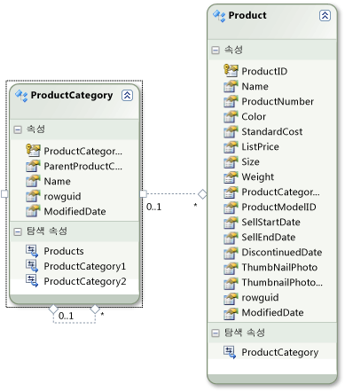

# 연습: DataGrid 컨트롤에서 SQL Server 데이터베이스의 데이터 표시
이 연습에서는 SQL Server 데이터베이스에서 데이터를 검색하여 <xref:System.Windows.Controls.DataGrid> 컨트롤에 표시합니다.  ADO.NET Entity Framework를 사용하여 데이터를 나타내는 엔터티 클래스를 만들고 LINQ를 사용하여 엔터티 클래스에서 지정된 데이터를 검색하는 쿼리를 작성합니다.  
  
## 사전 요구 사항  
 이 연습을 완료하려면 다음 구성 요소가 필요합니다.  
  
-   [!INCLUDE[vs_dev11_long](../../../../includes/vs-dev11-long-md.md)].  
  
-   AdventureWorksLT2008 샘플 데이터베이스가 연결되어 있는 SQL Server 또는 SQL Server Express의 실행 중인 인스턴스에 액세스.  AdventureWorksLT2008 데이터베이스는 [CodePlex 웹 사이트](http://go.microsoft.com/fwlink/?LinkId=159848)에서 다운로드할 수 있습니다.  
  
### 엔터티 클래스를 만들려면  
  
1.  Visual Basic 또는 C\#에서 `DataGridSQLExample`이라는 새 WPF 응용 프로그램 프로젝트를 만듭니다.  
  
2.  솔루션 탐색기에서 프로젝트를 마우스 오른쪽 단추로 클릭하고 **추가**를 가리킨 다음 **새 항목**을 선택합니다.  
  
     새 항목 추가 대화 상자가 나타납니다.  
  
3.  설치된 템플릿 창에서 **데이터**를 선택하고 템플릿 목록에서 **ADO.NET 엔터티 데이터 모델**을 선택합니다.  
  
       
  
4.  파일의 이름을 `AdventureWorksModel.edmx`로 지정하고 **추가**를 클릭합니다.  
  
     엔터티 데이터 모델 마법사가 나타납니다.  
  
5.  모델 콘텐츠 선택 화면에서 **데이터베이스에서 생성**을 선택하고 **다음**을 클릭합니다.  
  
       
  
6.  데이터 연결 선택 화면에서 AdventureWorksLT2008 데이터베이스에 대한 연결을 제공합니다.  자세한 내용은 [데이터 연결 선택 대화 상자](http://go.microsoft.com/fwlink/?LinkId=160190)를 참조하십시오.  
  
       
  
7.  이름이 `AdventureWorksLT2008Entities`이고 **App.Config의 엔터티 연결 설정을 다음으로 저장** 확인란이 선택되어 있는지 확인하고 **다음**을 클릭합니다.  
  
8.  데이터베이스 개체 선택 화면에서 테이블 노드를 확장하고 **Product** 및 **ProductCategory** 테이블을 선택합니다.  
  
     모든 테이블에 대해 엔터티 클래스를 생성할 수 있지만, 이 예제에서는 이 두 테이블에서만 데이터를 검색합니다.  
  
       
  
9. **마침**을 클릭합니다.  
  
     Product 및 ProductCategory 엔터티가 Entity Designer에 표시됩니다.  
  
       
  
### 데이터를 검색하여 표시하려면  
  
1.  MainWindow.xaml 파일을 엽니다.  
  
2.  <xref:System.Windows.Window>의 <xref:System.Windows.FrameworkElement.Width%2A> 속성을 450으로 설정합니다.  
  
3.  XAML 편집기에서 다음 <xref:System.Windows.Controls.DataGrid> 태그를 `<Grid>` 태그와 `</Grid>` 태그 사이에 추가하여 `dataGrid1`이라는 <xref:System.Windows.Controls.DataGrid>를 추가합니다.  
  
     [!code-xml[DataGrid_SQL_EF_Walkthrough#3](../../../../samples/snippets/csharp/VS_Snippets_Wpf/DataGrid_SQL_EF_Walkthrough/CS/MainWindow.xaml#3)]  
  
       
  
4.  <xref:System.Windows.Window>를 선택합니다.  
  
5.  속성 창 또는 XAML 편집기를 사용하여 <xref:System.Windows.FrameworkElement.Loaded> 이벤트에 대해 `Window_Loaded`라는 <xref:System.Windows.Window>의 이벤트 처리기를 만듭니다.  자세한 내용은 [방법: 단순한 이벤트 처리기 만들기](http://msdn.microsoft.com/ko-kr/b1456e07-9dec-4354-99cf-18666b64f480)를 참조하십시오.  
  
     다음 예제에서는 MainWindow.xaml에 대한 XAML을 보여 줍니다.  
  
    > [!NOTE]
    >  Visual Basic을 사용하는 경우에는 MainWindow.xaml의 첫 번째 줄에서 `x:Class="DataGridSQLExample.MainWindow"`를 `x:Class="MainWindow"`로 바꿉니다.  
  
     [!code-xml[DataGrid_SQL_EF_Walkthrough#1](../../../../samples/snippets/csharp/VS_Snippets_Wpf/DataGrid_SQL_EF_Walkthrough/CS/MainWindow.xaml#1)]  
  
6.  <xref:System.Windows.Window>에 대한 코드 숨김 파일\(MainWindow.xaml.vb 또는 MainWindow.xaml.cs\)을 엽니다.  
  
7.  조인된 테이블에서 특정 값만 검색하고 <xref:System.Windows.Controls.DataGrid>의 <xref:System.Windows.Controls.ItemsControl.ItemsSource%2A> 속성을 설정하는 다음 코드를 쿼리 결과에 추가합니다.  
  
     [!code-csharp[DataGrid_SQL_EF_Walkthrough#2](../../../../samples/snippets/csharp/VS_Snippets_Wpf/DataGrid_SQL_EF_Walkthrough/CS/MainWindow.xaml.cs#2)]
     [!code-vb[DataGrid_SQL_EF_Walkthrough#2](../../../../samples/snippets/visualbasic/VS_Snippets_Wpf/DataGrid_SQL_EF_Walkthrough/VB/MainWindow.xaml.vb#2)]  
  
8.  예제를 실행합니다.  
  
     데이터를 표시하는 <xref:System.Windows.Controls.DataGrid>가 나타납니다.  
  
       
  
## 다음 단계  
  
## 참고 항목  
 <xref:System.Windows.Controls.DataGrid>   
 [어떻게 수행할 i: 신청 WPF 응용 프로그램에서 엔터티 프레임 워크?](란?LinkId%20159868%20=)