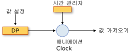

# 애니메이션 및 타이밍 시스템 개요
이 항목에서는 타이밍 시스템이 애니메이션, <xref:System.Windows.Media.Animation.Timeline> 및 <xref:System.Windows.Media.Animation.Clock> 클래스를 사용하여 속성에 애니메이션 효과를 주는 방법에 대해 설명합니다.  
  
   
   
## 사전 요구 사항  
 이 항목을 이해하려면 [애니메이션 개요](../../../../docs/framework/wpf/graphics-multimedia/animation-overview.md)에 설명된 것처럼 [!INCLUDE[TLA2#tla_winclient](../../../../includes/tla2sharptla-winclient-md.md)] 애니메이션을 사용하여 속성에 애니메이션 효과를 줄 수 있어야 합니다.  또한 [종속성 속성](GTMT)에 익숙하면 도움이 됩니다. 자세한 내용은 [종속성 속성 개요](../../../../docs/framework/wpf/advanced/dependency-properties-overview.md)를 참조하십시오.  
  
   
## Timeline 및 Clock  
 [애니메이션 개요](../../../../docs/framework/wpf/graphics-multimedia/animation-overview.md)에서는 <xref:System.Windows.Media.Animation.Timeline>이 시간 세그먼트를 나타내는 방법과 애니메이션이 출력 값을 생성하는 <xref:System.Windows.Media.Animation.Timeline> 형식이라는 것을 설명했습니다.  <xref:System.Windows.Media.Animation.Timeline> 자체는 시간 세그먼트를 설명하는 것 외에 어떠한 작업도 수행하지 않습니다.  실제 작업을 수행하는 것은 Timeline의 <xref:System.Windows.Media.Animation.Clock> 개체입니다.  마찬가지로 애니메이션은 실제로 속성에 애니메이션 효과를 주지 않습니다. 애니메이션 클래스는 출력 값이 계산되는 방법을 설명하지만 애니메이션 출력을 구동하고 속성에 적용하는 것은 애니메이션에 대해 만들어진 <xref:System.Windows.Media.Animation.Clock>입니다.  
  
 <xref:System.Windows.Media.Animation.Clock>은 <xref:System.Windows.Media.Animation.Timeline>에 대한 타이밍 관련 런타임 상태를 유지 관리하는 특수한 형식의 개체입니다.  이 개체는 애니메이션 및 타이밍 시스템에 필수적인 세 가지 정보인 <xref:System.Windows.Media.Animation.Clock.CurrentTime%2A>, <xref:System.Windows.Media.Animation.Clock.CurrentProgress%2A> 및 <xref:System.Windows.Media.Animation.Clock.CurrentState%2A>를 제공합니다.  <xref:System.Windows.Media.Animation.Clock>은 해당 <xref:System.Windows.Media.Animation.Timeline>: <xref:System.Windows.Media.Animation.Timeline.Duration%2A>, <xref:System.Windows.Media.Animation.Timeline.RepeatBehavior%2A>, <xref:System.Windows.Media.Animation.Timeline.AutoReverse%2A> 등에 의해 설명되는 타이밍 동작을 사용하여 현재 시간, 진행률 및 상태를 확인합니다.  
  
 대부분의 경우 Timeline에 대해 <xref:System.Windows.Media.Animation.Clock>이 자동으로 만들어집니다.  <xref:System.Windows.Media.Animation.Storyboard> 또는 <xref:System.Windows.Media.Animation.Animatable.BeginAnimation%2A> 메서드를 사용하여 애니메이션 효과를 줄 경우 Timeline 및 애니메이션에 대해 Clock이 자동으로 만들어지고 해당 대상 속성에 적용됩니다.  <xref:System.Windows.Media.Animation.Timeline>의 <xref:System.Windows.Media.Animation.Timeline.CreateClock%2A> 메서드를 사용하여 <xref:System.Windows.Media.Animation.Clock>을 명시적으로 만들 수도 있습니다.  <xref:System.Windows.Media.MediaTimeline.CreateClock%2A?displayProperty=fullName> 메서드는 자신이 호출되는 <xref:System.Windows.Media.Animation.Timeline>에 대한 적절한 형식의 Clock을 만듭니다.  <xref:System.Windows.Media.Animation.Timeline>은 자식 Timeline이 포함된 경우 자식 Timeline에 대해서도 <xref:System.Windows.Media.Animation.Clock> 개체를 만듭니다.  결과 <xref:System.Windows.Media.Animation.Clock> 개체는 자신이 만들어진 <xref:System.Windows.Media.Animation.Timeline> 개체 트리의 구조와 일치하는 트리로 정렬됩니다.  
  
 여러 다른 형식의 Timeline을 위한 여러 다른 형식의 Clock이 있습니다.  다음 표에서는 몇 가지 다른 <xref:System.Windows.Media.Animation.Timeline> 형식에 해당하는 <xref:System.Windows.Media.Animation.Clock> 형식을 보여 줍니다.  
  
|Timeline 형식|Clock 형식|Clock 용도|  
|-----------------|--------------|--------------|  
|Animation\(<xref:System.Windows.Media.Animation.AnimationTimeline>에서 상속\)|<xref:System.Windows.Media.Animation.AnimationClock>|종속성 속성에 대한 출력 값을 생성합니다.|  
|<xref:System.Windows.Media.MediaTimeline>|<xref:System.Windows.Media.MediaClock>|미디어 파일을 처리합니다.|  
|<xref:System.Windows.Media.Animation.ParallelTimeline>|<xref:System.Windows.Media.Animation.ClockGroup>|해당 자식 <xref:System.Windows.Media.Animation.Clock> 개체를 그룹화하고 제어합니다.|  
|<xref:System.Windows.Media.Animation.Storyboard>|<xref:System.Windows.Media.Animation.ClockGroup>|해당 자식 <xref:System.Windows.Media.Animation.Clock> 개체를 그룹화하고 제어합니다.|  
  
 작성된 모든 <xref:System.Windows.Media.Animation.AnimationClock> 개체를 <xref:System.Windows.Media.Animation.IAnimatable.ApplyAnimationClock%2A> 메서드를 사용하여 호환되는 종속성 속성에 적용할 수 있습니다.  
  
 다수의 비슷한 개체에 애니메이션 효과를 주는 경우처럼 성능 저하가 발생할 수 있는 시나리오에서는 개별적으로 <xref:System.Windows.Media.Animation.Clock> 사용을 관리하면 성능을 높일 수 있습니다.  
  
   
## Clock 및 시간 관리자  
 [!INCLUDE[TLA2#tla_winclient](../../../../includes/tla2sharptla-winclient-md.md)]에서 개체에 애니메이션 효과를 줄 경우 Timeline에 대해 만들어진 <xref:System.Windows.Media.MediaPlayer.Clock%2A> 개체를 관리하는 것은 시간 관리자입니다.  시간 관리자는 <xref:System.Windows.Media.MediaPlayer.Clock%2A> 개체 트리의 루트이며 해당 트리에서 시간의 흐름을 제어합니다.  시간 관리자는 각 [!INCLUDE[TLA2#tla_winclient](../../../../includes/tla2sharptla-winclient-md.md)] 응용 프로그램에 대해 자동으로 만들어지고 응용 프로그램 개발자에게 표시되지 않습니다. 시간 관리자는 초당 여러 번 "틱"합니다. 초당 발생하는 실제 틱 수는 사용 가능한 시스템 리소스에 따라 달라집니다.  이러한 각 틱마다 시간 관리자는 타이밍 트리에 있는 모든 <xref:System.Windows.Media.Animation.ClockState> <xref:System.Windows.Media.Animation.Clock> 개체의 상태를 계산합니다.  
  
 다음 그림은 시간 관리자, <xref:System.Windows.Media.Animation.AnimationClock> 및 애니메이션 효과를 준 종속성 속성 간의 관계를 보여 줍니다.  
  
   
속성에 애니메이션 효과 주기  
  
 시간 관리자는 틱할 경우 응용 프로그램에서 모든 <xref:System.Windows.Media.Animation.ClockState> <xref:System.Windows.Media.Animation.Clock>의 시간을 업데이트합니다.  <xref:System.Windows.Media.Animation.Clock>은 <xref:System.Windows.Media.Animation.AnimationClock>일 경우 자신이 만들어진 <xref:System.Windows.Media.Animation.AnimationTimeline>의 <xref:System.Windows.Media.Animation.AnimationTimeline.GetCurrentValue%2A> 메서드를 사용하여 현재 출력 값을 계산합니다.  <xref:System.Windows.Media.Animation.AnimationClock>은 현재 로컬 시간, 입력 값\(일반적으로 속성의 기준 값\) 및 기본 대상 값을 <xref:System.Windows.Media.Animation.AnimationTimeline>에 제공합니다.  <xref:System.Windows.DependencyObject.GetValue%2A> 메서드 또는 해당 CLR 접근자를 사용하여 애니메이션 효과가 주어진 속성의 값을 검색할 경우 해당 <xref:System.Windows.Media.Animation.AnimationClock>의 출력을 얻게 됩니다.  
  
#### Clock 그룹  
 이전 단원에서는 다른 형식의 Timeline에 대한 다른 형식의 <xref:System.Windows.Media.Animation.Clock> 개체가 있다는 것을 설명했습니다.  다음 그림은 시간 관리자, <xref:System.Windows.Media.Animation.ClockGroup>, <xref:System.Windows.Media.Animation.AnimationClock> 및 애니메이션 효과를 준 종속성 속성 간의 관계를 보여 줍니다.  <xref:System.Windows.Media.Animation.ClockGroup>은 애니메이션 및 기타 Timeline을 그룹화하는 <xref:System.Windows.Media.Animation.Storyboard> 클래스와 같은 다른 Timeline을 그룹화하는 Timeline에 대해 만들어집니다.  
  
   
ClockGroup  
  
#### 컴퍼지션  
 여러 Clock을 단일 속성과 연관시킬 수 있으며 이 경우 각 Clock은 이전 Clock의 출력 값을 기준 값으로 사용합니다.  다음 그림에서는 동일한 속성에 적용되는 세 가지 <xref:System.Windows.Media.Animation.AnimationClock> 개체를 보여 줍니다.  Clock1은 애니메이션 효과가 주어진 속성의 기준 값을 입력으로 사용하여 출력을 생성합니다.  Clock2는 Clock1의 출력을 입력으로 사용하여 출력을 생성합니다.  Clock3은 Clock2의 출력을 입력으로 사용하여 출력을 생성합니다.  여러 Clock이 동일한 속성에 동시에 영향을 줄 경우 이러한 Clock을 컴포지션 체인에 있다고 말합니다.  
  
   
컴포지션 체인  
  
 컴포지션 체인에서 <xref:System.Windows.Media.Animation.AnimationClock> 개체의 입력 및 출력 간에 관계가 생성되지만 해당 타이밍 동작은 영향을 받지 않습니다. <xref:System.Windows.Media.Animation.Clock> 개체\(<xref:System.Windows.Media.Animation.AnimationClock> 개체 포함\)는 부모 <xref:System.Windows.Media.Animation.Clock> 개체에 대한 계층적 종속성을 가집니다.  
  
 여러 Clock을 동일한 속성에 적용하려면 <xref:System.Windows.Media.Animation.Storyboard>, 애니메이션 또는 <xref:System.Windows.Media.Animation.AnimationClock>을 적용할 때 <xref:System.Windows.Media.Animation.HandoffBehavior> <xref:System.Windows.Media.Animation.HandoffBehavior>를 사용합니다.  
  
#### 틱 및 이벤트 통합  
 출력 값을 계산하는 것 외에도 시간 관리자는 틱할 때마다 다른 작업을 수행합니다. 즉, 각 Clock의 상태를 확인하고 적절하게 이벤트를 발생시킵니다.  
  
 틱이 자주 발생하는 동안 틱 사이에 많은 작업이 수행될 수 있습니다.  예를 들어 <xref:System.Windows.Media.Animation.Clock>이 중지되고 시작했다가 다시 중지되어 해당 <xref:System.Windows.Media.Animation.Clock.CurrentState%2A> 값이 세 번 변경될 수도 있습니다.  이론적으로 보면 <xref:System.Windows.Media.Animation.Clock.CurrentStateInvalidated> 이벤트는 단일 틱에서 여러 번 발생할 수 있지만 타이밍 엔진에서 이벤트를 통합하므로 <xref:System.Windows.Media.Animation.Clock.CurrentStateInvalidated> 이벤트는 틱당 한 번만 발생할 수 있습니다.  이는 모든 타이밍 이벤트에 적용됩니다. 즉, 지정된 <xref:System.Windows.Media.Animation.Clock> 개체에 대해 각 형식의 이벤트가 하나만 발생합니다.  
  
 <xref:System.Windows.Media.Animation.Clock>이 틱 사이에 상태를 전환하고 원래 상태로 돌아갈 경우\(예: <xref:System.Windows.Media.Animation.ClockState>에서 <xref:System.Windows.Media.Animation.ClockState>로 변경되었다가 다시 <xref:System.Windows.Media.Animation.ClockState>로 변경될 경우\) 연결된 이벤트가 여전히 발생합니다.  
  
 타이밍 이벤트에 대한 자세한 내용은 [타이밍 이벤트 개요](../../../../docs/framework/wpf/graphics-multimedia/timing-events-overview.md)를 참조하십시오.  
  
   
## 속성의 현재 값 및 기준 값  
 애니메이션 효과를 줄 수 있는 속성은 기준 값과 현재 값의 두 개의 값을 가질 수 있습니다.  해당 CLR 접근자 또는 <xref:System.Windows.DependencyObject.SetValue%2A> 메서드를 사용하여 속성을 설정할 경우 해당 기준 값이 설정됩니다.  속성에 애니메이션 효과를 주지 않을 경우 해당 기준 값과 현재 값은 동일합니다.  
  
 속성에 애니메이션 효과를 줄 경우 <xref:System.Windows.Media.Animation.AnimationClock>은 속성의 현재 값을 설정합니다.  해당 CLR 접근자나 <xref:System.Windows.DependencyObject.GetValue%2A> 메서드를 통해 속성 값을 검색할 경우 <xref:System.Windows.Media.Animation.AnimationClock>이 <xref:System.Windows.Media.Animation.ClockState> 또는 <xref:System.Windows.Media.Animation.ClockState>이면 <xref:System.Windows.Media.Animation.AnimationClock>의 출력이 반환됩니다.  <xref:System.Windows.Media.Animation.IAnimatable.GetAnimationBaseValue%2A> 메서드를 사용하여 속성의 기준 값을 검색할 수 있습니다.  
  
## 참고 항목  
 [애니메이션 개요](../../../../docs/framework/wpf/graphics-multimedia/animation-overview.md)   
 [타이밍 이벤트 개요](../../../../docs/framework/wpf/graphics-multimedia/timing-events-overview.md)   
 [타이밍 동작 개요](../../../../docs/framework/wpf/graphics-multimedia/timing-behaviors-overview.md)