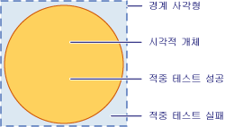
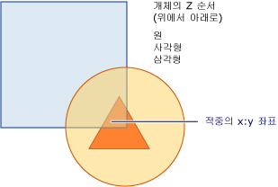

# 시각적 계층에서 적중 테스트
이 항목에서는 시각적 계층에서 제공하는 적중 테스트 기능의 개요를 제공합니다. 적중된 테스트 지원을 사용 하는 기 하 도형 또는 점 값의 렌더링된 된 콘텐츠에 속하는지 여부를 결정할 수는 <xref:System.Windows.Media.Visual>, 여러 개체를 선택할 선택 직사각형과 같은 사용자 인터페이스 동작을 구현할 수 있습니다.  
  
 
  
   
## 적중 테스트 시나리오  
 합니다 <xref:System.Windows.UIElement> 클래스를 제공 합니다 <xref:System.Windows.UIElement.InputHitTest%2A> 메서드를 사용 하면 지정된 된 좌표 값을 사용 하 여 요소에 대해 적중 테스트 합니다. 대부분의 경우에 <xref:System.Windows.UIElement.InputHitTest%2A> 메서드 구현 적중 요소 테스트에 대 한 원하는 기능을 제공 합니다. 그러나 시각적 계층에서 적중 테스트를 구현해야 하는 몇 가지 시나리오가 있습니다.  
  
-   이외에 대 한 테스트 적중<xref:System.Windows.UIElement> 개체:은 적중 테스트 하 고 아닌 경우이 적용 됩니다<xref:System.Windows.UIElement> 같은 개체 <xref:System.Windows.Media.DrawingVisual> 또는 그래픽 개체입니다.  
  
-   기하 도형을 사용하는 적중 테스트: 점의 좌표 값이 아닌 기하 도형 개체를 사용하여 적중 테스트를 수행해야 하는 경우에 적용됩니다.  
  
-   여러 개체에 대한 적중 테스트: 겹치는 개체와 같은 여러 개체에 대해 적중 테스트를 수행해야 하는 경우에 적용됩니다. 단지 첫 번째 개체만이 아니라 기하 도형 또는 점을 교차하는 모든 시각적 개체에 대한 결과를 얻을 수 있습니다.  
  
-   무시 <xref:System.Windows.UIElement> 적중 테스트 정책을: 무시 해야 하는 경우에 적용 됩니다는 <xref:System.Windows.UIElement> 적중 횟수를 요소가 해제 되어 있는지 여부 또는 보이지 않는 등의 요인을 고려 하는 정책을 테스트 합니다.  
  
> [!NOTE]
>  시각적 계층의 적중 테스트를 보여 주는 전체 코드 샘플에 대해서는 [DrawingVisuals를 사용하는 적중 테스트 샘플](https://go.microsoft.com/fwlink/?LinkID=159994) 및 [Win32 상호 운용성을 사용하는 적중 테스트 샘플](https://go.microsoft.com/fwlink/?LinkID=159995)을 참조하세요.  
  
   
## 적중 테스트 지원  
 용도 <xref:System.Windows.Media.VisualTreeHelper.HitTest%2A> 에서 메서드를 <xref:System.Windows.Media.VisualTreeHelper> 클래스는 기 하 도형 또는 점 좌표 값이 컨트롤 또는 그래픽 요소와 같은 지정된 된 개체의 렌더링된 된 콘텐츠 내에 있는지를 결정 하는 것입니다. 예를 들어 적중 테스트를 사용하여 개체의 경계 사각형 내부를 마우스로 클릭할 경우 기하 도형 원 내에 포함되는지 여부를 확인할 수 있습니다. 또한 적중 테스트의 기본 구현을 재정의하여 사용자 고유의 적중 테스트 계산을 사용자 지정하도록 선택할 수도 있습니다.  
  
 다음 그림은 사각형이 아닌 개체의 영역 및 해당 경계 사각형 간 관계를 보여 줍니다.  
  
   
유효한 적정 테스트 영역의 다이어그램  
  
   
## 적중 테스트 및 Z 순서  
 [!INCLUDE[TLA#tla_winclient](../../../../includes/tlasharptla-winclient-md.md)] 시각적 계층은 단지 최상위 개체만이 아니라 점 또는 기하 도형 아래의 모든 개체에 대한 적중 테스트를 지원합니다. 결과는 Z 순서대로 반환됩니다. 그러나 매개 변수로 전달 하는 시각적 개체는 <xref:System.Windows.Media.VisualTreeHelper.HitTest%2A> 부분을 결정 하는 메서드 도달 하는 시각적 트리의 테스트 합니다. 시각적 트리 전체 또는 일부에 대해 적중 테스트를 수행할 수 있습니다.  
  
 다음 그림에서 원 개체는 사각형 및 삼각형 개체 위에 있습니다. 적중 횟수 테스트 z 값이 최상위 시각적 개체에에서만 관심이, 경우에 반환할 시각적 적중된 테스트 열거형을 설정할 수 있습니다 <xref:System.Windows.Media.HitTestResultBehavior.Stop> 에서 <xref:System.Windows.Media.HitTestResultCallback> 첫 번째 항목 이후에 적중된 테스트 통과 중지 합니다.  
  
   
시각적 트리의 z 순서 다이어그램  
  
 특정 점 또는 기 하 도형 아래의 모든 시각적 개체를 열거 하려는 경우 반환 <xref:System.Windows.Media.HitTestResultBehavior.Continue> 에서 <xref:System.Windows.Media.HitTestResultCallback>합니다. 즉 전체가 가려진 경우에도 다른 개체 아래에 있는 시각적 개체에 대한 적중 테스트를 수행할 수 있습니다. 자세한 내용은 "적중 테스트 결과 콜백 사용" 섹션의 샘플 코드를 참조하세요.  
  
> [!NOTE]
>  투명한 시각적 개체에 대해서도 적중 테스트를 수행할 수 있습니다.  
  
   
## 기본 적중 테스트 사용  
 사용 하 여 점이 시각적 개체의 기 하 도형 내 여부를 확인할 수는 <xref:System.Windows.Media.VisualTreeHelper.HitTest%2A> 시각적 개체 및 점 좌표 값에 대해 테스트를 지정 하는 방법입니다. 시각적 개체 매개 변수는 시각적 트리에서 적중 테스트 검색의 시작점을 식별합니다. 시각적 개체에에서 있으면 해당 기 하 도형에 좌표가 포함 된 시각적 트리를로 설정 됩니다는 <xref:System.Windows.Media.HitTestResult.VisualHit%2A> 의 속성을 <xref:System.Windows.Media.HitTestResult> 개체입니다. 합니다 <xref:System.Windows.Media.HitTestResult> 다음에서 반환 되는 <xref:System.Windows.Media.VisualTreeHelper.HitTest%2A> 메서드. 지점은 적중 테스트 하 고, 시각적 하위 트리를 사용 하 여 포함 되지 않은 경우 <xref:System.Windows.Media.VisualTreeHelper.HitTest%2A> 반환 `null`합니다.  
  
> [!NOTE]
>  기본 적중 테스트는 항상 z 순서로 최상위 개체를 반환합니다. 부분적으로 또는 완전히 가려져 있더라도 모든 시각적 개체를 식별하려면 적중 테스트 결과 콜백을 사용합니다.  
  
 좌표 값에 대 한 점 매개 변수로 전달 된 <xref:System.Windows.Media.VisualTreeHelper.HitTest%2A> 메서드가 적중 테스트 시각적 개체의 좌표 공간 상대적이 되도록 합니다. 예를 들어 중첩된 시각적 개체가 부모 좌표 공간에서 (100, 100)에 정의된 경우 (0, 0)의 자식 시각적 개체에 대해 적중 테스트를 수행하는 것은 부모 좌표 공간의 (100, 100)에서 적중 테스트를 수행하는 것과 같습니다.  
  
 다음 코드에 대 한 마우스 이벤트 처리기를 설정 하는 방법을 보여 줍니다는 <xref:System.Windows.UIElement> 적중 횟수 테스트에 사용 되는 이벤트를 캡처하기 위해 사용 되는 개체입니다.  
  
 [!code-csharp[HitTestingOverview#100](../../../../samples/snippets/csharp/VS_Snippets_Wpf/HitTestingOverview/CSharp/Window1.xaml.cs#100)]
 [!code-vb[HitTestingOverview#100](../../../../samples/snippets/visualbasic/VS_Snippets_Wpf/HitTestingOverview/visualbasic/window1.xaml.vb#100)]  
  
### 시각적 트리가 적중 테스트에 미치는 영향  
 시각적 트리의 시작점은 개체의 적중 테스트 열거 동안 반환되는 개체를 결정합니다. 여러 개체에 대해 적중 테스트를 수행하려는 경우 시각적 트리에서 시작점으로 사용되는 시각적 개체는 관심 있는 모든 개체의 공통 상위 항목이어야 합니다. 예를 들어 다음 다이어그램에서 button 요소 및 drawing visual 요소 둘 다에 대해 적중 테스트를 수행하려는 경우 시각적 트리의 시작점을 두 요소의 공통 상위 항목으로 설정해야 합니다. 이 경우 canvas 요소는 button 요소 및 drawing visual의 공통 상위 항목입니다.  
  
   
시각적 트리 계층 구조의 다이어그램  
  
> [!NOTE]
>  <xref:System.Windows.UIElement.IsHitTestVisible%2A> 속성 선언 하는 값을 가져오거나 여부는 <xref:System.Windows.UIElement>-파생된 개체가 반환 될 수는 적중 횟수 테스트 결과로 렌더링 된 콘텐츠의 일부에서. 또한 적중 테스트와 관련된 시각적 개체를 확인하도록 시각적 트리를 선택적으로 변경할 수 있습니다.  
  
   
## 적중 테스트 결과 콜백 사용  
 해당 기하 도형이 지정된 좌표 값을 포함하는 시각적 트리의 모든 시각적 개체를 열거할 수 있습니다. 또한 부분적으로 또는 완전히 가려져 있더라도 모든 시각적 개체를 식별할 수 있습니다. 시각적 트리를 사용 하는 시각적 개체를 열거 하는 <xref:System.Windows.Media.VisualTreeHelper.HitTest%2A> 적중된 테스트 콜백 함수를 사용 하 여 메서드. 적중 테스트 콜백 함수는 지정한 좌표 값이 시각적 개체에 포함된 경우 시스템에 의해 호출됩니다.  
  
 적중 테스트 결과 열거 동안에는 해당 시각적 트리를 수정하는 어떤 작업도 수행하면 안 됩니다. 개체가 트래버스되는 동안 시각적 트리에 추가 또는 제거하면 예기치 않은 동작이 발생할 수 있습니다. 후 시각적 트리를 안전 하 게 수정할 수 있습니다는 <xref:System.Windows.Media.VisualTreeHelper.HitTest%2A> 메서드 반환 합니다. 같은 데이터 구조를 제공 하는 것이 좋습니다는 <xref:System.Collections.ArrayList>적중 횟수 테스트 결과 열거 동안 값을 저장 합니다.  
  
 [!code-csharp[HitTestingOverview#101](../../../../samples/snippets/csharp/VS_Snippets_Wpf/HitTestingOverview/CSharp/Window1.xaml.cs#101)]
 [!code-vb[HitTestingOverview#101](../../../../samples/snippets/visualbasic/VS_Snippets_Wpf/HitTestingOverview/visualbasic/window1.xaml.vb#101)]  
  
 적중 테스트 콜백 메서드는 시각적 트리의 특정 시각적 개체에서 적중 테스트가 식별될 때 수행하는 작업을 정의합니다. 반환할 작업을 수행 하 고 나면는 <xref:System.Windows.Media.HitTestResultBehavior> 여부 다른 시각적 개체의 열거를 계속할지 여부를 결정 하는 값입니다.  
  
 [!code-csharp[HitTestingOverview#102](../../../../samples/snippets/csharp/VS_Snippets_Wpf/HitTestingOverview/CSharp/Window1.xaml.cs#102)]
 [!code-vb[HitTestingOverview#102](../../../../samples/snippets/visualbasic/VS_Snippets_Wpf/HitTestingOverview/visualbasic/window1.xaml.vb#102)]  
  
> [!NOTE]
>  적중 시각적 개체의 열거 순서는 z 순서는 따릅니다. 최상위 z 순서 수준의 시각적 개체는 첫 번째로 열거되는 개체입니다. 열거되는 다른 시각적 개체는 z 순서의 내림차순으로 표시됩니다. 이 열거 순서는 시각적 개체의 렌더링 순서에 해당합니다.  
  
 반환 하 여 적중된 테스트 콜백 함수에서 언제 든 지 시각적 개체의 열거를 중지할 수 있습니다 <xref:System.Windows.Media.HitTestResultBehavior.Stop>합니다.  
  
 [!code-csharp[HitTestingOverview#103](../../../../samples/snippets/csharp/VS_Snippets_Wpf/HitTestingOverview/CSharp/Window1.xaml.cs#103)]
 [!code-vb[HitTestingOverview#103](../../../../samples/snippets/visualbasic/VS_Snippets_Wpf/HitTestingOverview/visualbasic/window1.xaml.vb#103)]  
  
   
## 적중 테스트 필터 콜백 사용  
 선택적 적중 테스트 필터를 사용하여 적중 테스트 결과로 전달되는 개체를 제한할 수 있습니다. 이를 통해 적중 횟수 테스트 결과 처리 중 시각적 트리에서 관련이 없는 파트를 무시할 수 있습니다. 적중된 테스트 필터를 구현 하려면 적중된 테스트 필터 콜백 함수를 정의 하 고이 호출할 때 매개 변수 값으로 전달 된 <xref:System.Windows.Media.VisualTreeHelper.HitTest%2A> 메서드.  
  
 [!code-csharp[HitTestingOverview#104](../../../../samples/snippets/csharp/VS_Snippets_Wpf/HitTestingOverview/CSharp/Window1.xaml.cs#104)]
 [!code-vb[HitTestingOverview#104](../../../../samples/snippets/visualbasic/VS_Snippets_Wpf/HitTestingOverview/visualbasic/window1.xaml.vb#104)]  
  
 선택적 적중된 테스트 필터 콜백 함수를 제공 하지 않을 경우 전달 된 `null` 값에 대 한 매개 변수로 <xref:System.Windows.Media.VisualTreeHelper.HitTest%2A> 메서드.  
  
 [!code-csharp[HitTestingOverview#105](../../../../samples/snippets/csharp/VS_Snippets_Wpf/HitTestingOverview/CSharp/Window1.xaml.cs#105)]
 [!code-vb[HitTestingOverview#105](../../../../samples/snippets/visualbasic/VS_Snippets_Wpf/HitTestingOverview/visualbasic/window1.xaml.vb#105)]  
  
   
시각적 트리 정리  
  
 적중 테스트 필터 콜백 함수를 사용하면 해당 렌더링된 콘텐츠가 지정한 좌표를 포함하는 모든 시각적 개체를 열거할 수 있습니다. 그렇지만 적중 테스트 결과 콜백 함수에서 처리하지 않으려는 시각적 트리의 특정 분기를 무시하고 싶을 수 있습니다. 적중 테스트 필터 콜백 함수의 반환 값은 수행해야 하는 시각적 개체의 열거 작업 유형을 결정합니다. 예를 들어, 값을 반환 하는 경우 <xref:System.Windows.Media.HitTestFilterBehavior.ContinueSkipSelfAndChildren>, 적중 횟수 테스트 결과 열거에서 현재 시각적 개체 및 자식 함수를 제거할 수 있습니다. 즉, 적중 테스트 결과 콜백 함수를 사용하면 열거에 이러한 개체가 표시되지 않습니다. 개체의 시각적 트리를 정리하면 적중 테스트 결과 열거 패스 동안 처리 양이 감소합니다. 다음 코드 예제에서 필터는 레이블 및 해당 하위 항목을 건너뛰고 다른 모든 항목에 대해 적중 테스트를 수행합니다.  
  
 [!code-csharp[HitTestingOverview#106](../../../../samples/snippets/csharp/VS_Snippets_Wpf/HitTestingOverview/CSharp/Window1.xaml.cs#106)]
 [!code-vb[HitTestingOverview#106](../../../../samples/snippets/visualbasic/VS_Snippets_Wpf/HitTestingOverview/visualbasic/window1.xaml.vb#106)]  
  
> [!NOTE]
>  적중 테스트 결과 콜백이 호출되지 않는 경우에 적중 테스트 필터 콜백이 호출되는 경우도 있습니다.  
  
   
## 기본 적중 테스트 재정의  
 시각적 개체의 기본 적중 테스트 지원을 재정의 하 여 재정의할 수 있습니다는 <xref:System.Windows.Media.Visual.HitTestCore%2A> 메서드. 즉, 호출 하는 <xref:System.Windows.Media.VisualTreeHelper.HitTest%2A> 메서드를 재정의 된 구현 <xref:System.Windows.Media.Visual.HitTestCore%2A> 라고 합니다. 재정의된 메서드는 좌표가 시각적 개체의 렌더링된 콘텐츠 밖에 있는 경우에도 적중 테스트가 시각적 개체의 경계 사각형 내에 적용되면 호출됩니다.  
  
 [!code-csharp[HitTestingOverview#107](../../../../samples/snippets/csharp/VS_Snippets_Wpf/HitTestingOverview/CSharp/Window1.xaml.cs#107)]
 [!code-vb[HitTestingOverview#107](../../../../samples/snippets/visualbasic/VS_Snippets_Wpf/HitTestingOverview/visualbasic/window1.xaml.vb#107)]  
  
 시각적 개체의 경계 사각형과 렌더링된 콘텐츠 둘 다에 대해 적중 테스트를 수행하려는 경우가 있을 수 있습니다. 사용 하 여 합니다 `PointHitTestParameters` 에서 재정의 된 매개 변수 값 <xref:System.Windows.Media.Visual.HitTestCore%2A> 기본 메서드에 매개 변수로 <xref:System.Windows.Media.Visual.HitTestCore%2A>, 시각적 개체의 경계 사각형 적중에 따라 작업을 수행 하 고 다음에 대 한 두 번째 적중된 테스트를 수행할 수 있습니다는 시각적 개체의 콘텐츠를 렌더링 합니다.  
  
 [!code-csharp[HitTestingOverview#108](../../../../samples/snippets/csharp/VS_Snippets_Wpf/HitTestingOverview/CSharp/Window1.xaml.cs#108)]
 [!code-vb[HitTestingOverview#108](../../../../samples/snippets/visualbasic/VS_Snippets_Wpf/HitTestingOverview/visualbasic/window1.xaml.vb#108)]  
  
## 참고 항목  
 <xref:System.Windows.Media.VisualTreeHelper.HitTest%2A>  
 <xref:System.Windows.Media.HitTestResult>  
 <xref:System.Windows.Media.HitTestResultCallback>  
 <xref:System.Windows.Media.HitTestFilterCallback>  
 <xref:System.Windows.UIElement.IsHitTestVisible%2A>  
 [적중 테스트 DrawingVisuals 샘플을 사용 하 여](https://go.microsoft.com/fwlink/?LinkID=159994)  
 [적중 테스트 Win32 상호 운용성 샘플](https://go.microsoft.com/fwlink/?LinkID=159995)  
 [시각적 요소의 기하 도형 적중 테스트](../../../../docs/framework/wpf/graphics-multimedia/how-to-hit-test-geometry-in-a-visual.md)  
 [Win32 호스트 컨테이너를 사용하여 적중 테스트](../../../../docs/framework/wpf/graphics-multimedia/how-to-hit-test-using-a-win32-host-container.md)
