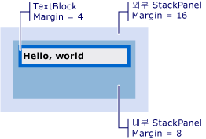

# 방법: 시각적 요소의 오프셋 가져오기
이 예제에서는 부모 또는 모든 상위나 하위에 상대적인 시각적 개체의 오프셋 값을 검색하는 방법을 보여 줍니다.  
  
## 예제  
 다음 태그 예제에서는 <xref:System.Windows.FrameworkElement.Margin%2A> 값이 4로 정의된 <xref:System.Windows.Controls.TextBlock>을 보여 줍니다.  
  
 [!code-xml[VisualSnippets#VisualSnippet1](../../../../samples/snippets/csharp/VS_Snippets_Wpf/VisualSnippets/CSharp/Window1.xaml#visualsnippet1)]  
  
 다음 코드 예제에서는 <xref:System.Windows.Media.VisualTreeHelper.GetOffset%2A> 메서드를 사용하여 <xref:System.Windows.Controls.TextBlock>의 오프셋을 검색하는 방법을 보여 줍니다.  오프셋 값은 반환된 <xref:System.Windows.Vector> 값에 포함되어 있습니다.  
  
 [!code-csharp[VisualSnippets#VisualSnippet2](../../../../samples/snippets/csharp/VS_Snippets_Wpf/VisualSnippets/CSharp/Window1.xaml.cs#visualsnippet2)]
 [!code-vb[VisualSnippets#VisualSnippet2](../../../../samples/snippets/visualbasic/VS_Snippets_Wpf/VisualSnippets/visualbasic/window1.xaml.vb#visualsnippet2)]  
  
 오프셋에는 <xref:System.Windows.FrameworkElement.Margin%2A> 값이 고려됩니다.  이 경우 <xref:System.Windows.Vector.X%2A>는 4이고, <xref:System.Windows.Vector.Y%2A>는 4입니다.  
  
 반환된 오프셋 값은 <xref:System.Windows.Media.Visual>의 부모를 기준으로 합니다.  <xref:System.Windows.Media.Visual>의 부모를 기준으로 하지 않는 오프셋 값을 반환하려면 <xref:System.Windows.Media.Visual.TransformToAncestor%2A> 메서드를 사용합니다.  
  
## 상위에 상대적인 오프셋 가져오기  
 다음 태그 예제에서는 두 <xref:System.Windows.Controls.StackPanel> 개체 안에 중첩된 <xref:System.Windows.Controls.TextBlock>을 보여 줍니다.  
  
 [!code-xml[VisualSnippets#VisualSnippet7](../../../../samples/snippets/csharp/VS_Snippets_Wpf/VisualSnippets/CSharp/Window2.xaml#visualsnippet7)]  
  
 다음 그림에서는 태그의 결과를 보여 줍니다.  
  
   
두 StackPanel 안에 중첩된 TextBlock  
  
 다음 코드 예제에서는 <xref:System.Windows.Media.Visual.TransformToAncestor%2A> 메서드를 사용하여 포함 <xref:System.Windows.Window>에 상대적인 <xref:System.Windows.Controls.TextBlock>의 오프셋을 검색하는 방법을 보여 줍니다.  오프셋 값은 반환된 <xref:System.Windows.Media.GeneralTransform> 값에 포함되어 있습니다.  
  
 [!code-csharp[VisualSnippets#VisualSnippet5](../../../../samples/snippets/csharp/VS_Snippets_Wpf/VisualSnippets/CSharp/Window1.xaml.cs#visualsnippet5)]
 [!code-vb[VisualSnippets#VisualSnippet5](../../../../samples/snippets/visualbasic/VS_Snippets_Wpf/VisualSnippets/visualbasic/window1.xaml.vb#visualsnippet5)]  
  
 오프셋은 포함 <xref:System.Windows.Window> 안의 모든 개체에 대한 <xref:System.Windows.FrameworkElement.Margin%2A> 값을 고려합니다.  이 경우 <xref:System.Windows.Vector.X%2A>는 28\(16 \+ 8 \+ 4\)이고 <xref:System.Windows.Vector.Y%2A>는 28입니다.  
  
 반환되는 오프셋 값은 <xref:System.Windows.Media.Visual>의 상위에 상대적입니다.  <xref:System.Windows.Media.Visual>의 하위에 상대적인 오프셋 값을 반환하려면 <xref:System.Windows.Media.Visual.TransformToDescendant%2A> 메서드를 사용합니다.  
  
## 하위에 상대적인 오프셋 가져오기  
 다음 태그 예제에서는 <xref:System.Windows.Controls.StackPanel> 개체 안에 포함된 <xref:System.Windows.Controls.TextBlock>을 보여 줍니다.  
  
 [!code-xml[VisualSnippets#VisualSnippet4](../../../../samples/snippets/csharp/VS_Snippets_Wpf/VisualSnippets/CSharp/Window1.xaml#visualsnippet4)]  
  
 다음 코드 예제에서는 <xref:System.Windows.Media.Visual.TransformToDescendant%2A> 메서드를 사용하여 자식 <xref:System.Windows.Controls.TextBlock>을 기준으로 <xref:System.Windows.Controls.StackPanel>의 오프셋을 검색하는 방법을 보여 줍니다.  오프셋 값은 반환된 <xref:System.Windows.Media.GeneralTransform> 값에 포함되어 있습니다.  
  
 [!code-csharp[VisualSnippets#VisualSnippet9](../../../../samples/snippets/csharp/VS_Snippets_Wpf/VisualSnippets/CSharp/Window1.xaml.cs#visualsnippet9)]
 [!code-vb[VisualSnippets#VisualSnippet9](../../../../samples/snippets/visualbasic/VS_Snippets_Wpf/VisualSnippets/visualbasic/window1.xaml.vb#visualsnippet9)]  
  
 오프셋은 모든 개체에 대한 <xref:System.Windows.FrameworkElement.Margin%2A> 값을 고려합니다.  이 경우 <xref:System.Windows.Vector.X%2A>는 \-4이고 <xref:System.Windows.Vector.Y%2A>는 \-4입니다.  부모 개체가 자식 개체에 대해 음의 방향으로 오프셋되므로 오프셋 값은 음수 값입니다.  
  
## 참고 항목  
 <xref:System.Windows.Media.Visual>   
 <xref:System.Windows.Media.VisualTreeHelper>   
 [WPF 그래픽 렌더링 개요](../../../../docs/framework/wpf/graphics-multimedia/wpf-graphics-rendering-overview.md)