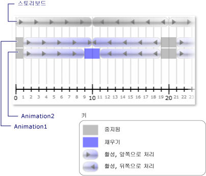

# 방법: 시계의 상태가 변경될 때 알림 받기
시계가 시작되거나 중지될 때와 같이 시계의 <xref:System.Windows.Media.Animation.Clock.CurrentState%2A>가 무효화되면 시계의 <xref:System.Windows.Media.Animation.Clock.CurrentStateInvalidated> 이벤트가 발생합니다.  직접 <xref:System.Windows.Media.Animation.Clock>을 사용하거나 <xref:System.Windows.Media.Animation.Timeline>을 사용하여 이 이벤트에 등록할 수 있습니다.  
  
 다음 예제에서는 <xref:System.Windows.Media.Animation.Storyboard>와 두 개의 <xref:System.Windows.Media.Animation.DoubleAnimation> 개체를 사용하여 두 사각형의 너비에 애니메이션 효과를 적용합니다.  시계 상태 변경을 수신하기 위해 <xref:System.Windows.Media.Animation.Timeline.CurrentStateInvalidated> 이벤트를 사용합니다.  
  
## 예제  
 [!code-xml[timingbehaviors_snip#_graphicsmm_StateExampleMarkupWholePage](../../../../samples/snippets/csharp/VS_Snippets_Wpf/timingbehaviors_snip/CSharp/StateExample.xaml#_graphicsmm_stateexamplemarkupwholepage)]  
  
 [!code-csharp[timingbehaviors_snip#_graphicsmm_StateEventHandlers](../../../../samples/snippets/csharp/VS_Snippets_Wpf/timingbehaviors_snip/CSharp/StateExample.xaml.cs#_graphicsmm_stateeventhandlers)]
 [!code-vb[timingbehaviors_snip#_graphicsmm_StateEventHandlers](../../../../samples/snippets/visualbasic/VS_Snippets_Wpf/timingbehaviors_snip/visualbasic/stateexample.xaml.vb#_graphicsmm_stateeventhandlers)]  
  
 다음 그림에서는 부모 시간 표시 막대\(*Storyboard*\)가 진행될 때 애니메이션에 적용되는 두 가지 다른 상태를 보여 줍니다.  
  
   
  
 다음 표에서는 *Animation1*의 <xref:System.Windows.Media.Animation.Timeline.CurrentStateInvalidated> 이벤트가 발생하는 시간을 보여 줍니다.  
  
||||||||  
|-|-|-|-|-|-|-|  
|시간\(초\)|1|10|19|21|30|39|  
|State|Active|Active|Stopped|Active|Active|Stopped|  
  
 다음 표에서는 *Animation2*의 <xref:System.Windows.Media.Animation.Timeline.CurrentStateInvalidated> 이벤트가 발생하는 시간을 보여 줍니다.  
  
||||||||||  
|-|-|-|-|-|-|-|-|-|  
|시간\(초\)|1|9|11|19|21|29|31|39|  
|State|Active|채우는 중|Active|Stopped|Active|채우는 중|Active|Stopped|  
  
 *Animation1*의 <xref:System.Windows.Media.Animation.Timeline.CurrentStateInvalidated> 이벤트는 10초에서 발생하지만 해당 상태는 그대로 <xref:System.Windows.Media.Animation.ClockState>입니다.  이는 10초에 상태가 변경되지만 동일한 눈금에서 상태가 <xref:System.Windows.Media.Animation.ClockState>에서 <xref:System.Windows.Media.Animation.ClockState>으로 변경된 다음 다시 <xref:System.Windows.Media.Animation.ClockState>로 변경되었기 때문입니다.