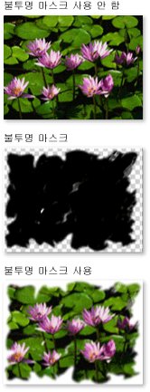

# 불투명 마스크 개요
불투명 마스크를 사용하여 요소 또는 시각적 개체의 부분을 투명하게 또는 부분적으로 투명하게 만들 수 있습니다. 적용할 불투명 마스크를 만들려면를 <xref:System.Windows.Media.Brush> 에 <xref:System.Windows.UIElement.OpacityMask%2A> 요소의 속성 또는 <xref:System.Windows.Media.Visual>합니다.  브러시가 요소 또는 시각적 개체에 매핑되고, 각 브러시 픽셀의 불투명도 값을 사용하여 요소 또는 시각적 개체의 각 해당 픽셀에 대한 결과 불투명도가 결정됩니다.  
  
   
## 전제 조건  
 이 개요에 잘 알고 있다고 가정 <xref:System.Windows.Media.Brush> 개체입니다. 브러시 사용에 대한 지침을 보려면 [단색 및 그라데이션을 사용한 그리기 개요](../../../../docs/framework/wpf/graphics-multimedia/painting-with-solid-colors-and-gradients-overview.md)를 참조하세요. 에 대 한 자세한 <xref:System.Windows.Media.ImageBrush> 하 고 <xref:System.Windows.Media.DrawingBrush>를 참조 하십시오 [이미지, 그림 및 시각적 표시로 그리기](../../../../docs/framework/wpf/graphics-multimedia/painting-with-images-drawings-and-visuals.md)합니다.  
  
   
## 불투명 마스크를 사용하여 시각 효과 만들기  
 불투명 마스크는 요소 또는 시각적 개체에 콘텐츠를 매핑하여 작동합니다. 그런 후 각 브러시의 픽셀의 알파 채널을 사용하여 요소 또는 시각적 개체의 해당 픽셀에 대한 결과 불투명도를 결정하며 브러시의 실제 색은 무시됩니다. 브러시의 특정 부분이 투명하면 요소 또는 시각적 개체의 해당 부분도 투명해 집니다. 브러시의 특정 부분이 불투명하면 요소 또는 시각적 개체의 해당 부분에 대한 불투명도는 달라지지 않습니다. 불투명 마스크로 지정된 불투명도는 요소 또는 시각적 개체의 불투명도 설정과 조합됩니다. 예를 들어 요소가 25% 불투명하고 완전 불투명에서 완전 투명으로 전환되는 불투명 마스크가 적용되면 요소는 25% 불투명에서 완전 투명으로 전환됩니다.  
  
> [!NOTE]
>  불투명 마스크 모든 요소에 적용 될 수 있지만이 개요의 예제는 이미지 요소에 불투명 마스크의 사용을 보여 줍니다, 또는 <xref:System.Windows.Media.Visual>, 패널 및 컨트롤을 포함 합니다.  
  
 불투명 마스크는 보기에서 페이드되는 이미지나 단추를 만들거나, 요소에 질감을 추가하거나, 그라데이션을 조합하여 유리같은 표면을 생성하는 등의 흥미로운 시각 효과를 만드는 데 사용됩니다. 다음 그림에서는 불투명 마스크의 사용을 보여 줍니다. 마스크의 투명한 부분을 표시하는 데 바둑판 배경이 사용됩니다.  
  
   
불투명 마스크 예제  
  
   
## 불투명 마스크 만들기  
 불투명 마스크를 만들려면는 <xref:System.Windows.Media.Brush> 에 적용 된 <xref:System.Windows.UIElement.OpacityMask%2A> 요소 또는 시각적 개체의 속성입니다. 모든 형식을 사용할 수 있습니다 <xref:System.Windows.Media.Brush> 를 불투명 마스크로 합니다.  
  
-   <xref:System.Windows.Media.LinearGradientBrush>, <xref:System.Windows.Media.RadialGradientBrush>: 요소 또는 시각적 개체가 보기에서 확인 하는 데 사용 합니다.  
  
     다음 이미지는 <xref:System.Windows.Media.LinearGradientBrush> 불투명 마스크로 사용 합니다.  
  
       
LinearGradientBrush 불투명 마스크 예제  
  
-   <xref:System.Windows.Media.ImageBrush>: 소프트 또는 찢어진 가장자리 효과 및 질감을 만들려면 사용 합니다.  
  
     다음 이미지는 <xref:System.Windows.Media.ImageBrush> 불투명 마스크로 사용 합니다.  
  
       
LinearGradientBrush 불투명 마스크 예제  
  
-   <xref:System.Windows.Media.DrawingBrush>: 도형, 이미지 및 그라데이션 패턴에서 복잡 한 불투명 마스크를 만들려면 사용 합니다.  
  
     다음 이미지는 <xref:System.Windows.Media.DrawingBrush> 불투명 마스크로 사용 합니다.  
  
       
DrawingBrush 불투명 마스크 예제  
  
 그라데이션 브러시 (<xref:System.Windows.Media.LinearGradientBrush> 고 <xref:System.Windows.Media.RadialGradientBrush>)는 불투명 마스크로 사용 하기에 특히 적합 합니다. 때문에 <xref:System.Windows.Media.SolidColorBrush> 저하 불투명도 할 영역이 균일 한 색으로 채우기, 마스크;를 사용 하 여는 <xref:System.Windows.Media.SolidColorBrush> 요소나 시각적 개체를 설정 하는 것과 같습니다 <xref:System.Windows.UIElement.OpacityMask%2A> 속성입니다.  
  
   
## 그라데이션을 불투명 마스크로 사용  
 그라데이션 채우기를 만들려면 두 개 이상의 그라데이션 중지점을 지정합니다. 각 그라데이션 중지점은 색과 위치에 대한 설명을 포함합니다(그라데이션 만들기 및 사용에 대한 자세한 내용은 [단색 및 그라데이션 개요 그리기](../../../../docs/framework/wpf/graphics-multimedia/painting-with-solid-colors-and-gradients-overview.md) 참조). 해당 프로세스는 불투명 마스크 그라데이션이 색을 혼합하는 대신, 알파 채널 값을 혼합한다는 점을 제외한다면 그라데이션을 불투명 마스크로 사용할 때와 같습니다. 따라서 그라데이션의 콘텐츠의 실제 색은 중요하지 않으며 각 색의 알파 채널 또는 불투명도만 중요합니다. 다음은 예제입니다.  
  
 [!code-xaml[OpacityMasksSnippet#LinearGradientOpacityMaskonImage](../../../../samples/snippets/csharp/VS_Snippets_Wpf/OpacityMasksSnippet/CS/GradientBrushExample.xaml#lineargradientopacitymaskonimage)]  
  
   
## 불투명 마스크에 대한 그라데이션 중지점 지정  
 이전 예제에서는 시스템 정의 색 <xref:System.Windows.Media.Colors.Black%2A> 그라데이션의 시작 색으로 사용 됩니다. 때문에 모든 색을 <xref:System.Windows.Media.Colors> 클래스를 제외 하 고 <xref:System.Windows.Media.Colors.Transparent%2A>은 완전히 불투명 그라데이션 불투명 마스크에 대 한 시작 색을 정의 하기만 하면 사용할 수 있습니다.  
  
 불투명 마스크를 정의할 때 알파 값을 추가로 제어 하기 위해 사용 하 여 색의 알파 채널을 지정할 수 있습니다 [!INCLUDE[TLA#tla_argb](../../../../includes/tlasharptla-argb-md.md)] 태그 또는 사용 하 여 16 진수 표기법을 <xref:System.Windows.Media.Color.FromScRgb%2A?displayProperty=nameWithType> 메서드.  
  
   
### "XAML"에서 색 불투명도 지정  
 [!INCLUDE[TLA#tla_xaml](../../../../includes/tlasharptla-xaml-md.md)]에서는 [!INCLUDE[TLA2#tla_argb](../../../../includes/tla2sharptla-argb-md.md)] 16진수 표기법을 사용하여 개별 색의 불투명도를 지정합니다. [!INCLUDE[TLA2#tla_argb](../../../../includes/tla2sharptla-argb-md.md)] 16진수 표기법은 다음 구문을 사용합니다.  
  
 `#` **aa** *rrggbb*  
  
 이전 줄의 *aa*는 색의 불투명도 지정하는 데 사용되는 2자리 16진수 값을 나타냅니다. *rr*, *gg* 및 *bb* 각각은 색에서 빨강, 녹색 및 파랑의 양을 지정하는 데 사용되는 2자리 16진수 값을 나타냅니다. 각 16진수 숫자는 0-9 또는 A-F의 값을 가질 수 있습니다. 0이 가장 작은 값이고 F가 가장 큰 값입니다. 알파 값 00은 완전히 투명한 색을 지정하지만 알파 값 FF는 완전히 불투명한 색을 만듭니다.  다음 예제에서는 16진수 [!INCLUDE[TLA2#tla_argb](../../../../includes/tla2sharptla-argb-md.md)] 표기법이 두 색을 지정하는 데 사용됩니다. 첫 번째는 완전히 불투명하고 두 번째는 완전히 투명합니다.  
  
 [!code-xaml[OpacityMasksSnippet#AARRGGBBValueonOpacityMask](../../../../samples/snippets/csharp/VS_Snippets_Wpf/OpacityMasksSnippet/CS/GradientBrushExample.xaml#aarrggbbvalueonopacitymask)]  
  
   
## 이미지를 불투명 마스크로 사용  
 이미지를 불투명 마스크로 사용할 수도 있습니다. 다음 그림은 예제를 보여 줍니다. 마스크의 투명한 부분을 표시하는 데 바둑판 배경이 사용됩니다.  
  
   
불투명 마스크 예제  
  
 이미지를 불투명 마스크로 사용 하려면 사용는 <xref:System.Windows.Media.ImageBrush> 이미지를 포함 합니다. 불투명 마스크로 사용할 이미지를 만들 때는 이미지를 여러 수준의 투명도를 지원하는 형식(예: [!INCLUDE[TLA#tla_png](../../../../includes/tlasharptla-png-md.md)])으로 저장합니다. 다음 예제에서는 이전 그림을 만드는 데 사용된 코드를 보여 줍니다.  
  
 [!code-xaml[OpacityMasksSnippet#UIElementOpacityMask](../../../../samples/snippets/csharp/VS_Snippets_Wpf/OpacityMasksSnippet/CS/ImageBrushExample.xaml#uielementopacitymask)]  
  
   
### 바둑판식 배열 이미지를 불투명 마스크로 사용  
 다음 예제에서는 동일한 이미지를 다른 사용 <xref:System.Windows.Media.ImageBrush>, 하지만 브러시의 바둑판식 배열 기능 이미지 50 픽셀 정사각형의 타일을 생성 하기 위해 사용 됩니다.  
  
 [!code-xaml[OpacityMasksSnippet#TiledImageasOpacityMask](../../../../samples/snippets/csharp/VS_Snippets_Wpf/OpacityMasksSnippet/CS/ImageBrushExample.xaml#tiledimageasopacitymask)]  
  
   
## 그리기에서 불투명 마스크 만들기  
 그리기를 불투명 마스크로 사용할 수 있습니다. 그리기 내에 포함된 도형 자체를 그라데이션, 단색, 이미지, 심지어 다른 그리기로 채울 수 있습니다. 다음 그림에서는 불투명 마스크로 사용되는 그리기 예제를 보여 줍니다. 마스크의 투명한 부분을 표시하는 데 바둑판 배경이 사용됩니다.  
  
   
DrawingBrush 불투명 마스크 예제  
  
 그리기를 불투명 마스크로 사용 하려면를 <xref:System.Windows.Media.DrawingBrush> 그리기를 포함 합니다. 다음 예제에서는 이전 그림을 만드는 데 사용된 코드를 보여 줍니다.  
  
 [!code-xaml[OpacityMasksSnippet#OpacityMaskfromDrawing](../../../../samples/snippets/csharp/VS_Snippets_Wpf/OpacityMasksSnippet/CS/DrawingBrushExample.xaml#opacitymaskfromdrawing)]  
  
   
### 바둑판식 배열 그리기를 불투명 마스크로 사용  
 같은 합니다 <xref:System.Windows.Media.ImageBrush>, <xref:System.Windows.Media.DrawingBrush> 해당 그리기를 바둑판식으로 배열 하도록 만들 수 있습니다. 다음 예제에서는 그리기 브러시를 사용하여 바둑판식으로 배열된 불투명 마스크를 만듭니다.  
  
 [!code-xaml[OpacityMasksSnippet#TiledDrawingasOpacityMask](../../../../samples/snippets/csharp/VS_Snippets_Wpf/OpacityMasksSnippet/CS/DrawingBrushExample.xaml#tileddrawingasopacitymask)]  
  
## 참고자료
- [이미지, 그림 및 시각적 표시로 그리기](../../../../docs/framework/wpf/graphics-multimedia/painting-with-images-drawings-and-visuals.md)
- [단색 및 그라데이션을 사용한 그리기 개요](../../../../docs/framework/wpf/graphics-multimedia/painting-with-solid-colors-and-gradients-overview.md)
