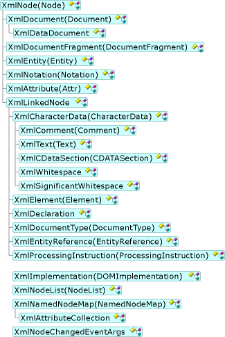

# XML DOM(문서 개체 모델) 계층 구조
다음 그림은 관련 위치에 클래스 이름과 함께 괄호 안에 W3C(World Wide Web 컨소시엄) 이름을 표시하여 XML DOM(문서 개체 모델)에 대한 클래스 계층 구조를 보여 줍니다.  
  
   
XML DOM(문서 개체 모델) 계층 구조  
  
 다음 클래스는 **XmlNode**에서 상속하지 않습니다.  
  
-   **XmlImplementation**  
  
-   **XmlNamedNodeMap**  
  
-   **XmlNodeList**  
  
-   **XmlNodeChangedEventArgs**  
  
 **XmlImplementation** 클래스는 XML 문서를 만드는 데 사용됩니다. 자세한 내용은 [XML 문서 만들기](../../../../docs/standard/data/xml/xml-document-creation.md)를 참조하세요.  
  
 **XmlNamedNodeMap** 클래스는 정렬되지 않은 노드 집합을 처리합니다. 자세한 내용은 [이름 또는 인덱스별로 정렬되지 않은 노드 검색](../../../../docs/standard/data/xml/unordered-node-retrieval-by-name-or-index.md)을 참조하세요.  
  
 **XmlNodeList** 클래스는 정렬된 노드 목록을 처리합니다. 자세한 내용은 [인덱스를 사용한 정렬된 노드 검색](../../../../docs/standard/data/xml/ordered-node-retrieval-by-index.md)을 참조하세요.  
  
 **XmlNodeChangedEventArgs** 클래스는 **XmlDocument**에 등록된 이벤트 처리기를 처리합니다. 자세한 내용은 [XmlNodeChangedEventArgs를 사용한 XML 문서의 이벤트 처리](../../../../docs/standard/data/xml/event-handling-in-an-xml-document-using-the-xmlnodechangedeventargs.md)를 참조하세요.  
  
 **XmlLinkedNode** 클래스는 **XmlNode**에서 상속합니다. 이 클래스의 용도는 **XmlNode**의 **PreviousSibling** 및 **NextSibling** 메서드를 재정의하는 것입니다. 그런 다음, 이처럼 재정의된 메서드를 서로 계층 구조를 이루는 형제 클래스인 **XmlCharacterData**, **XmlDeclaration**, **XmlDocumentType**, **XmlElement**, **XmlEntityReference** 및 **XmlProcessingInstruction**에서 상속하여 사용합니다.  
  
## 참고 항목  
 [XML DOM(문서 개체 모델)](../../../../docs/standard/data/xml/xml-document-object-model-dom.md)
