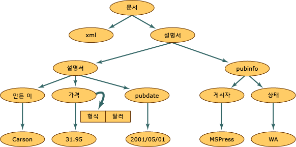

# <a name="xml-document-object-model-dom"></a>XML DOM(문서 개체 모델)
XML DOM(문서 개체 모델) 클래스는 XML 문서의 메모리 내 표현입니다. DOM을 사용하여 XML 문서를 프로그래밍 방식으로 읽고, 조작하고, 수정할 수 있습니다. **XmlReader** 클래스로도 XML을 읽을 수는 있지만, 이 클래스는 캐시되지 않은 정방향 전용 및 읽기 전용 액세스를 제공합니다. 따라서 **XmlReader**로는 특성 값이나 요소의 내용을 편집할 수 없으며, 노드를 삽입하고 제거할 수도 없습니다. 편집은 DOM의 기본 기능입니다. 실제 XML 데이터는 파일에 저장될 때나 다른 개체에서 읽어 올 때 순차적인 방식으로 저장되지만 XML 데이터를 메모리에 표현하는 것은 일반적이고 구조적인 방식으로 수행됩니다. 다음은 XML 데이터입니다.  
  
## <a name="input"></a>입력  
  
```xml  
<?xml version="1.0"?>  
  <books>  
    <book>  
        <author>Carson</author>  
        <price format="dollar">31.95</price>  
        <pubdate>05/01/2001</pubdate>  
    </book>  
    <pubinfo>  
        <publisher>MSPress</publisher>  
        <state>WA</state>  
    </pubinfo>  
  </books>   
```  
  
 다음 그림은 이 XML 데이터를 DOM 구조로 읽어올 때 메모리가 구조화되는 방법을 보여 줍니다.  
  
   
XML 문서 구조  
  
 XML 문서 구조에서 이 그림의 각 원은 **XmlNode** 개체라고 하는 노드를 나타냅니다. **XmlNode** 개체는 DOM 트리에서 기본 개체입니다. **XmlNode**를 확장한 **XmlDocument** 클래스는 XML을 메모리에 로드하거나 파일로 저장하는 것처럼 문서 전체에 수행되는 메서드를 지원합니다. 또한 **XmlDocument**를 통해 전체 XML 문서의 노드를 보고 조작할 수도 있습니다. **XmlNode**와 **XmlDocument**에서는 모두 성능과 가용성이 향상되었고 다음 기능을 수행하는 메서드 및 속성을 제공합니다.  
  
-   요소 노드, entityreference 노드 등과 같은 DOM 관련 노드 액세스 및 수정  
  
-   전체 노드 검색과 요소 노드의 텍스트와 같이 노드가 포함하는 정보 검색  
  
    > [!NOTE]
    >  응용 프로그램에 DOM이 제공하는 구조나 편집 기능이 필요하지 않은 경우 **XmlReader** 및 **XmlWriter** 클래스에서는 XML에 대한 캐시되지 않은 정방향 전용 스트림 액세스를 제공합니다. 자세한 내용은 <xref:System.Xml.XmlReader> 및 <xref:System.Xml.XmlWriter>를 참조하세요.  
  
 **Node** 개체에는 일련의 메서드 및 속성뿐만 아니라 잘 정의된 기본적인 특성도 들어 있습니다. 특성에는 다음이 포함됩니다.  
  
-   노드에는 하나의 부모 노드가 있습니다. 부모 노드는 해당 노드의 바로 위에 있는 노드입니다. Document 루트는 문서 자체와 문서 조각을 포함하는 최상위 노드이므로 부모가 없는 유일한 노드입니다.  
  
-   대부분의 노드에는 자식 노드, 즉 바로 아래에 있는 노드가 여러 개 있을 수 있습니다. 다음은 자식 노드를 가질 수 있는 노드 형식의 목록입니다.  
  
    -   **Document**  
  
    -   **DocumentFragment**  
  
    -   **EntityReference**  
  
    -   **요소**  
  
    -   **특성**  
  
     **XmlDeclaration**, **Notation**, **Entity**, **CDATASection**, **Text**, **Comment**, **ProcessingInstruction** 및 **DocumentType** 노드에는 자식 노드가 없습니다.  
  
-   다이어그램에 표시된 **book** 및 **pubinfo** 노드와 같이 동일한 수준의 노드는 형제 관계입니다.  
  
 특성 처리 방법은 DOM의 특징 중 하나입니다. 특성은 부모-자식 및 형제 관계에 있는 노드가 아닙니다. 특성은 요소 노드의 속성으로 간주되며 이름 및 값 쌍으로 구성됩니다. 예를 들어, `format="dollar` 요소와 연관된 `price`"로 구성되는 XML 데이터의 경우 `format`이라는 단어는 이름이고 `format` 특성의 값은 `dollar`입니다. **price** 노드의 `format="dollar"` 특성을 검색하려면 커서가 `price` 요소 노드에 있을 때 **GetAttribute** 메서드를 호출합니다. 자세한 내용은 [DOM에서 특성 액세스](../../../../docs/standard/data/xml/accessing-attributes-in-the-dom.md)를 참조하세요.  
  
 노드는 XML을 메모리로 읽어올 때 만들어집니다. 그러나 모든 노드가 동일한 형식은 아닙니다. XML의 요소에는 처리 명령 대신 다양한 규칙과 구문이 있습니다. 따라서 다양한 데이터를 읽을 때 각 노드에 노드 형식이 지정됩니다. 이 노드 형식은 해당 노드의 특징 및 기능을 결정합니다.  
  
 메모리에 생성되는 노드 형식에 대한 자세한 내용은 [XML 노드 형식](../../../../docs/standard/data/xml/types-of-xml-nodes.md)을 참조하세요. 노드 트리에 생성되는 개체에 대한 자세한 내용은 [XML 데이터에 개체 계층 구조 매핑](../../../../docs/standard/data/xml/mapping-the-object-hierarchy-to-xml-data.md)을 참조하세요.  
  
 Microsoft는 XML 문서 작업을 손쉽게 수행할 수 있도록 W3C(World Wide Web 컨소시엄) DOM Level 1 및 Level 2에서 사용할 수 있는 API를 확장했습니다. W3C 표준을 완전하게 지원하는 동시에 추가 클래스, 메서드 및 속성으로 W3C XML DOM을 사용하여 수행할 수 있는 것 이상의 기능을 제공합니다. 새 클래스를 사용하면 관계형 데이터에 액세스할 수 있어 ADO.NET 데이터와 동기화하는 동시에 데이터를 XML로 표현하는 메서드가 제공됩니다. 자세한 내용은 [XmlDataDocument로 데이터 집합 동기화](../../../../docs/framework/data/adonet/dataset-datatable-dataview/dataset-and-xmldatadocument-synchronization.md)를 참조하세요.  
  
 DOM은 XML 데이터를 메모리로 읽어와 구조를 변경하고, 노드를 추가하거나 제거하며, 요소에 들어 있는 텍스트에 포함된 노드의 데이터를 수정할 경우에 매우 유용합니다. 그러나 그 밖의 상황에서는 DOM보다 더 빠른 다른 클래스를 사용할 수 있습니다. XML에 대한 캐시되지 않은 정방향 전용 고속 스트림 액세스의 경우 **XmlReader** 및 **XmlWriter**를 사용하세요. 커서 모델 및 **XPath**를 사용한 임의 액세스가 필요한 경우에는 **XPathNavigator** 클래스를 사용하세요.  
  
## <a name="see-also"></a>참고 항목  
 [XML 노드 형식](../../../../docs/standard/data/xml/types-of-xml-nodes.md)  
 [XML 데이터에 개체 계층 구조 매핑](../../../../docs/standard/data/xml/mapping-the-object-hierarchy-to-xml-data.md)
