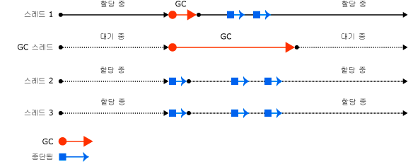

# 백그라운드 가비지 수집

백그라운드 GC(가비지 수집)에서 임시 세대(0세대 및 1세대)는 2세대 수집이 진행되는 동안 필요에 따라 수집됩니다. 백그라운드 가비지 수집은 백그라운드 또는 서버 GC인지 여부에 따라 하나 이상의 전용 스레드에서 수행되며 2세대 수집에만 적용됩니다.

백그라운드 가비지 수집은 기본적으로 사용하도록 설정되어 있습니다. .NET Framework 앱의 [gcConcurrent](../../../docs/framework/configure-apps/file-schema/runtime/gcconcurrent-element.md) 구성 설정 또는 .NET Core 앱의 [System.GC.Concurrent](../../core/run-time-config/garbage-collector.md#systemgcconcurrentcomplus_gcconcurrent) 설정에서 사용하거나 사용하지 않도록 설정할 수 있습니다.

> [!NOTE]
> 백그라운드 가비지 수집은 .NET Framework 4 이상 버전에서 사용할 수 있으며 [동시 가비지 수집](#concurrent-garbage-collection)을 대체합니다. .NET Framework 4에서는 *워크스테이션* 가비지 수집의 경우에만 지원됩니다. .NET Framework 4.5부터 백그라운드 가비지 수집이 *워크스테이션* 및 *서버* 가비지 수집 모두에서 가능합니다.

백그라운드 가비지 수집 중의 임시 세대 수집을 *포그라운드* 가비지 수집이라고 합니다. 포그라운드 가비지 수집이 발생하면 모든 관리되는 스레드가 일시 중단됩니다.

백그라운드 가비지 수집이 진행 중이고 0세대에 충분한 개체가 할당된 경우 CLR은 0세대 또는 1세대 포그라운드 가비지 수집을 수행합니다. 전용 백그라운드 가비지 수집 스레드는 안전한 지점을 수시로 검사하여 포그라운드 가비지 수집 요청이 있는지 여부를 확인합니다. 요청이 있는 경우 포그라운드 가비지 수집이 발생할 수 있도록 백그라운드 수집은 스스로를 일시 중단합니다. 포그라운드 가비지 수집이 완료되고 나면 전용 백그라운드 가비지 수집 스레드와 사용자 스레드가 다시 시작됩니다.

백그라운드 가비지 수집 중에 임시 가비지 수집이 발생할 수 있으므로 백그라운드 가비지 수집은 동시 가비지 수집에 의해 적용된 할당 제한을 제거합니다. 백그라운드 가비지 수집은 임시 세대에서 비활성 개체를 제거할 수 있습니다. 필요한 경우 1세대 가비지 수집 중에 힙을 확장할 수도 있습니다.

## 백그라운드 워크스테이션 및 서버 GC 비교

.NET Framework 4.5부터 서버 가비지 수집에 백그라운드 GC를 사용할 수 있습니다. 백그라운드 GC는 서버 가비지 수집의 기본 모드입니다.

백그라운드 서버 가비지 수집은 백그라운드 워크스테이션 가비지 수집과 비슷하게 작동하지만, 몇 가지 다른 점이 있습니다.

- 백그라운드 서버 가비지 수집은 다중 스레드를 사용하는 반면, 백그라운드 워크스테이션 가비지 수집은 단일 전용 백그라운드 가비지 수집 스레드를 사용합니다. 일반적으로 각 논리 프로세서에 사용할 수 있는 전용 스레드가 있습니다.

- 워크스테이션 백그라운드 가비지 수집 스레드와는 달리 백그라운드 서버 GC 스레드는 시간 초과되지 않습니다.

다음 그림에서는 개별 전용 스레드에서 수행되는 백그라운드 *워크스테이션* 가비지 수집을 보여 줍니다.

다음 그림에서는 개별 전용 스레드에서 수행되는 백그라운드 *서버* 가비지 수집을 보여 줍니다.

## 동시 가비지 수집

> [!TIP]
> 이 섹션은 다음에 적용됩니다.
>
> - 워크스테이션 가비지 수집의 경우 .NET Framework 3.5 이전 버전
> - 서버 가비지 수집의 경우 .NET Framework 4 이전 버전
>
> 동시 가비지는 이후 버전에서 백그라운드 가비지 수집으로 대체됩니다.

워크스테이션 또는 서버 가비지 수집에서 [동시 가비지 수집을 활성화](../../../docs/framework/configure-apps/file-schema/runtime/gcconcurrent-element.md)할 수 있습니다. 동시 가비지 수집을 사용하면 대부분의 수집 기간 동안 가비지 수집을 수행하는 전용 스레드와 다른 스레드가 동시에 실행될 수 있습니다. 이 옵션은 2세대 가비지 수집에만 영향을 미칩니다. 0세대 및 1세대는 빠르게 완료되므로 항상 비동시 수집입니다.

동시 가비지 수집을 사용하면 수집을 위한 일시 중지가 최소화되어 대화형 애플리케이션의 응답성이 향상됩니다. 동시 가비지 수집 스레드가 실행되는 대부분의 시간 동안 관리되는 스레드가 계속 실행될 수 있습니다. 이로써 가비지 수집이 발생하는 동안 일시 중지 시간이 더 짧아지게 됩니다.

동시 가비지 수집은 전용 스레드에서 수행됩니다. 기본적으로 CLR은 단일 프로세서 및 다중 프로세서 컴퓨터에서 동시 가비지 수집을 사용하도록 설정하여 워크스테이션 가비지 수집을 실행합니다.

다음 그림에서는 개별 전용 스레드에서 수행되는 동시 가비지 수집을 보여 줍니다.

## 참조

- [워크스테이션 및 서버 가비지 수집](workstation-server-gc.md)
- [가비지 수집을 위한 런타임 구성 옵션](../../core/run-time-config/garbage-collector.md)
