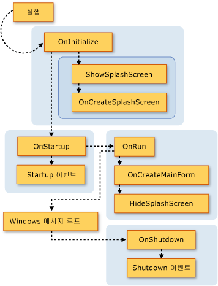

# Visual Basic 응용 프로그램 모델 확장
재정의 하 여 응용 프로그램 모델에 기능을 추가할 수 있습니다는 `Overridable` <xref:Microsoft.VisualBasic.ApplicationServices.WindowsFormsApplicationBase>클래스</xref:Microsoft.VisualBasic.ApplicationServices.WindowsFormsApplicationBase> 의 멤버 이 기법을 사용 하면 응용 프로그램이 시작 되 고 종료 하는 대로 메서드를 호출을 추가 하 고 응용 프로그램 모델의 동작을 사용자 지정할 수 있습니다.  
  
## 응용 프로그램 모델의 시각적 개요  
 이 섹션은 시각적으로 Visual Basic 응용 프로그램 모델에는 함수 호출 시퀀스를 표시합니다. 다음 섹션 정보에서 각 함수의 용도 설명합니다.  
  
 다음 그래픽 일반적인 Visual Basic Windows Forms 응용 프로그램에서 응용 프로그램 모델 호출 시퀀스를 보여 줍니다. 시퀀스를 시작 하는 경우는 `Sub Main` 프로시저 호출의 <xref:Microsoft.VisualBasic.ApplicationServices.WindowsFormsApplicationBase.Run%2A>메서드.</xref:Microsoft.VisualBasic.ApplicationServices.WindowsFormsApplicationBase.Run%2A>  
  
   
  
 Visual Basic 응용 프로그램 모델도 제공 된 <xref:Microsoft.VisualBasic.ApplicationServices.WindowsFormsApplicationBase.StartupNextInstance>및 <xref:Microsoft.VisualBasic.ApplicationServices.WindowsFormsApplicationBase.UnhandledException>이벤트.</xref:Microsoft.VisualBasic.ApplicationServices.WindowsFormsApplicationBase.UnhandledException> </xref:Microsoft.VisualBasic.ApplicationServices.WindowsFormsApplicationBase.StartupNextInstance> 다음 그래픽은 이러한 이벤트를 발생 시키기 위한 메커니즘을 보여 줍니다.  
  
   
  
   
  
## 기본 메서드 재정의  
 <xref:Microsoft.VisualBasic.ApplicationServices.WindowsFormsApplicationBase.Run%2A>는 순서를 정의 하는 메서드는 `Application` 메서드를 실행 합니다.</xref:Microsoft.VisualBasic.ApplicationServices.WindowsFormsApplicationBase.Run%2A> 기본적으로는 `Sub Main` 을 호출 하는 Windows Forms 응용 프로그램에 대 한 프로시저는 <xref:Microsoft.VisualBasic.ApplicationServices.WindowsFormsApplicationBase.Run%2A>메서드.</xref:Microsoft.VisualBasic.ApplicationServices.WindowsFormsApplicationBase.Run%2A>  
  
 응용 프로그램이 있는 경우 일반 응용 프로그램 (다중 인스턴스 응용 프로그램) 또는 단일 인스턴스 응용 프로그램의 첫 번째 인스턴스는 <xref:Microsoft.VisualBasic.ApplicationServices.WindowsFormsApplicationBase.Run%2A>메서드가 실행 되는 `Overridable` 메서드는 다음 순서 대로:</xref:Microsoft.VisualBasic.ApplicationServices.WindowsFormsApplicationBase.Run%2A>  
  
1.  <xref:Microsoft.VisualBasic.ApplicationServices.WindowsFormsApplicationBase.OnInitialize%2A>.</xref:Microsoft.VisualBasic.ApplicationServices.WindowsFormsApplicationBase.OnInitialize%2A> 기본적으로이 메서드 비주얼 스타일, 텍스트 표시 스타일 및 기본 응용 프로그램 스레드 (Windows 인증을 사용 하는 응용 프로그램) 하는 경우에 대 한 현재 보안 주체를 설정 및 호출 `ShowSplashScreen` 모두 `/nosplash` 나 `-nosplash` 명령줄 인수로 사용 됩니다.  
  
     이 함수를 반환 하는 경우 응용 프로그램 시작 시퀀스가 취소 되 `False`합니다. 이는 응용 프로그램 실행 되지 상황일 경우에 유용할 수 있습니다.  
  
     <xref:Microsoft.VisualBasic.ApplicationServices.WindowsFormsApplicationBase.OnInitialize%2A>다음 메서드를 호출 하는 메서드:</xref:Microsoft.VisualBasic.ApplicationServices.WindowsFormsApplicationBase.OnInitialize%2A>  
  
    1.  <xref:Microsoft.VisualBasic.ApplicationServices.WindowsFormsApplicationBase.ShowSplashScreen%2A>.</xref:Microsoft.VisualBasic.ApplicationServices.WindowsFormsApplicationBase.ShowSplashScreen%2A> 응용 프로그램 정의 시작 화면 인지 여부를 결정 하 고 그렇지 않으면 시작 화면을 별도 스레드에 표시 합니다.  
  
         <xref:Microsoft.VisualBasic.ApplicationServices.WindowsFormsApplicationBase.ShowSplashScreen%2A>시작을 표시 하는 코드를 포함 하는 메서드 화면을 최소한 지정 된 밀리초 수의 <xref:Microsoft.VisualBasic.ApplicationServices.WindowsFormsApplicationBase.MinimumSplashScreenDisplayTime%2A>속성.</xref:Microsoft.VisualBasic.ApplicationServices.WindowsFormsApplicationBase.MinimumSplashScreenDisplayTime%2A> </xref:Microsoft.VisualBasic.ApplicationServices.WindowsFormsApplicationBase.ShowSplashScreen%2A> 사용 하 여 응용 프로그램에 시작 화면 추가 해야 하는이 기능을 사용 하는 **프로젝트 디자이너** (로 설정 하는 `My.Application.MinimumSplashScreenDisplayTime` 속성을&2; 초), 설정 또는 `My.Application.MinimumSplashScreenDisplayTime` 속성을 재정의 하는 메서드에서 <xref:Microsoft.VisualBasic.ApplicationServices.WindowsFormsApplicationBase.OnInitialize%2A>또는 <xref:Microsoft.VisualBasic.ApplicationServices.WindowsFormsApplicationBase.OnCreateSplashScreen%2A>메서드.</xref:Microsoft.VisualBasic.ApplicationServices.WindowsFormsApplicationBase.OnCreateSplashScreen%2A> </xref:Microsoft.VisualBasic.ApplicationServices.WindowsFormsApplicationBase.OnInitialize%2A> 자세한 내용은 <xref:Microsoft.VisualBasic.ApplicationServices.WindowsFormsApplicationBase.MinimumSplashScreenDisplayTime%2A>.</xref:Microsoft.VisualBasic.ApplicationServices.WindowsFormsApplicationBase.MinimumSplashScreenDisplayTime%2A> 을 참조 하십시오.  
  
    2.  <xref:Microsoft.VisualBasic.ApplicationServices.WindowsFormsApplicationBase.OnCreateSplashScreen%2A>.</xref:Microsoft.VisualBasic.ApplicationServices.WindowsFormsApplicationBase.OnCreateSplashScreen%2A> 디자이너를를 시작 화면을 초기화 하는 코드를 내보낼 수 있습니다.  
  
         기본적으로이 메서드는 아무 작업도 수행 하지 않습니다. 응용 프로그램에 대 한 시작 화면을 선택 하는 경우는 [!INCLUDE[vbprvb](../../../csharp/programming-guide/concepts/linq/includes/vbprvb_md.md)] **프로젝트 디자이너**, 디자이너 재정의 <xref:Microsoft.VisualBasic.ApplicationServices.WindowsFormsApplicationBase.OnCreateSplashScreen%2A>메서드를 설정 하는 메서드로 <xref:Microsoft.VisualBasic.ApplicationServices.WindowsFormsApplicationBase.SplashScreen%2A>시작 화면 폼의 새 인스턴스 속성.</xref:Microsoft.VisualBasic.ApplicationServices.WindowsFormsApplicationBase.SplashScreen%2A> </xref:Microsoft.VisualBasic.ApplicationServices.WindowsFormsApplicationBase.OnCreateSplashScreen%2A>  
  
2.  <xref:Microsoft.VisualBasic.ApplicationServices.WindowsFormsApplicationBase.OnStartup%2A>.</xref:Microsoft.VisualBasic.ApplicationServices.WindowsFormsApplicationBase.OnStartup%2A> 발생 시키기 위한 확장 지점을 제공는 `Startup` 이벤트입니다. 이 함수를 반환 하는 경우 응용 프로그램 시작 시퀀스가 중지 `False`합니다.  
  
     기본적으로이 메서드는 <xref:Microsoft.VisualBasic.ApplicationServices.WindowsFormsApplicationBase.Startup>이벤트.</xref:Microsoft.VisualBasic.ApplicationServices.WindowsFormsApplicationBase.Startup> 이벤트 처리기를 설정 하는 경우는 @System.ComponentModel.CancelEventArgs.Cancel 이벤트 인수를 속성 `True`, 메서드가 반환 `False` 응용 프로그램 시작을 취소할 수 있습니다.  
  
3.  <xref:Microsoft.VisualBasic.ApplicationServices.WindowsFormsApplicationBase.OnRun%2A>.</xref:Microsoft.VisualBasic.ApplicationServices.WindowsFormsApplicationBase.OnRun%2A> 기본 응용 프로그램 초기화를 완료 한 후 실행을 시작할 준비가 되었을 때에 대 한 시작 지점을 제공 합니다.  
  
     기본적으로 Windows Forms 메시지 루프를 시작 하기 전에이 메서드 호출의 `OnCreateMainForm` (폼을 만드는 응용 프로그램의 주) 및 `HideSplashScreen` (시작 화면을 닫기)를 메서드:  
  
    1.  <xref:Microsoft.VisualBasic.ApplicationServices.WindowsFormsApplicationBase.OnCreateMainForm%2A>.</xref:Microsoft.VisualBasic.ApplicationServices.WindowsFormsApplicationBase.OnCreateMainForm%2A> 기본 폼을 초기화 하는 코드를 내보내는 디자이너에 대 한 방법을 제공 합니다.  
  
         기본적으로이 메서드는 아무 작업도 수행 하지 않습니다. 그러나 선택 하면 기본 폼에서 응용 프로그램에 대 한는 [!INCLUDE[vbprvb](../../../csharp/programming-guide/concepts/linq/includes/vbprvb_md.md)] **프로젝트 디자이너**, 디자이너 재정의 <xref:Microsoft.VisualBasic.ApplicationServices.WindowsFormsApplicationBase.OnCreateMainForm%2A>메서드를 설정 하는 메서드로 <xref:Microsoft.VisualBasic.ApplicationServices.WindowsFormsApplicationBase.MainForm%2A>속성을 기본 폼의 새 인스턴스로.</xref:Microsoft.VisualBasic.ApplicationServices.WindowsFormsApplicationBase.MainForm%2A> </xref:Microsoft.VisualBasic.ApplicationServices.WindowsFormsApplicationBase.OnCreateMainForm%2A>  
  
    2.  <xref:Microsoft.VisualBasic.ApplicationServices.WindowsFormsApplicationBase.HideSplashScreen%2A>.</xref:Microsoft.VisualBasic.ApplicationServices.WindowsFormsApplicationBase.HideSplashScreen%2A> 응용 프로그램에 정의 된 시작 화면이 파일이 열려 있는 경우이 메서드는 시작 화면을 닫습니다.  
  
         기본적으로이 메서드는 시작 화면을 닫습니다.  
  
4.  <xref:Microsoft.VisualBasic.ApplicationServices.WindowsFormsApplicationBase.OnStartupNextInstance%2A>.</xref:Microsoft.VisualBasic.ApplicationServices.WindowsFormsApplicationBase.OnStartupNextInstance%2A> 응용 프로그램의 다른 인스턴스가 시작 될 때 단일 인스턴스 응용 프로그램의 동작 방식을 사용자 지정 하는 방법을 제공 합니다.  
  
     기본적으로이 메서드는 <xref:Microsoft.VisualBasic.ApplicationServices.WindowsFormsApplicationBase.StartupNextInstance>이벤트.</xref:Microsoft.VisualBasic.ApplicationServices.WindowsFormsApplicationBase.StartupNextInstance>  
  
5.  <xref:Microsoft.VisualBasic.ApplicationServices.WindowsFormsApplicationBase.OnShutdown%2A>.</xref:Microsoft.VisualBasic.ApplicationServices.WindowsFormsApplicationBase.OnShutdown%2A> 발생 시키기 위한 확장 지점을 제공는 `Shutdown` 이벤트입니다. 이 메서드는 주 응용 프로그램에서 처리 되지 않은 예외가 발생 하는 경우 실행 되지 않습니다.  
  
     기본적으로이 메서드는 <xref:Microsoft.VisualBasic.ApplicationServices.WindowsFormsApplicationBase.Shutdown>이벤트.</xref:Microsoft.VisualBasic.ApplicationServices.WindowsFormsApplicationBase.Shutdown>  
  
6.  <xref:Microsoft.VisualBasic.ApplicationServices.WindowsFormsApplicationBase.OnUnhandledException%2A>.</xref:Microsoft.VisualBasic.ApplicationServices.WindowsFormsApplicationBase.OnUnhandledException%2A> 위의 메서드 중 하나에서 처리 되지 않은 예외가 발생 하는 경우에 실행 합니다.  
  
     기본적으로이 메서드는 <xref:Microsoft.VisualBasic.ApplicationServices.WindowsFormsApplicationBase.UnhandledException>만큼 디버거가 연결 되지 않은 및 응용 프로그램을 처리 하는 이벤트는 `UnhandledException` 이벤트.</xref:Microsoft.VisualBasic.ApplicationServices.WindowsFormsApplicationBase.UnhandledException>  
  
 응용 프로그램의 후속 인스턴스를 호출 하는 응용 프로그램에는 단일 인스턴스 응용 프로그램은 응용 프로그램이 이미 실행 중인 경우는 <xref:Microsoft.VisualBasic.ApplicationServices.WindowsFormsApplicationBase.OnStartupNextInstance%2A>메서드를 응용 프로그램을 한 후 종료의 원본 인스턴스에 복구.</xref:Microsoft.VisualBasic.ApplicationServices.WindowsFormsApplicationBase.OnStartupNextInstance%2A>  
  
 <xref:Microsoft.VisualBasic.ApplicationServices.WindowsFormsApplicationBase>생성자 호출의 <xref:Microsoft.VisualBasic.ApplicationServices.WindowsFormsApplicationBase.UseCompatibleTextRendering%2A>속성을 응용 프로그램의 폼에 사용할 텍스트 렌더링 엔진을 확인 합니다.</xref:Microsoft.VisualBasic.ApplicationServices.WindowsFormsApplicationBase.UseCompatibleTextRendering%2A> </xref:Microsoft.VisualBasic.ApplicationServices.WindowsFormsApplicationBase> 기본적으로는 <xref:Microsoft.VisualBasic.ApplicationServices.WindowsFormsApplicationBase.UseCompatibleTextRendering%2A>속성에서 반환 `False`, GDI 텍스트 렌더링 엔진을 사용 하는 것을 나타내는, 기본값인에 [!INCLUDE[vbprvblong](../../../visual-basic/developing-apps/customizing-extending-my/includes/vbprvblong_md.md)].</xref:Microsoft.VisualBasic.ApplicationServices.WindowsFormsApplicationBase.UseCompatibleTextRendering%2A> 재정의할 수는 <xref:Microsoft.VisualBasic.ApplicationServices.WindowsFormsApplicationBase.UseCompatibleTextRendering%2A>반환할 속성 `True`, GDI + 텍스트 렌더링 엔진을 사용할 수 없음을 나타냅니다 Visual Basic.NET 2002 및 Visual Basic.NET 2003에서 기본값인.</xref:Microsoft.VisualBasic.ApplicationServices.WindowsFormsApplicationBase.UseCompatibleTextRendering%2A>  
  
## 응용 프로그램 구성  
 일부로 [!INCLUDE[vbprvb](../../../csharp/programming-guide/concepts/linq/includes/vbprvb_md.md)] 응용 프로그램 모델은 <xref:Microsoft.VisualBasic.ApplicationServices.WindowsFormsApplicationBase>클래스는 응용 프로그램을 구성 하는 보호 되는 속성을 제공 합니다.</xref:Microsoft.VisualBasic.ApplicationServices.WindowsFormsApplicationBase> 구현 하는 클래스의 생성자에서 이러한 속성을 설정 해야 합니다.  
  
 기본 Windows Forms 프로젝트에서는 **프로젝트 디자이너** 디자이너 설정으로 속성을 설정 하는 코드를 만듭니다. 속성은 응용 프로그램 시작 되 고, 경우에 사용 됩니다. 응용 프로그램이 시작 된 이후에 설정 해도 효과가 없습니다.  
  
|속성|결정|프로젝트 디자이너의 응용 프로그램 창에서 설정|  
|---|---|---|  
|<xref:Microsoft.VisualBasic.ApplicationServices.WindowsFormsApplicationBase.IsSingleInstance%2A></xref:Microsoft.VisualBasic.ApplicationServices.WindowsFormsApplicationBase.IsSingleInstance%2A>|여부는 단일 인스턴스 또는 다중 인스턴스 응용 프로그램으로 응용 프로그램이 실행 됩니다.|**단일 인스턴스 응용 프로그램** 확인란|  
|<xref:Microsoft.VisualBasic.ApplicationServices.WindowsFormsApplicationBase.EnableVisualStyles%2A></xref:Microsoft.VisualBasic.ApplicationServices.WindowsFormsApplicationBase.EnableVisualStyles%2A>|경우 응용 프로그램이 Windows XP와 일치 하는 비주얼 스타일을 사용 합니다.|**XP 비주얼 스타일 사용** 확인란|  
|<xref:Microsoft.VisualBasic.ApplicationServices.WindowsFormsApplicationBase.SaveMySettingsOnExit%2A></xref:Microsoft.VisualBasic.ApplicationServices.WindowsFormsApplicationBase.SaveMySettingsOnExit%2A>|응용 프로그램이 종료 될 때 응용 프로그램의 사용자 설정 변경 내용을 자동으로 저장 합니다.|**종료 시 My.Settings 저장** 확인란|  
|<xref:Microsoft.VisualBasic.ApplicationServices.WindowsFormsApplicationBase.ShutdownStyle%2A></xref:Microsoft.VisualBasic.ApplicationServices.WindowsFormsApplicationBase.ShutdownStyle%2A>|어떻게 하면 응용 프로그램이 시작 폼을 닫을 때 또는 마지막 폼을 닫을 때와 같은 종료 합니다.|**종료 모드** 목록|  
  
## 참고 항목  
 <xref:Microsoft.VisualBasic.ApplicationServices.ApplicationBase></xref:Microsoft.VisualBasic.ApplicationServices.ApplicationBase>   
 <xref:Microsoft.VisualBasic.ApplicationServices.WindowsFormsApplicationBase.Startup></xref:Microsoft.VisualBasic.ApplicationServices.WindowsFormsApplicationBase.Startup>   
 <xref:Microsoft.VisualBasic.ApplicationServices.WindowsFormsApplicationBase.StartupNextInstance></xref:Microsoft.VisualBasic.ApplicationServices.WindowsFormsApplicationBase.StartupNextInstance>   
 <xref:Microsoft.VisualBasic.ApplicationServices.WindowsFormsApplicationBase.UnhandledException></xref:Microsoft.VisualBasic.ApplicationServices.WindowsFormsApplicationBase.UnhandledException>   
 <xref:Microsoft.VisualBasic.ApplicationServices.WindowsFormsApplicationBase.Shutdown></xref:Microsoft.VisualBasic.ApplicationServices.WindowsFormsApplicationBase.Shutdown>   
 <xref:Microsoft.VisualBasic.ApplicationServices.WindowsFormsApplicationBase.NetworkAvailabilityChanged></xref:Microsoft.VisualBasic.ApplicationServices.WindowsFormsApplicationBase.NetworkAvailabilityChanged>   
 <xref:Microsoft.VisualBasic.ApplicationServices.WindowsFormsApplicationBase></xref:Microsoft.VisualBasic.ApplicationServices.WindowsFormsApplicationBase>   
 [Visual Basic 응용 프로그램 모델 개요](../../../visual-basic/developing-apps/development-with-my/overview-of-the-visual-basic-application-model.md)   
 [프로젝트 디자이너, 응용 프로그램 페이지(Visual Basic)](https://docs.microsoft.com/visualstudio/ide/reference/application-page-project-designer-visual-basic)
